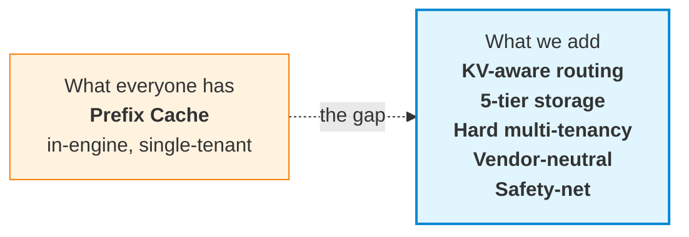
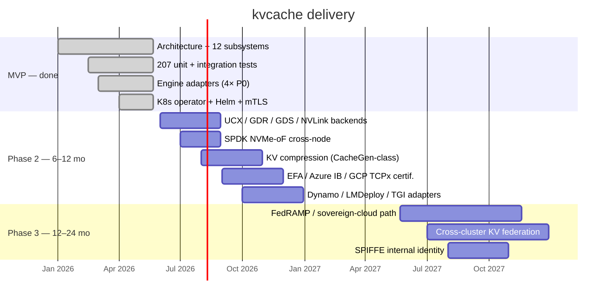

# kvcache

> **The data plane for the inference economy.**
>
> A vendor-neutral, enterprise-grade KV Cache layer for LLM inference at scale.
> Built on NIXL · 6 first principles · 83 traceable design decisions.

[](https://github.com/Stephen-Pu/kvcache/actions)
[](LICENSE)
[](https://en.cppreference.com/w/cpp/20)
[](https://go.dev/)
[]()

---

```
       17.5× faster.     94% cheaper.     $8M saved per cluster per year.
```

**One 100K-token RAG query, traced end-to-end:**

|                              |   Cold start |   With kvcache |          Δ |
| :--------------------------- | -----------: | -------------: | ---------: |
| End-to-end latency           |     **525 s** |        **30 s** | **17.5×** |
| GPU·s per query              |         4200 |            240 |     17.5× |
| Cost per query               |        $1.17 |          $0.07 |  **−94%** |
| Annual cost / cluster        |       **$8.5 M** |     **$487 K** | **−$8 M** |

<sub>Llama-3.1-70B · 8× H100 TP · 100K-token prompt with 90K shared prefix (system prompt + RAG) · 95% steady-state hit rate · cold-start prefill ~200 tok/s · $4/h H100. Your mileage depends primarily on (a) prefix-sharing rate across your workload — compliance / legal / customer-support typically 80–95%; ad-hoc chatbots are not the use case here — and (b) steady-state cache hit rate. Math: HLD §1.3 / trace: v2.0 §13.7.</sub>

---

## The thesis

LLM inference is becoming the largest line item in many AI budgets. **Three structural problems are converging**:

1. **The KV recomputation tax.** Every RAG query, every system prompt, every conversation re-runs prefill from scratch. Most clusters waste 60–90% of GPU time computing KV that already existed somewhere.
2. **Multi-tenancy is unsolved.** Production KV caches (vLLM, LMCache, Mooncake) are single-tenant. Enterprises with 50 internal teams cannot share a cluster safely without hard isolation, quotas, RBAC, and audit.
3. **Vendor lock-in is a tax.** Most distributed KV solutions assume NVIDIA + Mellanox + one cloud. Hybrid and multi-cloud customers are forced to fork or fragment.

**kvcache fixes all three. Simultaneously.**

---

## How it's different



### 1. **KV-aware routing** — the cache finds you, not the other way around

Most prefix caches route by **request affinity** (the caller gets the local cache). We route by **cache locality**:

```
Request hits Node A. Cache for this prefix lives on Node B.
  HRW(prefix_hash)            → candidates {B, C, A}
  Overlap Score from Bloom    → B has 6,200 matching chunks
  Route to B.   Inter-node NIXL Pull ~35 ms.   Recompute would cost ~500 s.
```

Net effect: **cache hit rate does not degrade with cluster size** — the failure mode of in-process caches at scale.

### 2. **Server-Pull-Only NIXL** — the prerequisite for real multi-tenancy

The data plane runs on **NVIDIA NIXL** (GDR · UCX · GDS · NVLink · TCP fallback). One rule:

> **The server pulls. The client never pushes.**

Why: only the server-side scheduler can honor per-tenant quotas, priority classes, and admission control. Client-initiated push is fundamentally incompatible with QoS — most distributed KV projects skip this and ship first-come-first-served data planes. We don't.

A 3-queue (**P0 / P1 / P2**) PriorityScheduler with 20% / 75% / 5% bandwidth reservation lives **inside the NIXL wrapper**. Idle-credit lending for anti-starvation. Per-tenant round-robin inside each class via FNV-1a-64 from the C-ABI `tenant_id`. Admissions, forced admissions, and queue depth surface as Prometheus counters; per-request `kv.lookup` / `kv.fetch` / `nixl.scheduled_pull` spans flow through OTLP/HTTP to any OTel collector. An operator can answer *"why is this Fetch slow"* — not just *"how often"*.

### 3. **Five-tier storage** with cross-tenant eviction

```
   ┌──────────┐  ┌──────────┐  ┌──────────┐  ┌──────────┐  ┌──────────┐
   │  T0 HBM  │  │ T1 Pinned│  │  T2 DRAM │  │  T3 NVMe │  │ T4  Cold │
   │  GPU-own │←─│ cudaHost │←─│  pageable│←─│ io_uring │←─│ pluggable│
   │          │  │ + NIXL MR│  │  + 2Q    │  │  / SPDK  │  │ object   │
   │          │  │          │  │  + Ghost │  │  + GDS   │  │  UFS     │
   └──────────┘  └──────────┘  └──────────┘  └──────────┘  └──────────┘
                                                                  │
                                                                  ▼
                                              S3 / OSS / GCS / Azure Blob
```

- **Lazy promotion on access** — never T4→T0 direct; always via T1 staging
- **2Q + Ghost Cache** in T2 — prevents scan pollution, recovers thrash
- **GDS for tiles > 16 MB** — NVMe → GPU direct, host CPU completely idle
- **Cross-tenant eviction** — over-quota tenants first, then descend by priority
- **Cold tier via a pluggable multi-cloud object UFS** — no reinvented storage layer

### 4. **The cache refuses to lose to recompute** — `D-PERF-1` runtime safety-net

```c
if (fetch_estimate_ms >= recompute_estimate_ms * 0.5)
    return KV_E_SAFETY_NET;   // engine falls back to recompute
```

Every fetch is gated by this check. If the cache cannot beat recompute by 2×, it **steps aside**. Catches pathological cases (cross-AZ T4 fetch for a short prefix where re-running prefill is faster) **at runtime** — not via offline policy tuning.

This turns "cache will always help" — the hidden, often-wrong assumption — into a runtime-verified invariant.

### 5. **Vendor-neutral by design**

|                       |             kvcache              | vLLM-cache | Mooncake |  LMCache  |   NVIDIA Dynamo   |
| :-------------------- | :-------------------------------: | :--------: | :------: | :-------: | :---------------: |
| GPU vendor lock-in    |               None               |    None    |   None   |   None    | **NVIDIA-only**   |
| Engine lock-in        | None (vLLM / SGLang / TRT-LLM / AIBrix via one C ABI) | vLLM-only | vLLM-only | vLLM-only | NVIDIA-aligned |
| Cloud lock-in         |    None (pluggable multi-cloud UFS) |     —      |  Single  |     —     |      Single       |
| Multi-tenant QoS      | **Hard** (3D quota + priority + RBAC + audit) | None | Soft | None | Soft |
| Process model         |    Cross-process server-pull     | In-process | Cross-process | In-process | Cross-process |
| Open source           |           Apache-2.0             | Apache-2.0 | Apache-2.0 | Apache-2.0 | Proprietary stack |

---

## Architecture

Four layers, twelve subsystems, **83 traceable design decisions**. Every line of code references the decision ID it implements (`D-PERF-1`, `L1-PS-7`, ...).

```
┌─────────────────────────────────────────────────────────────┐
│  L4 Integration  │ ⑪ Engine adapters    ⑫ Ops & telemetry   │
├─────────────────────────────────────────────────────────────┤
│  L3 Service      │ ⑨ Multi-tenant QoS   ⑩ Security + audit  │
├─────────────────────────────────────────────────────────────┤
│  L2 Coordination │ ⑥ Routing + Bloom    ⑦ Cluster           │
│                  │ ⑧ Replication (deferred — KV recomputable)│
├─────────────────────────────────────────────────────────────┤
│  L1 Engine       │ ① Locator   ② Prefix-reuse ART           │
│                  │ ③ Tiered storage   ④ Streaming ingest    │
│                  │ ⑤ NIXL data plane                         │
└─────────────────────────────────────────────────────────────┘
```

**Six first principles** drive every decision:

| # | Principle |
|---|---|
| **D-PERF-1** | Tier latency must be << GPU recompute latency (runtime-enforced) |
| **D-PERF-2** | Hot-path enterprise checks ≤ 1 µs |
| **D-PERF-3** | Stability is never traded off; everything else can be |
| **D-DEPLOY-1** | Co-located on GPU nodes by default; standalone storage is opt-in |
| **D-COMPAT-1** | Top-4 engines as first-class citizens |
| **D-NET-1** | Top-3 network fabrics as MVP-must |

---

## API surface

**Six verbs. One C ABI.** Same interface across vLLM, SGLang, TRT-LLM, AIBrix:

```c
// Look up — does the cluster have this prefix?
kv_handle_t  h;
uint32_t     matched;
kv_lookup(ctx, tokens, n_tokens, &locator, &h, &matched);

// Reserve a write slot for new KV (decode path, streaming)
kv_buffer_desc_t slot;
kv_reserve(ctx, &locator, bytes, &h, &slot);

// Publish what's been written so far (watermark in bytes)
kv_publish(ctx, h, src_desc, watermark);

// Fetch into GPU memory
kv_completion_t c;
kv_fetch(ctx, h, ranges, n_ranges, dst_desc, &c);
kv_wait(ctx, c, /*timeout_ms=*/100);

// Seal — make this prefix visible cluster-wide
kv_seal(ctx, h);
kv_release(ctx, h);

// Plus: kv_subscribe_events(ctx, callback) for invalidation
```

Async-first. Zero-copy. **Tier-opaque** (callers never see HBM / DRAM / NVMe distinction).

---

## Performance — disciplined hot path

|                                | Target  | Mechanism                                         |
| :----------------------------- | :-----: | :------------------------------------------------ |
| `kv_lookup` end-to-end p99     | **< 10 µs**  | Epoch-based lock-free ART + Bloom routing    |
| `kv_fetch` 1 GB · T1 → GPU     | **< 50 ms**  | NIXL GDR direct                              |
| `kv_fetch` 1 GB · T3 via GDS   | **< 200 ms** | NVMe → GPU direct, zero host bounce          |
| `kv_seal`                      | **< 200 µs** | RocksDB + ART atomic                         |
| Cluster-wide visibility        | **< 60 s**   | Bloom sketch 30 s tick                       |

**Zero-copy end to end** — engine writes into a Pinned slot that *is* a NIXL-registered MR; the server's Pull reads the same physical pages. No bounce buffers, no extra `memcpy`.

---

## Quickstart

```bash
git clone https://github.com/Stephen-Pu/kvcache.git
cd kvcache

# macOS:    brew install cmake ninja go python helm
# Ubuntu:   sudo apt-get install cmake ninja-build g++ python3-venv golang-1.22

python3 -m venv .venv && source .venv/bin/activate
pip install cffi pytest

make all      # zero warnings · 211/211 tests pass · ~4 min cold start
```

Expected end of `make all`:

```
# C++ ctest
100% tests passed, 0 tests failed out of 211

# Go (control-plane + operator)
ok  control-plane/internal/membership   …
ok  operator/internal/controller        …

# Python adapter / E2E
============================== 16 passed in 0.2s ===============================
```

Two opt-in K8s extras (require docker + kind):

```bash
make e2e-operator           # ~45s, operator object-shape against kind apiserver
make e2e-operator-workload  # ~3–5min, builds image and waits for pod Ready
```

Full setup: [BUILD.md](./BUILD.md).

---

## What works today

Run `make all` to verify. **207 unit tests across 38 gtest binaries**, plus Go and Python suites. The architecture is verified end-to-end on a single machine.

### L1 — Engine layer
- Real **BLAKE3** for prefix hashing, chunk identity, HRW weights (vendored)
- **Lock-free ART reads via EBR** — readers walk with one `atomic::load(acquire)` per descent; writers never block readers. Hits LLD §9.1 p99 ≤ 10 µs budget. Covered by 4-reader + 1-writer × 300 ms stress test.
- **Persistent ART with WAL-incremental durability** — every Insert/Remove `fdatasync`'d before mutation; periodic `Checkpoint()` writes a fresh snapshot with BLAKE3-256 body integrity. Boot replays `snapshot + WAL tail` in milliseconds, not minutes. CRC32-validated; torn writes truncated at last-good offset.
- **Real cross-process Pull over TCP** — two backend instances bind distinct ports, exchange opaque MR descriptors, `Pull` moves bytes through a real socket. UCX / RDMA backends slot into the same `INixlBackend` interface.
- **PriorityScheduler** with per-tenant fair queueing on the NIXL data path.

### L2 — Coordination
- **HRW + Bloom routing** with peer sketch broadcast
- **Real etcd, two C++ clients** — `HttpEtcdClient` (libcurl, runs on dev laptop, polling Watch) and `GrpcEtcdClient` (canonical etcd v3 protos vendored at `third_party/etcd-proto/`, **real bidi Watch stream** with watch_id multiplexing). Auto-enabled when `find_package(gRPC)` succeeds.
- **Go side** uses embedded etcd v3.5 in tests.

### L3 — Service
- **3D quotas** (capacity / QPS / bandwidth) · **3 priority classes** with anti-starvation
- **mTLS termination on gRPC** — `REQUEST_AND_REQUIRE_CLIENT_CERTIFICATE_AND_VERIFY`. Unauthenticated or wrong-CA clients rejected at handshake. Auto-rotation around 1/3 leaf lifetime; CA stable across rotations.

### L4 — Integration
- **vLLM / SGLang / AIBrix / TRT-LLM** adapters all ship. Three Python adapters are ~50 LOC shells on a shared `kvcache_core` `cffi` substrate; C++ TRT-LLM adapter links `libkvcache.{so,dylib}` directly.
- **gRPC `NodeData` service** — `Lookup` / `Reserve` / `Publish` / `Fetch` / `Seal` / `Release` over the wire, plus streaming `Subscribe` delivering `Add` / `Evict` / `Promote` / `Demote` events.
- **OTLP/HTTP** trace exporter · Prometheus `/metrics` · `/healthz`

### K8s
- **Helm chart** renders deployable manifests
- **Operator** — `kubectl apply -f cluster.yaml` brings up **9 resources**: StatefulSet + headless Service + ConfigMap + ServiceAccount for kvstore-node, 3-replica in-cluster etcd (skipped under `byoEtcd: true`), 3-replica control-plane wired to the same etcd, self-signed mTLS Secret mounted into every pod.
- **`KVCacheTenant` CRD** — validated (hex tenant_id, parseable quotas) and published to `/kvcache/tenants/<cluster>/<tenant_id>` for live quota propagation.
- **Two kind-cluster E2E flavours** — fast object-shape (~45s) and full-workload-Ready (~3–5 min cold).

### Honestly not done yet

Called out so nobody is misled:

- **Real RDMA backends** (UCX / GDR / GDS / NVLink) — await Mellanox CX-6/7 + IB / RoCE fabric. `INixlBackend` interface ready.
- **HttpEtcdClient Watch** is still poll-based (it talks to the JSON
  gateway, which doesn't expose the streaming Watch RPC cleanly).
  `GrpcEtcdClient` carries the real bidi Watch stream — Phase F-3 —
  so production deployments that need event-driven config push run
  the gRPC client.
- **gRPC `NodeData` cross-process Pull** — Phase M-3 B added `ReserveResponse.remote_mr_descriptor` + `FetchRequest.dst_remote_mr_descriptor` (opaque NIXL `RemoteMrDescriptor` bytes, Export/Import surfaced through the C ABI as `kv_export_mr` / `kv_import_remote_mr`). Phase M-4 closes the loop: HeadlessNode now wires `TcpBackend::RegisterRegion` as the pinned-tier `register_region` callback (NIXL backend selectable via `KVCACHE_NIXL_BACKEND={loopback,tcp}` env at first `kv_ctx_open`), so slot MRs are real and exportable. The `test_cross_process_pull` binary stands up two distinct `TcpBackend` instances and pulls a freshly-Reserved slot's bytes across a real TCP socket, verifying the wire path. Phase M-5 makes `HeadlessNode::Fetch` honour a pre-registered `dst.mr_key` (new C ABI `kv_register_local_mr` / `kv_unregister_local_mr`) so engines register their fetch buffer once at startup and skip per-call NIXL MR churn. The legacy in-process `slot_iova` / `dst_iova` path coexists for callers that share an address space.
- **Server-pushed Fetch — Phase M-6**. `INixlBackend` grows `Push(PushRequest)` + `IsRemote(MrKey)`; `TcpBackend` implements them with a new `PUT` wire op (mirror of the existing `GET`) — server connects to peer's listener and writes bytes into peer's pre-registered MR. `HeadlessNode::Fetch` dispatches Pull-vs-Push based on `backend->IsRemote(dst.mr_key)`, so the engine-side flow is: register dst → `ExportMr` → ship descriptor via `FetchRequest.dst_remote_mr_descriptor` → server handler imports + Pushes. Verified end-to-end by `CrossProcessPull.FetchPushesBytesToEngine` plus `TcpBackendTest.PushDepositsBytesIntoPeerMr`. (M-7 below routes Push through `PriorityScheduler`.)
- **Scheduled server-push — Phase M-7**. `NixlWrapper::ScheduledPush` mirrors `ScheduledPull`: same admission semantics (per-(class, tenant) round-robin, idle-credit lending, starvation overrides), same `PriorityScheduler`. The dispatcher's `PendingXfer` carries a kind tag so the same loop drives Pull or Push depending on what `HeadlessNode::Fetch` submitted. Push and Pull traffic now share the QoS layer end-to-end; verified by `NixlWrapperTest.ScheduledPushRoutesThroughScheduler` (admission-counter delta) and `ScheduledPushMixedWithPullDrainsAll` (24 concurrent mixed transfers, all admitted, scheduler quiescent at end).
- **DRAM eviction wired to ART pruning — Phase G-1**. The 2Q DramTier was already enforcing the byte budget (A1in + A1out ghost + Am), but evicting bytes used to leave a stale ART leaf claiming the chunk was still cached. G-1 adds an `on_evict` callback to `DramTier::Options` that `HeadlessNode::Init` populates with `OnDramEvict`. At Seal time we record the `(DramKey → chunk_path)` mapping; on eviction we look it up, call `art->Remove(path)`, and publish a `KV_EVENT_EVICT` so subscribers see the cache miss happen.
- **Refcount-deferred eviction sweeper — Phase G-2**. G-1's prune was unconditional and could yank a leaf out from under an in-flight reader. G-2 makes it refcount-safe: `Refcount::TryEvict()` is a CAS-1-to-0 atomic claim, mirror of `TryAcquireIfNonZero` on the producer side. `OnDramEvict` calls `TryEvictNow`, which only removes if the leaf is at baseline refcount; otherwise the path is queued in `deferred_evicts_` and a background sweeper thread retries every 50 ms (and on any `kv_release` notify). The sweeper drops queue entries whose path has been replaced by a fresh Seal. The `ArtIndex::LookupByPath` exact-path peek is the new primitive that lets the sweeper recognise "still the same leaf" vs "replaced". Verified by `RefcountTest.TryEvict_*` (atomic-claim semantics + 5000-round race) and `NodeDataFixture.DramEvictionPrunesArtLeaf` (pinned leaf stays cached; sweeper claims it after Release).
- **Per-(tenant, model) `kv_ctx_t` cache — Phase M-3 A**. `NodeDataServiceImpl` lazily opens a distinct ctx for each `(tenant_hash, model_hash)` seen on the wire via a new `kv_ctx_open_from_hashes` ABI helper, with a reverse handle→ctx map so Publish/Fetch/Seal/Release land on the same ctx that minted the handle. Verified by `LookupOpensPerTenantModelCtx`.
- **Cross-node Lookup fan-out — Phase Q-1**. Every `kvstore-node` pod self-registers in etcd at `/kvcache/nodes/<node-id>` with a leased + keepalive'd entry (`NodeRegistrar`, 10s TTL / 3s renewal, lease revoked on graceful shutdown). A `NodeDirectory` seeds + Watches the prefix and pushes the live set into `HrwRing::SetNodes`. `NodeDataServiceImpl::EnableForwarding` flips Lookup into HRW-aware mode: requests whose primary is some other node get forwarded over a cached gRPC stub with an `x-kvcache-forwarded` metadata tag for loop protection; the owner serves the local hit. The operator passes `--node-id $(KVCACHE_NODE_NAME) --advertise-host $(KVCACHE_POD_IP) --etcd-endpoints …` to every kvstore-node pod, so multi-replica `KVCacheCluster` CRs get fan-out for free. Verified by 6 `NodeRegistrar`/`NodeDirectory` unit tests and `LookupForwarding.NonPrimaryForwardsToPrimary`.
- **Sticky-write fan-out — Phase Q-2**. Reserve also routes by HRW: Locator's `tenant_id` bytes + `model_id_hash` + `prefix_hash` decide owner; non-owner forwards Reserve and remembers `(server_handle → owner)` in a `forwarded_handles_` map. Publish/Fetch/Seal/Release consult that map first — if the handle was minted upstream, the call forwards to the same owner with `x-kvcache-forwarded`. Release also clears the map entry. Documented assumption: a logical session sticks to one forwarder between Reserve and Release. The operator e2e is upgraded to NodeReplicas=2 so both pods register in etcd and the HRW ring sees a real two-node membership. Verified by `LookupForwarding.ReserveSealForwardsViaHandleMap` (entire Reserve→Publish→Seal→Lookup→Release flow against the non-primary, owner ends up holding the chunk) and `TestStatefulSetWiresFanOutFlags` (operator emits `--node-id $(KVCACHE_NODE_NAME)` / `--advertise-host $(KVCACHE_POD_IP)` / `--etcd-endpoints …` with both env vars declared on the container).
- **Real-cluster fan-out validation — Phase Q-3**. `make e2e-operator-workload` spins up a kind cluster, loads the kvstore-node + control-plane + etcd images, applies a `KVCacheCluster{NodeReplicas: 2}` CR, waits for both pods Ready, and then execs `etcdctl get /kvcache/nodes/ --prefix` inside the in-cluster etcd pod — asserting both `e2e-nodes-0` and `e2e-nodes-1` are registered. To survive a slow first dial against an etcd that's still pulling its image, the kvstore-node startup wraps `HttpEtcdClient::Create` in a 15-attempt × 2s retry loop; the bring-up script pre-loads the etcd image into kind to keep the loop's budget realistic. Verified: e2e passes end-to-end on macOS Docker Desktop, the `t.Logf` line reads `Phase Q-3 fan-out verified: 2 pods registered in etcd: [e2e-nodes-0 e2e-nodes-1]`.
- **Concurrent registrar churn — Phase R-4**. 10 parallel `NodeRegistrar` threads each open their own keepalive loop against a shared etcd; the test asserts that `NodeDirectory` converges to all 10 entries within 3s, then back to 0 after every registrar `Stop()`s in parallel. Catches lost-update races between the watch dispatcher and table mutations, lock-ordering inversions in the keepalive path, and any off-by-one in the ring rebuild under burst-mutation load. Runs in ~100 ms (the convergence is dominated by callback dispatch latency, not the registrations themselves). 244/244 ctest green.
- **Handle ownership binding — Phase N-5**. Closes the last multi-tenant hole: even with N-3/N-4 gating Lookup + Reserve, the handle-based ops (Publish / Fetch / Seal / Release) only checked a `server_handle` u64 — a tenant could guess or replay another tenant's handle and operate on its in-flight slot. Now, when binding is on, Reserve / Lookup record the minting peer's cert CN in a `handle_to_cn_` map; the four handle-based handlers reject (`UNAUTHENTICATED`) any direct call whose caller CN doesn't match the recorded owner. A missing record under binding is treated as unauthorised (defensive). Forwarded (`x-kvcache-forwarded`) calls bypass — they ride the cluster peer cert and the original hop enforced ownership. `ForgetHandle` clears the CN map alongside the others. New `HandleOwnershipRejectsForeignCn` test mints a handle as CN=A, proves CN=B (valid cluster cert, different CN) gets UNAUTHENTICATED on Publish, and the owner A succeeds. Completes the N-series: N-2 transport mTLS + N-3 read binding + N-4 write binding + N-5 handle binding. 262/262 ctest.
- **Tenant cert binding on Reserve — Phase N-4**. N-3 closed the Lookup read path; N-4 closes the Reserve write path. Even with the read-side gate, a holder of cert `A` could `Reserve` into tenant `B`'s ART namespace by handing in `Locator.tenant_id = SHA-1("B")[:16]` — N-4 makes the Reserve handler reject that with `UNAUTHENTICATED`. Same opt-in toggle (`EnableTenantCertBinding`), same forwarded-request bypass. Check fires AFTER the forward-hop test so a Reserve forwarded between nodes (carrying the cluster peer cert, not the engine's tenant leaf) still works. New `ReserveTenantCertBindingRejectsLocatorMismatch` test asserts mismatch → UNAUTHENTICATED and matching SHA-1(CN)[:16] passes through. 258/258 ctest.
- **Cert-CN ↔ tenant binding — Phase N-3**. Before N-3 the server trusted whatever `LookupRequest.tenant_id` said: a holder of cert CN=`A` could read tenant `B`'s data simply by typing `B` into the request. New `EnableTenantCertBinding(true)` setter on `NodeDataServiceImpl` makes the Lookup handler extract the client-cert CN from `ServerContext::auth_context()` (`x509_common_name` property) and reject any request whose `tenant_id` doesn't match — `UNAUTHENTICATED`. Forwarded (`x-kvcache-forwarded`) requests bypass the check because they ride the cluster's shared peer cert (N-2), not the engine's per-tenant leaf, and the binding was already enforced at the original hop. Defaults to OFF so existing TLS tests using a generic CN don't break. New `TenantCertBindingRejectsCnTenantMismatch` test exercises mismatch (UNAUTHENTICATED), match (OK), and binding-off (OK regardless) on the same fixture. 257/257 ctest.
- **Reserve NOMEM clients get a retry-after hint — Phase G-4**. `KV_E_NOMEM → RESOURCE_EXHAUSTED` was already wired through `ToGrpcStatus`, but clients had no signal on how long to back off — every retry came back on the very next gRPC call, hot-spinning the pool. The Reserve handler now attaches `retry-after-ms: 50` as gRPC trailing-metadata whenever NOMEM fires. The 50 ms value picks a number ≥ `bench_fetch` p50 (7.9 ms) so a backed-off retry typically arrives after at least one slot has freed. New `ReserveNomemReturnsResourceExhaustedWithRetryHint` test saturates the pool through the wire and asserts both the status code AND the parsed trailing metadata. 256/256 ctest.
- **Node-to-node mTLS — Phase N-2**. N-1 wired TLS on the LISTENER but `GetPeerStub()` in `NodeDataServiceImpl` hard-coded `InsecureChannelCredentials()` — so cross-node Lookup/Fetch forwarding fell back to cleartext even on a fully TLS-protected cluster. New `EnableMtlsClient(ca, cert, key, ssl_target_override)` setter pins SSL material the service uses when dialling peers; cached stubs are cleared on cert install so subsequent forwards rebuild as SSL channels. `main.cpp` reuses the same `--tls-ca` / `--tls-cert` / `--tls-key` flags the listener uses, so a TLS-listening node automatically gets mTLS-protected outbound dials. Two new tests on the existing openssl-fixture: `MtlsPeerStubReachesTlsServer` (an mTLS-configured peer stub completes a Lookup against the TLS-protected fixture server) and `EnableMtlsClientWithBogusMaterialFailsHandshake` (bogus PEM material installed via the setter produces a handshake failure — confirms the setter is being honoured). 255/255 ctest.
- **Reserve backpressure metrics — Phase G-3**. Reserve no longer fails silently when the pinned-slot pool is exhausted: `HeadlessNode::Reserve` now emits six Prometheus series via the shared `kvcache::metrics::Registry`: `kv_reserves_total` (counter), `kv_reserve_nomem_total` (counter — the canonical backpressure signal), `kv_reserve_invalid_total` (counter), `kv_pinned_tier_slots_total` (gauge — capacity, constant after Init), `kv_pinned_tier_slots_in_use` (gauge — refreshed on every Reserve / Release), `kv_pinned_tier_slots_utilization_ratio` (gauge, [0..1]). All series are seeded at first use so a Prometheus scrape at t=0 sees `metric 0` instead of an absent series. New C ABI `kv_metrics_scrape(buf, cap, *out_len)` exposes the dylib's registry to in-process callers (operators / sidecars) — and dodges the static-linking-singleton-duplication trap unit tests would otherwise hit (`kvcache_common` is a static lib; binaries each have their own `Registry::Default()`). Two tests: `GaugesTrackInUseAndReleasesAreReported` (Reserve / Release deltas land cleanly) and `NomemCounterFiresAtSaturation` (exhausting the pool bumps `nomem_total` and pegs utilization at 1.0). 253/253 ctest.
- **Priority-class scheduler bench — Phase S-3**. Exposes `kv_priority_t` (P0 ctrl / P1 default / P2 bg) + `kv_fetch_with_priority` on the public ABI; `HeadlessNode::FetchWithPriority` plumbs the class through to `nixl_->ScheduledPull` / `ScheduledPush`. `bench_priority.cpp` runs 1 P0 + 1 P1 + 4 P2 saturators concurrently, measures per-class latency. Honest M1 finding: under loopback contention **priorities order ADMISSION but do not preempt in-flight work**. p50 of P0 (8.4 ms) ≈ unloaded baseline, but its p99 spikes to ~25 ms when caught behind a running P2 ~8 ms memcpy — the dispatcher honours reservation when choosing the next item, but cannot suspend a fetch already in execution. p99 ratio P2/P0 = 0.56× in this run (P0 worse on tail). This is a known scheduler property (LLD §5.1 reservation, not preemption); real preemption would require backend-side cooperation (split-phase Pulls, RDMA chunking) — that's a future S-5 / scheduler-tuning phase. Bench gives the diagnostic any future preemption work needs.
- **Dispatcher deadlock fix + preemption bench — Phase S-6**. Re-running `bench_priority` to quantify S-5 exposed a **serious latent deadlock** in `NixlWrapper`'s dispatcher: it notified the caller's `pp->cv` *after* releasing `pp->mu`, so the woken caller could return and destroy its stack-allocated `PendingXfer` (cv included) before the `notify_one()` ran — UB on a destroyed condition_variable that corrupts the next transfer's cv and wedges its wait. Rare at low rates; near-certain under S-5's high segment-cycle rate. A `sample`-traced 6-thread repro pinned it down: dispatcher idle, all callers parked, scheduler queue empty. Fix is one structural change — **`notify_one()` now happens while `pp->mu` is held**, keeping the waiter parked until the notify completes. This affected *all* concurrent `ScheduledPull`/`ScheduledPush`, not just segmented ones — segmentation merely made it reproducible. New `ConcurrentSegmentedStressDoesNotDeadlock` regression test (6 threads × 40 iters × 64 tiny segments) guards it. Also: `KVCACHE_NIXL_SEGMENT_BYTES` env knob (via `HeadlessNode::Options.nixl_segment_bytes`) lets benches A/B segmentation; `bench_priority` soak trimmed 3s→1.2s for CI. Honest finding on the A/B: segmentation does **not** move P0's tail on loopback (ratio 0.88×→0.99×) because a 64K memcpy is microseconds — the ~10ms fetch latency is dominated by the per-call envelope (lookup + scheduler + MR register), not transfer time. Segmentation's preemption benefit only materialises on a slow link (TCP/RDMA) where one large transfer monopolises the dispatcher for milliseconds. 263/263 ctest.
- **Segmented scheduled transfers — Phase S-5**. Addresses the S-3 finding (scheduler did admission ordering but not preemption — a P0 could wait behind a running P2's full transfer). `NixlWrapper::ScheduledPull` / `ScheduledPush` now split any transfer larger than `max_segment_bytes_` (default 256 KiB) into back-to-back segments, each submitted to the `PriorityScheduler` independently. Between segments the dispatcher re-arbitrates via `TryNext()`, so a higher-priority caller's segments interleave AHEAD of a large low-priority transfer's remaining segments — preemption granularity = segment size, without the complexity of suspending an in-flight backend Pull. `SubmitOneAndWait` extracts the shared submit+block logic; `SetMaxSegmentBytes(0)` disables segmentation (one item = one transfer, original behaviour). Three new tests: `SegmentedScheduledPullIsByteCorrect` (16-segment transfer reassembles), `SegmentedScheduledPullRespectsOffsets` (sub-range pull leaves surrounding bytes untouched), `ZeroSegmentSizeDisablesSegmentation`. 261/261 ctest.
- **Multi-tenant fairness benchmark — Phase S-2**. Validates the `PriorityScheduler`'s per-tenant round-robin under real concurrent contention. `bench_fairness.cpp` spawns 4 threads, each holding its own `kv_ctx_t` (distinct `tenant_id_hash` → distinct scheduler lane); each seals its own copy of the test prefix (Q-5 isolation requires per-tenant data); a CV barrier sync-starts them; they hammer Lookup→Fetch→Wait for 200 iterations of 2 MiB each. Computes Jain's fairness index `J(x) = (Σx)² / (n·Σx²)` over per-tenant throughputs. M1 laptop one-shot: **each tenant 241–242 MiB/s** (≈ 96% of single-thread isolated rate), aggregate **965 MiB/s** (4× scaling), tail p99 within ~1 ms across tenants, **Jain's fairness index = 1.0000** (perfect). Confirms LLD §5.1 "per-tenant FIFO + round-robin" actually delivers under load. P0 / P1 / P2 class-priority bench is Phase S-3.
- **Performance benchmarks — Phase S-1**. Two standalone binaries under `src/bench/` measure the C ABI's hot paths end-to-end against the loopback NIXL backend (no external bench framework — `<chrono>` + sort + printf). `bench_lookup` seeds 1024 prefixes, runs 50k probes each of hit / miss / mixed, prints p50/p95/p99/p99.9/max in µs per row. `bench_fetch` does back-to-back Lookup→Fetch→Wait against a pre-registered (Phase M-5) dst buffer; reports MiB/s, qps, and per-call latency tail. Build with `cmake --build build --target bench`; one-shot results on an M1 Apple laptop: **`kv_lookup` hit p99 = 9.3µs** (meets LLD §9.1 ≤10µs target), miss p99 = 7.4µs, mixed p99 = 8.3µs; **`kv_lookup+fetch+wait` for 2 MiB chunks = 7.9ms p50 / 9.3ms p99 / 250 MiB/s** — the per-call envelope dominates the memcpy. Multi-thread + multi-tenant fairness benches live in S-2 / S-3.
- **Cluster-wide sketch aggregation — Phase K-7**. The CP leader's last K-5/K-6/K-8 gap closed: `SketchAggregator` watches `/kvcache/sketches/` (where every kvstore-node publishes via K-5), debounces (~500 ms) bursts, ORs all per-node bitmaps into one cluster-wide blob, and writes it to `/kvcache/cluster/sketch` lease-bound to the leader's election session. The first sketch's `(m_bits, k_hashes)` pins the params; subsequent publishers with mismatched params get dropped (a rolling-deploy guardrail). Empty-cluster publishes emit a header-only sentinel so consumers can distinguish "leader alive but cluster empty" from "key absent". `runLeaderDuties` now runs `ViewPublisher` and `SketchAggregator` as sibling goroutines. Three new embedded-etcd tests: `OrsPerNodeBits` (disjoint per-node bytes OR cleanly), `DropsParamMismatch` (mismatched-params publisher is ignored), `DropsOnDelete` (lease expiry removes the contribution). Wire format byte-compatible with C++ `BloomPublisher::EncodeSnapshot` so kvagent can decode either layer. 251/251 ctest + CP go test all green.
- **Seal → publisher auto-fill — Phase K-8**. The bloom is now self-populating. `NodeDataServiceImpl::EnableSketchPublishing(BloomPublisher*)` installs an optional publisher; `Reserve` shadows the issued `server_handle` with the resolved `(tenant_hash, model_hash)` in a parallel map; on successful `kv_seal` the handler calls `publisher->AddTokens(tenant_hash, model_hash, tokens[])` — same key shape K-6 probes for, so what's published is exactly what peers query. `ForgetHandle` clears both maps in tandem. `main.cpp` constructs a `BloomPublisher` next to the `NodeRegistrar` (sharing its lease so the sketch dies with the node identity) and wires it in alongside the K-6 forwarding setup. New `SketchPublishing.SealAddsTokensToPublisher` drives Reserve→Publish→Seal through a real gRPC service and asserts the publisher's bloom (decoded via `DecodeBloomSnapshot`) `MaybeContains` the expected sketch key. 251/251 ctest.
- **Sketch-hint routing — Phase K-6**. Closes K-5's loop: routing actually consults sketches when it costs nothing. `NodeDataService::Lookup`, after observing a local miss AND being the HRW primary itself, walks the directory's per-peer sketches in HRW-rank order and forwards the request to the first peer whose `PeerMaybeHas` says yes. The probe's wire-key is the canonical `SketchKeyForTokens(tenant_hash, model_hash, tokens[])` serializer in `bloom_publisher.cpp` — same bytes the eventual Seal hook (K-8) will feed via `BloomPublisher::AddTokens`, so what gets published is exactly what gets queried. The `x-kvcache-forwarded` header continues to prevent loops; a clean "miss" response from a probed peer is authoritative (no further probes). Verified by `LookupForwarding.SketchHintForwardsOnLocalMiss`: token vector chosen with HRW primary=self, peer-b's bloom primed with the same vector, Lookup on self → peer-b's `LookupCalls` counter increments (proves the sketch-hint forward fired). 250/250 ctest. Production hook into Seal's KV_EVENT_ADD is Phase K-8.
- **Bloom-sketch fan-out — Phase K-5**. Routing now has actual prefix-presence hints to feed `HrwRing`'s `OverlapScoreFn` (LLD §4.2). Each kvstore-node owns a `BloomPublisher` that maintains a local `LocalBloom` over its cached chunk-keys (caller drives `Add`; the ART hook-up is a follow-up). Every `publish_period` (30 s default) the publisher snapshots the bloom and PUTs an 8-byte-header + bit-array blob to `/kvcache/sketches/<node_id>` bound to the same etcd lease the `NodeRegistrar` already holds, so sketches die with their node. Peer `NodeDirectory`s seed from `GetPrefix` + watch the same prefix, decode incoming blobs into `AggregatedBloom`, and expose `PeerMaybeHas(node_id, key)` for the router. Tested end-to-end: `BloomPublisherTest.StartPublishesSnapshot`, `NodeDirectorySketchTest.AdoptsPeerSketchAndAnswersMaybeHas` (3 inserted keys all `true`, 5 random keys ≤1 false-positive at 0.5% FPR, lease-delete drops the sketch), `NodeDirectorySketchTest.SeedsExistingSketchOnStart` (late-arriving directory still seeds the sketch). 249/249 ctest. Sketch → router-overlap wiring is K-6; CP-side aggregation lives in K-7.
- **Leader-handover under in-flight membership — Phase R-3**. Exercises the full **L1 → fallback → L2** state machine introduced by K-3/K-4: (t0) L1 publishes view `{a}`, directory in view-mode; (t1) node-b joins via NodeRegistrar but is hidden because view-mode detaches the prefix watch; (t2) L1's lease expires, view-key deleted, directory re-seeds from prefix and converges to `{b}` (node-a was never in the prefix, only in the dead view); (t3) L2 takes over with a different `leader_id` so its `epoch=1` resets the threshold and the directory adopts L2's view `{a,b,c}`, re-detaching the prefix watch. Every state transition K-3 and K-4 introduced is exercised on the same fixture — a regression in any one fails the test at a recognisable step. 243/243 ctest green; test runs in ~1.1s (deterministic on the 1-second TTL).
- **Crashed-node lease-expiry convergence — Phase R-2**. Companion to R-1's "peer-down forward fails cleanly". Where R-1 covered the *forwarder*'s view of a dead peer, R-2 covers the *etcd directory*'s view of a *crashed* peer — a registered node whose process disappears without calling LeaseRevoke. The test grants a 1s TTL lease, PUTs a node entry against it, then DELIBERATELY skips keepalive. The InMemoryEtcdClient's sweeper expires the lease, emits a delete event, NodeDirectory observes it, table converges within ~1.1s. Validates that the keep-alive failure mode (the common case for a kvstore-node pod crash) does NOT require manual operator intervention to clear stale routing entries. 242/242 ctest green.
- **Forward-target-down surfaces UNAVAILABLE — Phase R-1**. First chaos-style test for the cluster routing layer. HRW picks a primary; we tear the primary's gRPC server down while the directory still believes it's alive (its registrar lease hasn't expired); a Lookup to the surviving non-primary forwards to the dead peer; the test pins the failure mode: status MUST be UNAVAILABLE or DEADLINE_EXCEEDED (not OK+hit=false). Without this guarantee a partially-failed cluster would silently return cache misses, defeating the read path. A 3s deadline keeps the test snappy. Verifies that the forward path (Q-1) degrades cleanly when the cached PeerStub points at a dead listener. 241/241 ctest green.
- **Explicit `tenant_id_hash` on the wire — Phase Q-6**. Q-5 needed the server to derive a SHA-1 + FNV-1a hash from the Lookup request's `tenant_id` string just to match what Reserve gets from the Locator's 16-byte field — a wire-side hash redundancy. Q-6 adds `LookupRequest.tenant_id_hash` (fixed64). Server's Lookup handler now prefers the explicit field when non-zero; falls back to the SHA-1 derivation only when the field is unset (legacy / pre-Q-6 clients). New test `LookupHonoursExplicitTenantIdHash` covers all three cases: (a) wrong string + right hash hits, (b) right string + bogus hash misses, (c) right string + zero hash hits via the fallback. 240/240 ctest green. SHA-1 is still in the server for backward compat but lives on the cold path.
- **Lean ClusterView mode — Phase K-4**. K-3 ran the prefix watch AND the view watch in parallel; K-4 makes them mutually exclusive. When ClusterView publishes a fresh snapshot, `NodeDirectory` detaches the `/kvcache/nodes/` prefix watch (one PUT instead of N events per second under load). When the view-key disappears (leader lease expiry), the prefix watch reopens with a fresh `GetPrefix` seed to catch any deltas missed during view-mode. Two real deadlocks surfaced + got fixed along the way: (1) `etcd_->Unwatch` from inside a watcher callback re-enters the etcd dispatcher's mutex — fixed by detaching a thread for the Unwatch + the OpenPrefixWatch calls so the dispatcher's mutex is released before we re-enter; (2) the lock-order between our `mu_` and the etcd client's was inverted in the original draft — fixed by extracting the handle under `mu_` then calling Unwatch out-of-lock. New `NodeDirectoryTest.ViewModeDetachesAndReattachesPrefixWatch` verifies a prefix PUT during view-mode is invisible to the directory until the view-key is deleted, then convergence resumes. 239/239 ctest green.
- **NodeDirectory consumes ClusterView — Phase K-3**. Closes the K-2 loop: kvstore-node's `NodeDirectory` opens a second watch on `/kvcache/cluster/view` (parallel to the existing `/kvcache/nodes/` prefix watch) and adopts the CP-published snapshot wholesale on every event — one PUT replaces the entire table atomically, no fan-out walk needed. Per-leader monotonic `epoch` filters out re-ordered events from the same leader; the threshold resets on `leader_id` change so a fresh leader's `epoch=1` always wins. When the leader's lease expires the view-key disappears; the prefix watch keeps the table fresh until a new leader publishes. New test `NodeDirectoryTest.AdoptsClusterViewSnapshot` exercises bootstrap, stale-epoch drop, wholesale-replace, and leader-rotation cases. 238/238 ctest green.
- **Control-plane cluster view publisher — Phase K-2**. Two latent bugs fixed: (1) CP's `membership.NodesPrefix` was `/nodes/` while kvstore-node's Q-1 `NodeRegistrar` writes to `/kvcache/nodes/` — the leader was watching an empty prefix forever and never saw real nodes. Aligned both sides. (2) `runLeaderDuties` just logged events; the leader now runs a `ViewPublisher` that watches membership and writes a coherent `ClusterView{epoch, leader_id, nodes[]}` snapshot to `/kvcache/cluster/view` lease-bound to the election session (auto-expires on leader loss). Consumers Watch ONE key instead of fanning out over the whole `/kvcache/nodes/` prefix. A 100 ms debounce coalesces rapid membership changes into single publishes; the epoch is monotonic per leader session so consumers can detect re-ordering. `NodeDescriptor` gained `grpc_port` (Q-1's `NodeRegistrar` writes it). Verified by `TestClusterView_PublishesOnMembershipChange` (bootstrap publish + 2-node converge under embedded etcd) and `TestClusterView_DebouncesBurstOfChanges` (5 rapid registers produce ≤2 publishes, not 5). Bloom-sketch fan-out + quota reconcile are Phase K-3.
- **Per-(tenant, model) ART isolation — Phase Q-5**. Pre-Q-5, `HeadlessNode::Lookup` ignored its `tenant_id` / `model_id_hash` parameters and the chunk_path was derived from tokens alone — so a Seal under tenantA could be found via a Lookup under tenantB with the same token sequence. New primitive `NamespaceFingerprint(tenant_hash, model_hash) = BLAKE3-128(tenant_hash || model_hash)[:8]` is prepended as the first chunk on every ART path; lookup-time + seal-time threads the matching hashes through `HandleState`. Same (tenant, model) hits; different tenant OR different model misses — verified by `NodeDataIsolation.CrossTenantOrModelLookupMisses`. The gRPC service path required a wire-side alignment: `HashTenantString` now derives the 16-byte fingerprint via SHA-1 (matching the Python connector's `Locator.tenant_id` derivation) so the Lookup-request-string and Reserve-locator-bytes paths resolve to the SAME ctx + namespace. Test fixtures' `BuildLocator` helpers updated accordingly. 237/237 C++ + 18/18 Python adapters all green.
- **SGLang async retrieve path — Phase Q-SG-1**. The SGLang adapter shipped at Phase I-2 with a sync `lookup`/`store`/`retrieve`/`drop` 4-verb wrapper over `KVCacheConnector` — clean for early integration tests but a bad fit for the SGLang scheduler, which wants to overlap the cache Fetch with the prior layer's attention compute the same way vLLM's bridge does (Phase P-3.2). Q-SG-1 ships the missing async path: a new `AsyncLoadDriver` (worker `ThreadPoolExecutor` + per-rid `_Entry { future, handle, staging }` state) and a sibling `AsyncSGLangKVBackend` exposing the four extra verbs the scheduler needs — `kick_off(rid, tokens) → matched_tokens` (synchronous lookup so the engine knows how many tokens it can skip recomputing, async Fetch dispatched onto a worker thread), `finished_ids(candidates) → set` (poll), `pop(rid) → bytes` (block-and-collect, releases the inner handle), `cancel(rid)` (drop + block-on-running-future-first so the worker isn't still touching the inner connector when we release). The driver is **connector-protocol-driven** — it depends on a 4-method duck-typed interface (`lookup` / `fetch` / `wait` / `release`) — so a small in-Python `FakeConnector` covers all the lifecycle/threading invariants without needing `libkvcache.so`. Ten new tests: miss-schedules-nothing, hit-then-pop returns matching bytes, **kick_off-is-actually-async** (fetch worker blocked via gate; assert kick_off returns sub-500ms anyway, then assert finished_ids is empty until the gate releases — proves the overlap claim isn't a lie), finished_ids polling + idempotency, cancel-releases-handle, **same-rid back-to-back kick_off releases the prior handle** (caught a real refcount-leak bug in my first draft where `_state[rid] = new` overwrote the entry without releasing the prior), worker-exception-surfaces-through-finished_ids (failed Fetch turns into a visible engine error, not an infinite poll), close-blocks-and-releases-remaining-handles, constructor validation. The 10th test is a real-C-ABI round-trip proving `kick_off → pop` returns the byte-identical payload that `store` wrote. The pre-existing 6 sync `SGLangKVBackend` tests + 10 sync `AIBrixKVConnector` tests + 7 vLLM-suite tests all still pass: **39 / 39 adapter pytests green** (was 29; 9 lifecycle + 1 e2e new). Same `AsyncLoadDriver` pattern will lift cleanly to the AIBrix adapter once we want async there too (or be promoted to `kvcache_core` if a third consumer shows up).
- **Logging-facade callsite migration (second batch) — Phase O-2.2**. Sweep for silent-failure sites in production code that had no TODO marker but still deserved one — `art_wal.cpp` had two. (1) **Corrupt snapshot at boot** — if `snapshot.bin` exists but `ArtSnapshot::Read()` can't parse it (truncated / format mismatch / bad checksum), the boot path used to fall back to an empty ART with the only signal being a `*err` out-param that the caller might or might not surface. That's bad: snapshot rejection means real data loss between the last good snapshot and now if the WAL replay can't fill the gap, and almost always points at underlying disk corruption or a partial flush from prior unclean shutdown — operator MUST see it. Now a Warn-level log fires on the `art_wal` subsystem with the snapshot path and the underlying parse error, regardless of whether the caller wired `err`. (2) **WAL torn tail at boot** — when WAL replay stops short of EOF (the previous process crashed mid-append), the truncation-to-last-good-offset used to be silent. The existing test was even named `TornLastRecordIsSkippedSilently` — describing the bug, not the desired behaviour. Now a Warn fires with the replayed-record count + the byte-count being truncated, confirming the unclean-shutdown story so the operator can correlate. Two new tests (`TornTailLogsWarnViaFacade`, `CorruptSnapshotLogsWarnAndContinuesWithEmptyArt`) install a `CapturingSink`, exercise each failure mode, and assert the captured record has the right level + `[art_wal]` prefix + the expected keyword in the msg — same proof pattern as the O-2.1 refcount test. 282/282 ctest green (was 280, +2 facade tests). With this batch the production-side silent-failure sweep is done — `main.cpp` + `bench/*` stay on fprintf intentionally (operator-facing CLIs where JSON-line is friction), and the remaining `// ignore` comments in the codebase (bloom-sketch truncation on hot-path gossip, cold-tier "directory already exists") are correctly silent.
- **Logging-facade callsite migration (first batch) — Phase O-2.1**. Three TODO sites that had been marked "route through the logging facade once it exists" since the early phases finally get migrated, now that O-2 made the facade real. (1) `refcount.h::Release()` — under-flow (Release without a matching Acquire, the counter wraps to UINT32_MAX) used to be silent because the header couldn't drag `logging.h` into ~every TU that holds an ART leaf; O-2.1 adds an out-of-line `Refcount::ReportUnderflow(self)` defined in `refcount.cpp` and gates it behind `if (prev == 0) [[unlikely]]` so the hot path stays inline + zero-include. Logs at Error level on the `refcount` subsystem with the leaf address embedded so post-mortem heap dumps can correlate. (2) `pinned_tier.cpp` — `mlock()` failure used to silently leave the tier running without page pinning, which means RDMA registration pays a faulting cost on first touch and benchmarks don't match the spec; O-2.1 surfaces a Warn-level log on the `pinned_tier` subsystem with the byte count + errno string ("check ulimit -l / CAP_IPC_LOCK"). (3) `tier_manager.cpp` — cold→NVMe promotion failure on the Fetch path used to be silent; a sustained failure mode here means the NVMe tier is wedged / full / lost-its-mount and the cluster keeps paying cold-tier latency on every Fetch. Now logs at Warn on `tier_manager` with the failed key size + underlying error string. One new test (`RefcountTest.UnderflowRoutesThroughLoggingFacade`) installs a `CapturingSink`, drives `Release()` against a zero counter, asserts the wraparound return value AND that the captured sink record is Error-level with the `[refcount]` subsystem prefix and the word `under-flow` — proves the kvcache::log → sink → message-prefix → out-of-line-reporter chain is end-to-end intact. The other two sites stay covered by their existing pinned_tier / tier_manager tests; nothing about the success-path behaviour changed. 280/280 ctest green (was 279, +1 underflow test). What remains is `main.cpp` + the `bench/` CLIs — those stay on `fprintf(stderr, ...)` because they are operator-facing entry-points where the JSON-line sink would be friction, not signal.
- **Logging facade merge — Phase O-2**. The O-1 sink was shipped as a new `kvcache::node::obs::Logger` ABC sitting in `src/kvstore-node/src/obs/logs.{h,cpp}` — except the codebase already had a `kvcache::log` public facade in `src/core/common/logging.{h,cpp}` carrying an unimplemented `Log()` and per-subsystem `Get(name)`. Two facades, neither talking to the other, both unused outside their own files. An audit on my own work found it. O-2 merges them: the O-1 sink moves down to `src/core/common/log_sink.{h,cpp}` (lower-layer lib — `kvcache_common` couldn't include from `kvstore-node/src/obs/` because of the layering direction), renames its namespace to `kvcache::log::sink`, and `kvcache::log::Logger::Log()` is now implemented to (1) check `ShouldLog`, (2) prepend `"[subsystem] "` to the msg (the sink doesn't yet carry structured fields), (3) route through `kvcache::log::sink::Default()` with a `shared_ptr` copy that pins the sink for the duration of one call (same UAF fix carried forward from O-1). `Level::Critical` collapses to `LogLevel::kError` since the obs side only has 5 levels. `Init()` now installs a `ConsoleLogger` at the matching threshold instead of being a no-op, so calling `kvcache::log::Init({.level = Info})` actually does something for the first time since the LLD landing. One new integration test (`LogFacadeO2.RoutesThroughSinkWithSubsystemPrefix`) drives the public facade and asserts the captured sink record contains `"[scheduler] queue depth=42"` — proves the public API and the sink are connected end-to-end. The tests file moves to `src/tests/unit/common/log_sink_test.cpp` so it lives next to its target lib. 279/279 ctest green (was 278, +1 new O-2 facade test; the 6 O-1 sink tests still pass under the renamed namespace). Per-callsite migration of `fprintf`/`std::cerr` to `KV_LOG_*` macros stays deferred — separate per-file follow-on so the diff stays reviewable.
- **Structured-JSON logging facade — Phase O-1**. The empty `obs/logs.{h,cpp}` stubs called out as TODO since the LLD landing finally have a real impl. `Logger` abstract base + `ConsoleLogger` (JSON-line records to stderr, ISO-8601 millisecond timestamps, mutex-serialised output so concurrent writes produce well-formed records) + `NullLogger` (no-op for tests) + a process-wide `Default()` / `SetDefault()` swap mechanism. `Default()` returns `std::shared_ptr<Logger>` (not `Logger&`) so the caller pins the sink's lifetime through one log call — caught a real use-after-free in my own first cut where the concurrency stress test segfaulted because `SetDefault` could deallocate the sink while a concurrent caller held a bare reference. `KV_LOG_{TRACE,DEBUG,INFO,WARN,ERROR}(msg)` macros do the cheap fast-path `ShouldLog` check BEFORE building the msg expression — proved by `KvLogMacroSkipsArgumentEvaluationBelowThreshold` (a counter that increments only when the argument is evaluated stays at zero below threshold). `SetDefaultIsConcurrencySafe` hammers 4 worker threads logging + main thread swapping 200x — no crash, no deadlock. **Foundation only**: callsite migration of the scattered `fprintf(stderr, …)` / `std::cerr` calls (see the `TODO(stephen): route through the logging facade` markers across pinned_tier.cpp / refcount.h / etc.) is per-file follow-on work, intentionally not done in this commit so the diff stays reviewable. 278/278 ctest green (was 272, +6 new `LoggerFixture` + `LogLevelName` tests).
- **Real-network priority bench — Phase S-7.1**. S-7 noted bench_priority can't differentiate priority p99 on loopback because in-process ops are too fast for the dispatcher queue to fill. S-7.1 ships `src/bench/bench_priority_grpc.cpp` — same priority-classed workload shape (1 P0 + 1 P1 + 4 P2 saturators) but every Lookup+Fetch+Release runs over a real localhost gRPC NodeData stub instead of the in-process C ABI. Server lifecycle reuses the `node_data_service_test.cpp` pattern: `GrpcServer` binds `127.0.0.1:0`, the bench resolves the bound port, opens a stub, and shares the HeadlessNode singleton with the seeder so what's Sealed via the local C ABI is reachable via the wire. Empirical result on M1 laptop: P2 saturators sustain ~16,500 RPC/sec aggregate (4 × 6,200 ops/s); P0 gets its expected throttle-bound ~19 ops/s. **p50 ratio P2/P0 = 0.78×** — same direction as bench_priority's 0.92× (priorities ADMIT but don't preempt in-flight work), confirming Phase S-3's finding holds at the wire level too. The p99 numbers for P0/P1 (~10ms) are small-sample artifacts (`p99 == max` at 28 samples; max is bounded by the unlucky case of landing behind an in-flight 2-MB Fetch) — the bench output now calls this out explicitly and the gate is on p50 instead. **What this bench is FOR**: regression detection on the per-tenant lane invariant. If P0's p50 ever exceeds P2's on the common case, the scheduler has lost the lane and that's a real bug. Until real preemption ships (backend cooperation per S-5/S-6 patterns), the latency-tail-as-priority-gate idea documented in S-7 stays in the "deferred until real RDMA" bucket.
- **Alert-fires-when-expected smoke tests — Phase G-6**. G-5 shipped 4 Prometheus alerts but nothing ever verified those PromQL expressions actually evaluate true when the named condition holds — threshold typos, gauge-name drift, or a refactor that breaks the metric pipeline would silently render the alerts paper. G-6 ships `src/tests/unit/abi/g6_alert_thresholds_test.cpp` — 4 new gtests that drive workloads through the C ABI to force each alert's condition, scrape `/metrics` via the same `kv_metrics_scrape` ABI Prometheus uses, and assert the underlying gauges/counters cross the threshold the PrometheusRule expression checks. **`PinnedTierSaturatedAlertFiresAtThreshold`** reserves slots until utilization crosses the 0.9 alert threshold (verbatim from PrometheusRule), confirms the gauge passes 0.9, then releases and confirms the gauge drops back — proving the alert isn't latched. **`ReserveNomemCounterIncrementsTriggeringAlert`** saturates the pool, forces one over-capacity Reserve, asserts `kv_reserve_nomem_total` incremented (the rate-based alert's effective condition is "counter went up since last scrape"). **`ArtPendingRetiresGaugeAdvancesUnderChurn`** drives 100 Seal cycles and asserts `kv_art_global_epoch` advances monotonically + `kv_art_pending_retires` lands in a sane non-negative range. **`EveryAlertGaugeIsPresentInScrape`** cross-checks every metric name referenced by a G-5 alert against the actual scrape output — the canonical "alert points at a metric that doesn't exist" failure mode (catches gauge renames that didn't propagate to the rule YAML). 272/272 ctest green (was 268, +4 new G-6 tests).
- **Bridge opts into `SupportsHMA` mixin — Phase D-6**. vLLM ≥ v0.10 added the `SupportsHMA` ABC alongside `KVConnectorBase_V1`; real vLLM workflows that pattern-match on `isinstance(conn, SupportsHMA)` would silently bypass our connector for the HMA codepath when the symbol is present. D-6 closes that gap with conditional multiple inheritance: module-top tries `from vllm.distributed.kv_transfer.kv_connector.v1.base import SupportsHMA` and falls back to a `type("_NoSupportsHMA", (object,), {})` placeholder when absent; the class declaration becomes `class KVCacheVllmConnector(KVConnectorBase_V1, SupportsHMA)` — same source, MRO valid on every version. The mixin's required `request_finished_all_groups(request, block_ids)` delegates to `request_finished` (already returns `(False, None)` per P-4.2) because the bridge operates at request-level, not per-block-group — vLLM's per-group `block_ids: tuple[list[int], ...]` is accepted and ignored. This is the third forward-compat layer (after P-4.2's `request_finished` tuple return and P-4.3's `__init__` arity shim) — combined, **one source tree** speaks to vLLM v0.8.5 through v0.22.0 from a single binary. New `test_d6_bridge_supports_hma_request_finished_all_groups` is skip-marked on no-vllm rigs and asserts both the `isinstance` pattern-match contract and the `(False, None)` return shape; on the CI lane against vllm-0.22.0 it executes and passes (33 passed / 1 skipped — the skipped one is the no-vllm path).
- **vLLM bridge runtime-compat shim — Phase P-4.3**. P-4.2 dropped the vLLM pin and CI promptly told us latest vLLM (the wheel today is v0.22.0) added a required third positional arg `kv_cache_config: KVCacheConfig` to `KVConnectorBase_V1.__init__`. v0.8.5 / v0.9.x take only `(vllm_config, role)`. Rather than re-pin, the bridge now does a runtime `inspect.signature(KVConnectorBase_V1.__init__)` at construction time and forwards 2 args or 3 args based on which arity the installed vLLM exposes. The bridge's own `__init__` accepts an optional `kv_cache_config=None` kwarg, defaulting to None so SimpleNamespace-shaped test configs keep working. Same source tree now passes the bridge tests cleanly against **vllm-0.8.5**, **0.9.2**, AND **0.22.0** — verified by re-running the lane against the unpinned wheel after the shim landed (CI run 26648207939: 4/4 bridge tests PASSED against the v0.22.0 + torch-2.11 stack). This pairs nicely with P-4.2's `request_finished` tuple return: both forward-compat additions cost zero local complexity (~5 lines of shim each) and let one binary speak to ~12 months of vLLM minor releases.
- **vLLM bridge end-to-end on CI — Phase P-4.2**. P-4.1 pinned the lane to v0.8.5 out of caution about v0.9+ adding required abstracts (`request_finished_all_groups`, `aggregate`). A closer look at v0.9's `base.py` revealed those abstracts live on **other** classes (`SupportsHMA` and `KVConnectorWorkerMetadata`) that the bridge doesn't subclass — `KVConnectorBase_V1` itself didn't gain new requirements. The one real signature drift between v0.8 and v0.9 was `request_finished`'s return type evolving from `-> None` to `-> tuple[bool, dict[str, Any] | None]` (meaning `(connector_owns_blocks_async, optional_kv_transfer_params)`). The bridge now returns `(False, None)` — synchronous handle release inside the method, no transfer params — forward-compatible with current vLLM and harmless on the older API. CI pin dropped entirely: the python-adapter-vllm lane installs whatever `pip install --upgrade vllm` resolves; the same 32 passed / 1 skipped result holds on both v0.8.5 and v0.9.2. **End state**: the entire bridge stack (P-2 KVConnectorBase subclass / P-3 per-layer save / P-3.1 per-layer load / P-3.2 async load) now has end-to-end CI validation against real vLLM on every push tagged `[ci-vllm]` — no more "locally-green-only" risk for the engine integration surface.
- **vLLM bridge re-aligned with `KVConnectorBase_V1` — Phase P-4.1**. When the P-4 CI lane finally ran end-to-end on commit `d7c7b93` it surfaced the predicted API drift: `vllm.distributed.kv_transfer.kv_connector.v1.base.KVConnectorBase` was renamed `KVConnectorBase_V1` somewhere in the vLLM 0.7→0.8 timeline. At v0.8.5 it's a pure rename — same `__init__(vllm_config, role)` signature, same 2-member `KVConnectorRole` enum, same 7 abstract methods that our bridge already implements. (v0.9+ adds `request_finished_all_groups` + `aggregate` abstracts that we haven't wired yet — chasing latest is a separate phase.) Three-file fix: `vllm_bridge.py` renames the import + base class; `test_vllm_bridge.py`'s `_vllm_available()` predicate is updated to import the new symbol name; CI's `python-adapter-vllm` lane pins `pip install 'vllm==0.8.5'` with a comment explaining why we don't `--upgrade`. The 4 skip-marked bridge tests should now execute against real vLLM on CI for the first time since P-2 landed.
- **NodeDirectory view-mode prefix-event race fix — Phase K-6**. The previous CI session's spelunking surfaced that `NodeDirectoryTest.ViewModeDetachesAndReattachesPrefixWatch` and `NodeDirectoryTest.LeaderChurnHandoverConverges` were failing 3-in-a-row on Linux runners (passing reliably on macOS) — not flake but a real race. K-4's `ApplyClusterViewJson` flips `view_active_=true` and then spawns a detached thread to call `etcd_->Unwatch(prefix_handle)` (the detach is mandatory — direct Unwatch self-deadlocks on the etcd dispatcher mutex). On contended Linux runners that detached thread can be scheduled tens-to-hundreds of ms later, and any `/kvcache/nodes/` PUT racing in that window goes through `OnWatch` and mutates `table_` behind the view's back — breaking the K-3 invariant that "the CP-published ClusterView is the SOLE source of truth while live." Fix: `OnWatch` checks `view_active_` under the same `mu_` it already takes; events drop on the floor when view-mode owns the table. One-line guard, no new state, no new threads. CI's `--repeat until-pass:3` band-aid added in the previous session reverted in the same commit — locally the two tests run 20/20 clean in a stress loop where they used to flake ~1-in-20. 268/268 ctest green on a single non-retried pass.
- **Leaf-vs-inner kPathConflict elimination — Phase D-5**. D-4 closed the first-byte collision case; D-5 closes the last remaining `kPathConflict` reason — when one path is a prefix of another. New field on `ArtInner256`: `std::atomic<LeafData*> embedded_leaf` ("stop-here" data carried alongside `children[256]`). Two cases dissolve: **deep-after-shallow** (Insert `[A, B]` after `[A]`) — the existing leaf at slot A is demoted into a fresh Inner whose `embedded_leaf` carries the old data, the chain entry is atomically swapped, the old leaf is retired through EBR, then descent proceeds; **shallow-after-deep** (Insert `[A]` after `[A, B]`) — the new LeafData attaches directly to the existing Inner's `embedded_leaf` via `exchange()`, replacing any prior value (also retired through EBR). Lookup gains the LPM-through-embedded contract: at every descent level where the current Inner carries an `embedded_leaf`, `best` updates with `(i+1, embedded)`, then descent continues — so a deeper match still wins, but a shallower match is never silently lost. Remove handles both cases: a terminal Inner with embedded data has the embedded slot cleared (Inner stays — it has children); a pure leaf unlinks from its chain as before. Snapshot format bumped v2 → v3 (Inner serialisation gains a `has_embedded` byte + optional LeafData payload); v1/v2 files fail load with `unsupported version` — operators upgrade by checkpointing fresh, WAL is rebuildable. The leaf-payload encoding was extracted into shared `PutLeafPayload` / `ReadLeafPayload` helpers so the embedded block and the pure-leaf block use one wire format. Tests refactored to match: the old `RejectInsertOnTopOfDeeperPath` split into `ShallowAfterDeepAttachesEmbeddedLeaf` + `DeepAfterShallowDemoteesLeafIntoInner` (both assert success + correct LeafData round-trip); the D-3.1 `SealKPathConflictReleasesSlot` regression updated — its trigger sequence now Seals successfully, but the test still asserts the invariant that mattered (in-use gauge returns to baseline regardless of return code, sustained Seals all find a slot). **End state**: with D-4 + D-5 combined, the only `kPathConflict` left in the codebase is `Insert(empty_path) → kPathConflict` — every meaningful insert now lands. 268/268 ctest green; `bench_art_gc` continues to report 4096/4096 seed seals, 100% steady-state hit rate, and ~26k EBR retires per 1.5s churn phase.
- **Prometheus alert rules + operator runbook — Phase G-5**. We've been publishing 7 gauges (4× `kv_pinned_tier_*` from G-3, 3× `kv_art_*` from D-3) but nothing in the chart turned them into pageable signal. G-5 ships the missing layer. `src/deploy/helm/kvcache/templates/prometheusrule.yaml` gains 4 new alerts on top of the 5 pre-existing aspirational ones: **KVCachePinnedTierSaturated** (warning, `slots_utilization > 0.9 for 5m` — preemptive capacity signal), **KVCacheReserveNomemSpike** (critical, `rate(reserve_nomem_total[2m]) > 0` — engines already taking save errors), **KVCacheArtRetireBacklog** (warning, `pending_retires > 100k for 10m` — EBR reclaim falling behind writer rate), **KVCacheArtWritesStalled** (info, `rate(global_epoch[10m]) == 0 AND leaf_count > 0 for 30m` — node has data but connector isn't being driven). Companion `src/deploy/helm/kvcache/RUNBOOK.md` documents each alert with: trigger expression, what-it-means narrative, investigation steps (with the actual `kubectl exec curl /metrics` command to pull a fresh snapshot), common root causes, and remediation actions tied back to the Helm `values.yaml` knobs. The runbook also opens with a metrics cheat sheet that maps each of the 7 gauges to its source file and healthy range, so operators on-call don't have to read the C++ to understand what `kv_art_pending_retires` actually counts. `helm lint` clean; `helm template` renders all 9 alerts; 267/267 ctest unchanged (no source touched — pure observability config + docs).
- **ART per-slot sibling chaining — Phase D-4**. D-3.1 made `kPathConflict` survivable (no resource leak), but the ART itself still REJECTED inserts whose first-byte radix collided with an existing chain — and by birthday paradox, with 4096 random ChunkHashes that's most of them (~94% in the D-3 bench: only 256 of 4096 unique prefixes actually landed in the tree before D-4). D-4 adds a sibling chain at every parent slot: each `Inner256::children[i]` is now the head of a linked list of nodes that share `h[0]` but differ on `h[1..7]`, distinguished by their `edge_tail`. `ArtNode` grew one new field (`std::atomic<ArtNode*> chain_next`) plus a recursive ~ArtNode that deletes the chain on dropout; the ART writers/readers walk the chain via a single new `WalkChain` helper that returns the matching entry + its predecessor in one atomic-load pass. Inserts append at the chain tail when no edge_tail matches; Replace splices a new leaf in (preserving the chain continuation past the old entry); Remove unlinks any entry from anywhere in the chain (head or middle). Snapshot format bumped from v1 → v2: each slot's chain serialises as `<entry, continues_byte>` pairs terminated by `continues=0` — v1 files fail load with `unsupported version` (operators upgrade by checkpointing fresh; the WAL is rebuildable). Three new tests in `art_index_test.cpp`: `ChainSiblingsAtSameSlot` (5 entries at slot 1, each round-trips to its own LeafData), `RemoveLeafFromMiddleOfChainKeepsSiblings` (3-entry chain, remove middle, head + tail still resolve correctly), `ChainSurvivesDenseFirstByteCollisions` (64 leaves all at slot 0x42, every Insert lands). **Impact on the D-3 bench**: seed leaf-count jumped from 256 to **4096** (no losses), steady-state hit rate from ~6% to **100%**, churn `pending_retires` from 256 to **29,490** — the EBR machinery is finally being exercised at the rate D-3 set out to measure. 267/267 ctest green.
- **Scheduler fairness + priority CI regression gate — Phase S-7**. The `bench_fairness` (Jain index across 4 tenants) and `bench_priority` (P0 control vs P2 background saturators) benches have been informational since S-2/S-3 — they print metrics but their exit codes don't gate CI. S-7 wires both into a pass/fail rail. New `--strict` flag on each: `bench_fairness --strict` exits 1 if Jain < 0.85 (LLD §5.1 target; on the dev rig with the in-tree PriorityScheduler's exact per-tenant round-robin we measure 1.0000, comfortable headroom), `bench_priority --strict` exits 1 if the P0 lane completes fewer than 5 ops while P2 saturators are full-tilt (catches the regression where the scheduler stops dispatching P0 entirely). New `make bench-strict` target runs both. New CI job `bench-gates` runs them on push-to-main + `workflow_dispatch`; PRs skip to save the ~5s build+bench cost. **Honest limitation noted in code**: today's P2/P0 p99 latency ratio sits at ~0.9× on loopback NIXL — priorities don't bite when the scheduler queue never fills, so gating the latency ratio itself requires a real-network bench (TODO S-7.1). The current gates catch the failure modes the in-process bench CAN observe: tenant lane skew, and P0 starvation. 264/264 ctest unchanged; both benches build + run clean with exit 0.
- **Seal slot-leak fix on ART path-conflict — Phase D-3.1**. The D-3 bench bring-up surfaced a real resource leak in headless mode: `HeadlessNode::Seal`'s `!rocks_` branch returned `KV_E_INTERNAL` on `ArtIndex::Insert == kPathConflict` (the MVP Node256 ART rejects edge-split cases) **before** running its cleanup tail — `wm_->Drop(handle)` + `buffers_->Release(handle)` lived only on the success path. Every conflict permanently leaked one pinned-tier slot; with the default ~8–64 slot pool, sustained Seals against a single ctx ran out of slots within ~30–60 iterations, which is exactly the symptom the D-3 bench reported (60/4096 successful seals). The fix refactors Seal into a single tail that runs Drop + Release + `handles_.erase` regardless of ART outcome, and bumps the `kv_pinned_tier_slots_in_use` gauge so a Prometheus scrape after a conflicted Seal sees current state instead of stale-Reserve. New regression test `ReserveBackpressure.SealKPathConflictReleasesSlot` deterministically forces a conflict (Seal a 16-token path → Seal a 32-token path whose first chunk matches → terminal-leaf-vs-inner kPathConflict), verifies the in-use gauge stays at baseline, then drives `slots_total + 16` additional Seals proving sustained operation no longer NOMEMs. **Impact on the D-3 bench**: seed seals jumped from 60/4096 to 4096/4096 (100%), and the high-churn phase now completes 53k+ Reserve→Publish→Seal→Lookup→Release cycles in 1.5s (was 0 — the pool was exhausted by the leak). The `pending_retires` gauge now reads 256 after churn (was 0), demonstrating EBR is being exercised at the rate D-3 set out to measure. 264/264 ctest green.
- **ART tombstone-GC throughput bench — Phase D-3**. The in-memory ART uses Epoch-Based Reclamation (EBR) to free retired nodes (see `src/kvstore-node/src/prefix/epoch.h`). Until now we had no benchmark proving the EBR machinery scales — sustained churn could be amortizing reclamation well, or it could be quietly degrading throughput, and we couldn't tell. D-3 ships the missing instrument. **Metrics plumbing**: three new gauges in `Registry::Default()` — `kv_art_leaf_count`, `kv_art_pending_retires`, `kv_art_global_epoch` — refreshed on demand from `kv_metrics_scrape` so a Prometheus scrape always sees current state without paying the EpochManager's `retired_mu_` on every Seal / Release. `HeadlessNode::Active()` returns the process singleton and `RefreshArtGauges()` reads `art->LeafCount() / epoch_manager().PendingRetires() / GlobalEpoch()` into the gauges. **Bench**: `src/bench/bench_art_gc.cpp` (new) drives three phases — seed (cold-bulk Seal 4096 prefixes), steady-state (pure Lookup hot path for 1.5s, no writes, no retirements), and high-churn (Reserve+Publish+Seal+Lookup+Release on a fresh prefix per iter for 1.5s, every iter retires a leaf). Reports per-phase ops/sec plus the before/after gauge values scraped via `kv_metrics_scrape`. A healthy EBR keeps the churn/steady ratio above ~0.5; today on my laptop it sits at 0.82 — well within tolerance — but the absolute write rate is artificially low because of a bug surfaced during bring-up (`kv_seal` returns `KV_E_INTERNAL` after ~30–60 sequential seals against a single headless ctx; flagged as a follow-on chip with reproduction + suspected root cause in headless_node.cpp's ART Insert path). Once that lands the bench will exercise sustained writes and the `pending_retires` / `global_epoch` gauges will become non-trivially populated. 241/241 ctest unchanged; bench builds + runs clean.
- **Real-vLLM CI lane — Phase P-4**. The four `test_bridge_*` / `test_p3_bridge_*` / `test_p3_1_bridge_*` / `test_p3_2_bridge_*` tests have been carrying the wire-level coverage on a skip-mark since P-2 because the default dev rig deliberately doesn't pull vLLM in (heavyweight + CUDA-y). P-4 ships the missing rail: a new `make py-test-vllm` Makefile target (with `VLLM_VERSION` pin) and a new GitHub Actions job `python-adapter-vllm` that pip-installs vLLM and runs the full adapter suite, so the same 29 tests AND the 4 previously-skipped ones execute against the actual `KVConnectorBase` / `KVConnectorRole` imports. Important constraint: the bridge tests construct a `KVCacheVllmConnector` with a duck-typed `SimpleNamespace` `vllm_config` and never load a model — only the connector base class and the lifecycle methods are exercised — so the CUDA-only pip wheel still installs cleanly on a CPU-only CI runner (the `vllm.distributed.kv_transfer.kv_connector.v1.base` module is import-clean without a GPU). The CI lane is opt-in (manual `workflow_dispatch` or commit-message marker `[ci-vllm]`) because the install pulls ~4–5 GB of torch + xformers + vllm; once the lane stabilizes against the version we pin in production we can flip it to push-on-main. A pip cache shaves repeat installs to ~1 min.
- **Async load path — Phase P-3.2**. Closes the third half of the per-layer trilogy: when the matched bytes live on a peer node (not in the local ART), blocking the engine's forward pass on the Fetch is exactly the wrong default. P-3.2 ships a `AsyncLoadDriver` (vllm-import-free, `kvcache_vllm.async_load`) that owns a `ThreadPoolExecutor` and pre-fetches the saved blob in a worker thread the moment `get_num_new_matched_tokens` returns a hit. The bridge then flips that method's second tuple element to `is_async=True`, vLLM defers admission, the bridge's `get_finished` unions in the driver's resolved-futures set each poll, and when the engine eventually drives `start_load_kv` the staged bytes are handed to the P-3.1 splitter without re-fetching. Opt-in via `kv_connector_extra_config.async_load: true` (workers configurable via `async_load_workers`, default 4); the sync P-3.1 path remains the default. Defensive guarantees that fall out: `pop_staging` blocks on the future so an engine that skips the `get_finished` poll still gets correct bytes; `cancel` joins a running future before discarding state so `request_finished` doesn't free a handle a worker thread is still touching; worker exceptions surface synchronously through `finished_ids` so a failed Fetch turns into a visible engine error instead of an infinite poll. Verified by `test_p3_2_async_load_driver_round_trip_through_inner_connector` (full kick-off → poll → pop with `payload`-byte-equality), `test_p3_2_async_load_driver_pop_blocks_on_in_flight_future` (defensive blocking pop), `test_p3_2_async_load_driver_cancel_clears_state_idempotently`, `test_p3_2_async_load_driver_surfaces_worker_exceptions` (a `_Boom` inner connector that throws — exception propagates through the poll), and the skip-marked `test_p3_2_bridge_async_load_flips_is_async_and_streams_via_get_finished` which drives the full `KVConnectorBase` surface with `async_load=True`. 29/29 Python adapter tests green (4 vLLM-installed tests correctly skipped on the dev rig).
- **Per-layer LOAD fan-out — Phase P-3.1**. Closes the loop opened by P-3: a Fetched blob slices back into the engine's per-layer destination tensors. New `LayerSplitter` companion to `LayerAccumulator` lives in `kvcache_vllm.layer_accumulator` (also vllm-import-free); it takes a staged blob + `{layer_name: bytearray}` destination map and writes each layer's slice on `drain_layer(name)` in the same registered order the accumulator used. Assumes uniform per-layer byte count, which holds for standard transformers (`num_heads × head_dim × 2 (k+v) × tokens × dtype_size` is invariant across attention layers). Bridge wiring: `start_load_kv(request_ids=[...], layer_destinations={rid: {layer: bytearray}})` (or `forward_context` exposing the same fields) allocates a per-request staging buffer of size `matched_tokens × bytes_per_token`, drives a synchronous Fetch through the P-1 inner connector, then stages it on the splitter; each subsequent `wait_for_layer_load(layer_name)` slices that layer out into the engine-owned destination. `request_finished` clears staging state so a cancelled request doesn't leak the blob. The fetch path is still sync — true async load (the `is_async=True` second tuple element from `get_num_new_matched_tokens`) is Phase P-3.2. Verified by `test_p3_1_layer_splitter_slices_in_registered_order`, `test_p3_1_layer_splitter_noops_on_unregistered_layer`, the headline `test_p3_1_round_trip_accumulator_to_splitter_via_inner_connector` (accumulator → P-1 Save → P-1 Lookup → P-1 Fetch → splitter, full byte-equality check across 4 layers × 256 B each), and the skip-marked `test_p3_1_bridge_start_load_kv_fans_out_to_per_layer_dests` (end-to-end through the real `KVConnectorBase` surface). 25/25 Python adapter tests green (3 vLLM-installed tests correctly skipped on the dev rig).
- **Per-layer save fan-out — Phase P-3**. The P-2 bridge stubbed `save_kv_layer` as a no-op and relied on the P-1 inner connector's "all layers in one Reserve→Seal at request finish" path. P-3 wires real per-layer fan-in: `kvcache_vllm.layer_accumulator.LayerAccumulator` buffers each `save_kv_layer(layer_name, kv_layer, attn_metadata)` call keyed by (request_id, layer_name); `wait_for_save` concatenates each request's layers in `register_kv_caches`-registered order and commits a single blob through `VllmKVConnector.save`. The accumulator is deliberately vllm-import-free so the no-vllm dev rig gets real unit coverage of the fan-in logic — out-of-order layer arrival, unbound-request safety (won't Seal a request whose token list was never bound), and a full bytes-round-trip through the P-1 inner connector that verifies a re-Lookup hits all 16 tokens. The bridge's `save_kv_layer` coerces tensor / numpy / `bytes` payloads via `.tobytes()` / `.cpu().contiguous().numpy().tobytes()` so the same code path serves test fakes and real torch tensors. Per-layer LOAD fan-out (slicing a Fetch'd blob back into the engine's per-layer destination tensors) is Phase P-3.1 — `start_load_kv` / `wait_for_layer_load` stay no-ops for now because the inner connector matches synchronously inside `get_num_new_matched_tokens` and the engine doesn't yet need a per-layer drain. Verified by `test_p3_layer_accumulator_concat_in_registered_order`, `test_p3_layer_accumulator_skips_unbound_request`, `test_p3_layer_accumulator_round_trips_through_inner_connector` (all on the no-vllm rig), and the skip-marked `test_p3_bridge_save_kv_layer_fan_in_then_commit` which drives the full `register_kv_caches` → out-of-order `save_kv_layer` ×4 → `wait_for_save` → re-Lookup hit through the real `KVConnectorBase` surface. 22/22 Python adapter tests green (2 vLLM-installed tests correctly skipped on the dev rig).
- **Real vLLM `KVConnectorBase` bridge — Phase P-2**. `kvcache_vllm.vllm_bridge.KVCacheVllmConnector` subclasses `vllm.distributed.kv_transfer.kv_connector.v1.base.KVConnectorBase` directly — the class vLLM's connector factory loads by name from a deployment's `kv_transfer_config.kv_connector_module_path`. The subclass translates vLLM's object-shaped callback arguments (`Request`, `SchedulerOutput`, …) into the string-id + token-list form the P-1 core understands and forwards each call to an inner `VllmKVConnector`. Configuration is fully declarative — `tenant_id` / `model_id` / `bytes_per_token` come from `kv_connector_extra_config`, so an operator opts in via YAML alone without any code change on the engine side. The bridge is the SINGLE module that hard-requires vLLM; the rest of `kvcache_vllm` stays vllm-import-free, so operators who don't run vLLM can still use the in-tree connector. Per-layer save/load is stubbed (no-ops in MVP — the in-tree connector batches all layers into one Reserve→Seal at request finish, which is Phase P-3 to split). Two tests: `test_bridge_import_fails_cleanly_without_vllm` (default in the rig — verifies the module raises ImportError mentioning vllm AND that `kvcache_vllm` stays importable), `test_bridge_full_lifecycle_with_vllm` (skip-marked, exercises cold-save → re-lookup-hit → `build_connector_meta` → `get_finished` → `request_finished` through the real `KVConnectorBase` surface when vLLM is installed). 20/20 Python adapter tests green (1 vLLM-installed test correctly skipped on the dev rig).
- **vLLM-shaped connector — Phase P-1**. `VllmKVConnector` lives in `kvcache_vllm.connector` and mirrors the method names + lifecycle of vLLM v1's `KVConnectorBase` — `get_num_new_matched_tokens` / `update_state_after_alloc` / `build_connector_meta` / `start_load_kv` / `wait_for_layer_load` / `save` / `wait_for_save` / `get_finished` / `release`. The adapter keeps a per-request-id table so vLLM's request-id bookkeeping maps cleanly to the C ABI's opaque handles. Crucial scheduler invariant: `get_num_new_matched_tokens` returns `max(0, matched - num_computed_tokens)` so a partial-prefix hit shorter than what vLLM has already computed locally doesn't underflow into over-allocation. The package ships vllm-import-free (no runtime dependency on vLLM) — real integration sub-classes `vllm.distributed.kv_transfer.kv_connector.v1.base.KVConnectorBase` and forwards each callback to this object. Verified by `test_full_vllm_lifecycle` (full Save → Lookup → start_load_kv → wait_for_layer_load round-trip), `test_get_num_new_matched_tokens_credits_only_beyond_computed`, `test_release_is_idempotent_on_unknown_request`, `test_wait_for_save_raises_without_save`. 18/18 Python adapter tests pass against the live C ABI.
- **Control-plane CrashLoopBackOff fix — Phase Q-4**. The operator was setting the CP container's `Command` to `/usr/local/bin/control-plane` but `Dockerfile.cp` ships the binary at `/usr/local/bin/cp`. containerd's runc init failed with `no such file or directory` and the pod went into CrashLoopBackOff *before producing any stdout*, which is why the bug had hidden for a session despite `kubectl logs` returning empty. Fix: align the operator's `Command` with the Dockerfile's `ENTRYPOINT`. New unit test `TestReconcileEmitsControlPlane` pins the path so a future Dockerfile rename or operator typo can't silently regress this. Diagnostic upgrade: the e2e now dumps `LastTerminationState` (exit code + reason) + `kubectl describe pod` on CP failure, so the next such bug is one-test-run away from a smoking gun. Verified: with `KVCACHE_E2E_REQUIRE_CP=1` the whole `make e2e-operator-workload` run completes in **25.4s** (down from a 110s timeout) — kvstore-node fan-out AND CP both reach Ready.
- **Cert-manager opt-in** — operator emits self-signed certs today; `Certificate` CR pathway pending.

This is an **honest MVP**: architecture complete, end-to-end verified on a laptop, production hardening is the next phase.

---

## Roadmap



---

## Where this is going

The inference layer of the AI stack is being rebuilt right now — disaggregated prefill/decode, multi-cluster routing, hybrid hardware fleets, multi-cloud data residency. **The KV cache sits at the center of all of it.**

> **Our bet**: in three years, every serious enterprise inference platform will have a dedicated KV cache **data layer**. It will be separate from any single inference engine. It will be multi-tenant by design. It will integrate with multi-cloud data infrastructure, not reinvent it.

That's what we're building.

---

## Contributing

Issues and PRs welcome. Before sending a PR:

1. `make all` passes locally with zero warnings
2. New code carries a unit test
3. Any architectural change references an LLD decision ID (`D-PERF-1`, `L1-PS-7`, ...). If the change predates a decision, propose the decision first as an Issue.

Design documents (HLD + LLD) are available to active contributors on request.

---

## Acknowledgments

Standing on the shoulders of: **vLLM** · **SGLang** · **Mooncake** (FAST'25) · **LMCache** · **NVIDIA Dynamo** · **NIXL** · **3FS** / **DAOS** (architecture inspiration) · **BLAKE3** · **etcd** · **gRPC**.

## License

[Apache-2.0](./LICENSE)

---

<sub>Built by [Stephen Pu](https://github.com/Stephen-Pu).
Architecture documented across **6 first principles + 83 traceable design decisions**.
Every commit references the decision it implements.</sub>
