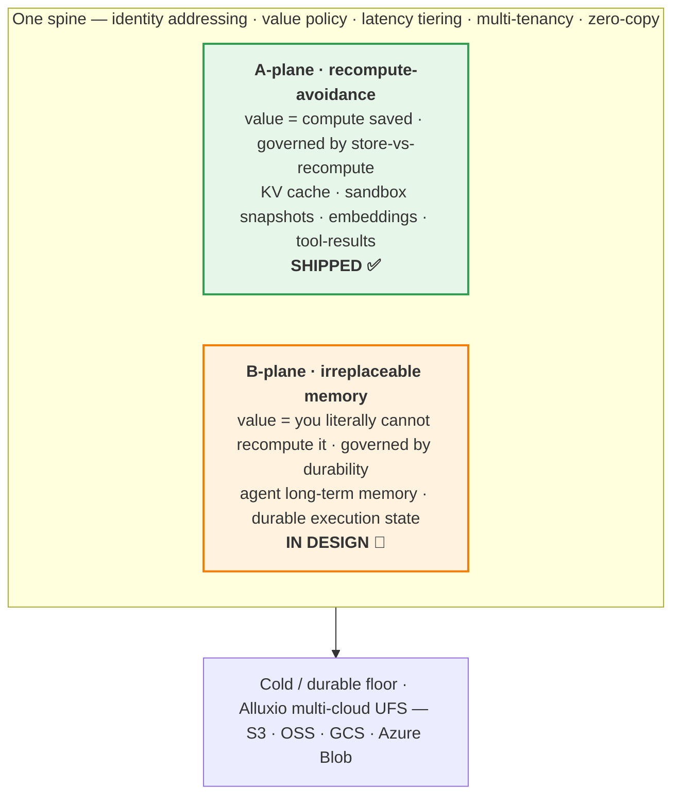

# kvcache

> **The open data plane for AI state.**
>
> Identity-addressed. Economically self-aware. Multi-tenant. Vendor-neutral.
> One spine for every state an AI system can't afford to lose — or to recompute.

[](https://github.com/Stephen-Pu/kvcache/actions)
[](LICENSE)
[](https://en.cppreference.com/w/cpp/20)
[](https://go.dev/)
[]()
[]()

---

**Most "AI state" infrastructure is a fraction of what a state layer should be. Here is the whole thing:**

```mermaid
flowchart TB
    T["a unit of AI state arrives<br/>KV block · checkpoint · sandbox · agent memory"]
    T --> ID["1 — Identity / lineage addressing<br/>keyed by what produced it, not by a path"]
    ID --> BRAIN{"2 — Economic brain<br/>store, or recompute?"}
    BRAIN -->|cheaper to keep| TIER["3 — Latency tiering<br/>HBM → DRAM → NVMe → cold · there is no cold state"]
    BRAIN -->|cheaper to redo| RC["recompute — the layer steps aside"]
    TIER --> FORK["4 — O&#40;1&#41; fork / branch<br/>copy-on-write, for exploration & speculation"]
    FORK --> EVICT["5 — Cost-based eviction<br/>drop what is cheapest to rebuild, not LRU"]
    EVICT --> ZC["6 — Zero-copy across nodes<br/>state migrates to compute, or compute routes to state"]
    ZC --> WRAP["wrapped in HARD multi-tenancy + vendor-neutrality<br/>what enterprises need · what no state store offers"]
    WRAP --> V["= a distributed memoization layer for AI state"]
    style BRAIN fill:#fff3e0,stroke:#f57c00,stroke-width:2px
    style V fill:#e6f7ea,stroke:#2e9e50,stroke-width:3px
    style RC fill:#f5f5f5,stroke:#999,color:#666
    style WRAP fill:#eef4ff,stroke:#2e5aac
```



<sub>Six primitives on one spine, plus the two things enterprises can't live without. **No shipping product implements all of them** — the gap analysis is below. We built the spine, economic brain included, and shipped the hardest plane first.</sub>

---

## The bottleneck moved. From data to state.

For a decade, infrastructure optimized **data at rest** — store it cheap, keep it forever, tier it cold.
Then AI stopped answering questions and started **doing work**, and a different kind of data took over:
**state in motion.**

KV caches. Checkpoints. Sandboxes. Agent memory. Execution state. Short-lived, latency-critical,
either reconstructable-at-a-cost or outright irreplaceable — and with **no cold tier to fall back on.**
A stale checkpoint restored a second late idles a GPU cluster. A missing KV block reruns prefill and
burns the FLOPs twice. A lost agent memory is gone for good.

The industry is scrambling to name this moment — *"State Lake," "context storage," "KV-centric infra."*
But **every incumbent answer is closed:** welded to one hyperscaler's cloud, or one vendor's silicon.

> **There is no open, neutral, economically-governed data plane for AI state.**
> That is the gap. That is what we are building.

---

## What "state" actually is

Strip away the marketing and KV caches, checkpoints, sandbox snapshots and agent memory share **one shape**:

- their value is **the recomputation they avoid** — or, when they can't be recomputed, the fact that they're **irreplaceable**;
- they are **addressed by identity** — *what produced them* — not by a file path;
- they live on a **latency continuum** from GPU memory to cold object storage, with **no meaningful cold tier**.

So we don't model state as a filesystem or an object store. We model it as what it is:

> ### State storage is **distributed memoization** —
> an identity-addressed, economically-governed cache of computation.
> *Checkpoint = memoized training. KV = memoized prefill. Sandbox = memoized environment. Memory = memoized experience.*

Those six primitives at the top aren't a wish-list. Each is genuinely hard — which is precisely why every
real implementation is *partial*:

| # | A real state layer must… | Why it's hard |
| :- | :--- | :--- |
| 1 | **Address by identity / lineage** — key state by *what produced it* | so it can answer *"have I computed this before?"* — the precondition for reuse |
| 2 | **Decide store-vs-recompute at runtime** — the *economic brain* | most systems blindly store or blindly recompute; the right call is per-block |
| 3 | **Tier by latency-to-compute**, HBM→DRAM→NVMe→cold | not temperature tiering — there is no "cold" state |
| 4 | **Fork / branch in O(1)** (copy-on-write) | agent exploration, speculative decode, param sweeps all need cheap divergence |
| 5 | **Evict by recompute cost, not recency** | LRU throws away the block that was most expensive to make |
| 6 | **Address across nodes, zero-copy** | state migrates to compute, or compute routes to state |

Plus the two things enterprises can't live without and no state store offers: **hard multi-tenancy** and **vendor-neutrality.**

---

## Two planes, one spine

Not all state is equal. The single sharpest cut is **can it be recomputed?**



Here is the uncomfortable truth the market misses: **it over-indexes on the A-plane cache — the part
that is *optional* — and under-serves the B-plane memory that genuinely *cannot be lost.*** Everyone is
racing to cache KV. Almost no one is building the open, governed layer for the agent memory and
execution state that has no recompute fallback at all.

We build **both**, on **one spine**, and we're **honest about which is shipped.**

---

## Why the incumbents don't close this gap

The strongest players have each built **one instance, mechanism-only, and locked.**

| | What it is | What it's missing |
| :-- | :-- | :-- |
| **NVIDIA Dynamo / KVBM** | The most complete engine — identity addressing, 4-tier, zero-copy | **No economic brain** (store-vs-recompute is outsourced to an external scheduler); **KV-instance only**; **NVIDIA-locked** |
| **Mooncake / LMCache** | Excellent distributed KV pools | KV only · single-cloud · single-tenant · no economic brain |
| **火山 "State Lake" / hyperscaler** | A broad narrative over existing block/file/object products | No unifying abstraction; **cloud-locked**; the umbrella has no spine |

The pattern is clear: **mechanism exists, in silos; the unifying, economically-governed, open, multi-tenant
spine does not.** The strongest player (KVBM) proves the point — it deliberately leaves the *economic decision*
to someone else, covers exactly *one* of the state instances, and runs *only* on NVIDIA.

**We built the spine, with the economic brain in it, open, on the plane that matters most first.**

---

## The proof: we shipped the hardest instance first

We didn't lead with a manifesto. We took the most expensive, most latency-sensitive A-plane instance —
**KV cache** — and shipped it end-to-end, economic brain included.

```
       17.5× faster.     94% cheaper.     $8M saved per cluster per year.
```

**One 100K-token RAG query, traced end-to-end:**

|                              |   Cold start |   With kvcache |          Δ |
| :--------------------------- | -----------: | -------------: | ---------: |
| End-to-end latency           |     **525 s** |        **30 s** | **17.5×** |
| Cost per query               |        $1.17 |          $0.07 |  **−94%** |
| Annual cost / cluster        |       **$8.5 M** |     **$487 K** | **−$8 M** |

<sub>Llama-3.1-70B · 8× H100 TP · 100K prompt, 90K shared prefix · 95% steady-state hit rate · $4/h H100.
Traced projection; assumptions & math in HLD §1.3 / v2.0 §13.7. High-prefix-sharing workloads
(compliance / legal / support: 80–95%). This is the A-plane, running today.</sub>

The five things that make it work are exactly primitives 1–6 above, made real:
**identity-addressed prefix reuse · KV-aware routing (hit rate doesn't decay with cluster size) ·
five-tier storage · a runtime `store-vs-recompute` safety-net that refuses to lose to recompute ·
server-pull-only NIXL for true multi-tenant QoS.** All vendor-neutral, across vLLM / SGLang / TRT-LLM / AIBrix.

---

## Capability matrix — the vision is aggressive, the disclosure is honest

We publish exactly what is built and what is not. This table is the contract, and it updates every milestone.

| State type | Plane | Shipped | Roadmap |
| :--------- | :---: | :-----: | :------ |
| **KV cache** | A | ✅ identity addressing · 5-tier · KV-routing · economic brain · hard multi-tenancy · vendor-neutral | — |
| Sandbox snapshot | A | — | P2 · reuses the spine |
| Embedding / RAG-chunk | A | — | P2 · reuses the spine |
| Tool-result memoization | A | — | P2 · idempotent-only |
| **Agent long-term memory** | B | — | P3 · durable, governed, vector-indexed, multi-tenant |
| **Durable execution state** | B | — | P3 · lineage DAG + crash-resume; integrates Temporal-class engines |

✅ shipped · — not yet · P2/P3 roadmap. Full plan: [repositioning proposal](./KV_Cache_到_State_Storage_重定位提案_v0.md).

> **Why publish this?** Because the alternative — an umbrella with no spine and no disclosed edges — is
> exactly what the hyperscaler narratives are. Our honesty about the boundary *is* the differentiation.

---

## What works today

`make all` — **207 unit tests across 38 gtest binaries**, plus Go and Python suites; verified end-to-end on one machine.

- **L1 Engine** — BLAKE3 identity hashing · lock-free ART reads (p99 ≤ 10 µs) · persistent ART with WAL durability · cross-process Pull · per-tenant priority scheduler
- **L2 Coordination** — HRW + Bloom routing · real etcd (HTTP + gRPC v3)
- **L3 Service** — 3D quotas · 3 priority classes with anti-starvation · mTLS with auto-rotation
- **L4 Integration** — vLLM / SGLang / AIBrix / TRT-LLM over one C ABI · gRPC service · OTLP traces · Prometheus
- **K8s** — Helm chart · operator (9 resources from one apply) · `KVCacheTenant` CRD · kind E2E

### Honestly not done yet
- **Real RDMA backends** (UCX / GDR / GDS / NVLink) — interface ready, awaits IB/RoCE fabric
- **Cross-node gRPC data path** — in-process today; NIXL descriptor exchange lands in M-3
- **B-plane (agent memory, durable execution)** — **in design, not built.** Roadmap, not a claim.

An **honest MVP**: the A-plane architecture is complete and verified; hardening and the B-plane are next.

---

## Where this is going

> **Our bet:** within three years, every serious enterprise AI platform will run a dedicated **state data
> plane** — separate from any inference engine, multi-tenant by design, integrated with multi-cloud
> infrastructure rather than reinventing it, and **open** rather than locked to one cloud or one chip.

The recompute-avoidance plane is shipped. The frontier no incumbent owns is the **B-plane**: where an
agent's **memory** and its **in-flight execution state** become durable, governed, portable, and
vendor-neutral. That's the half of "AI state" the market keeps naming and never building openly.

*(The repo is named `kvcache` because KV is the plane we shipped first. The platform is state.)*

---

## Architecture · API · Quickstart

Four layers, twelve subsystems, **83 traceable design decisions** — every line of code references the
decision it implements. **Six verbs, one C ABI** (`lookup / reserve / publish / fetch / seal / release`
+ event subscribe) — the same substrate every future state type plugs into. Async-first, zero-copy,
tier-opaque.

```bash
git clone https://github.com/Stephen-Pu/kvcache.git && cd kvcache
python3 -m venv .venv && source .venv/bin/activate && pip install cffi pytest
make all      # zero warnings · 210/210 tests pass · ~4 min cold start
```

Design principles, API surface, and full setup: [HLD](./KV_Cache_HLD_高阶架构设计.md) · [BUILD.md](./BUILD.md).

---

## Acknowledgments

Standing on the shoulders of: **vLLM** · **SGLang** · **Mooncake** (FAST'25) · **LMCache** ·
**NVIDIA Dynamo / NIXL** · **3FS** / **DAOS** · **Alluxio** · **BLAKE3** · **etcd** · **gRPC**.

## License

[Apache-2.0](./LICENSE)

---

<sub>Built by [Stephen Pu](https://github.com/Stephen-Pu). 6 first principles · 83 traceable design decisions.
Vision aggressive, disclosure honest — the capability matrix is the contract.</sub>
