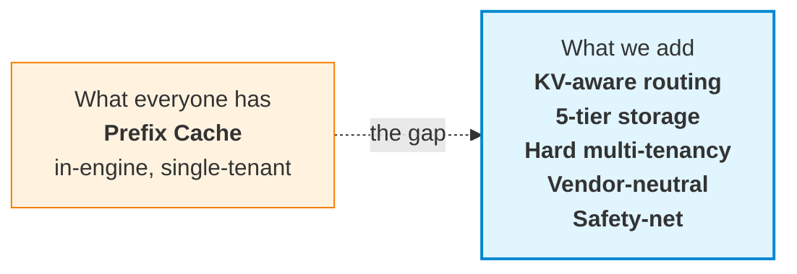
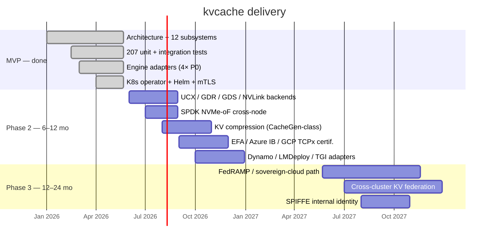

# kvcache

> **The data plane for the inference economy.**
>
> A vendor-neutral, enterprise-grade KV Cache layer for LLM inference at scale.
> Built on NIXL · 6 first principles · 83 traceable design decisions.

[](https://github.com/Stephen-Pu/kvcache/actions)
[](LICENSE)
[](https://en.cppreference.com/w/cpp/20)
[](https://go.dev/)
[]()

---

```
       17.5× faster.     94% cheaper.     $8M saved per cluster per year.
```

**One 100K-token RAG query, traced end-to-end:**

|                              |   Cold start |   With kvcache |          Δ |
| :--------------------------- | -----------: | -------------: | ---------: |
| End-to-end latency           |     **525 s** |        **30 s** | **17.5×** |
| GPU·s per query              |         4200 |            240 |     17.5× |
| Cost per query               |        $1.17 |          $0.07 |  **−94%** |
| Annual cost / cluster        |       **$8.5 M** |     **$487 K** | **−$8 M** |

<sub>Llama-3.1-70B · 8× H100 TP · 100K-token prompt with 90K shared prefix (system prompt + RAG) · 95% steady-state hit rate · cold-start prefill ~200 tok/s · $4/h H100. Your mileage depends primarily on (a) prefix-sharing rate across your workload — compliance / legal / customer-support typically 80–95%; ad-hoc chatbots are not the use case here — and (b) steady-state cache hit rate. Math: HLD §1.3 / trace: v2.0 §13.7.</sub>

---

## The thesis

LLM inference is becoming the largest line item in many AI budgets. **Three structural problems are converging**:

1. **The KV recomputation tax.** Every RAG query, every system prompt, every conversation re-runs prefill from scratch. Most clusters waste 60–90% of GPU time computing KV that already existed somewhere.
2. **Multi-tenancy is unsolved.** Production KV caches (vLLM, LMCache, Mooncake) are single-tenant. Enterprises with 50 internal teams cannot share a cluster safely without hard isolation, quotas, RBAC, and audit.
3. **Vendor lock-in is a tax.** Most distributed KV solutions assume NVIDIA + Mellanox + one cloud. Hybrid and multi-cloud customers are forced to fork or fragment.

**kvcache fixes all three. Simultaneously.**

---

## How it's different



### 1. **KV-aware routing** — the cache finds you, not the other way around

Most prefix caches route by **request affinity** (the caller gets the local cache). We route by **cache locality**:

```
Request hits Node A. Cache for this prefix lives on Node B.
  HRW(prefix_hash)            → candidates {B, C, A}
  Overlap Score from Bloom    → B has 6,200 matching chunks
  Route to B.   Inter-node NIXL Pull ~35 ms.   Recompute would cost ~500 s.
```

Net effect: **cache hit rate does not degrade with cluster size** — the failure mode of in-process caches at scale.

### 2. **Server-Pull-Only NIXL** — the prerequisite for real multi-tenancy

The data plane runs on **NVIDIA NIXL** (GDR · UCX · GDS · NVLink · TCP fallback). One rule:

> **The server pulls. The client never pushes.**

Why: only the server-side scheduler can honor per-tenant quotas, priority classes, and admission control. Client-initiated push is fundamentally incompatible with QoS — most distributed KV projects skip this and ship first-come-first-served data planes. We don't.

A 3-queue (**P0 / P1 / P2**) PriorityScheduler with 20% / 75% / 5% bandwidth reservation lives **inside the NIXL wrapper**. Idle-credit lending for anti-starvation. Per-tenant round-robin inside each class via FNV-1a-64 from the C-ABI `tenant_id`. Admissions, forced admissions, and queue depth surface as Prometheus counters; per-request `kv.lookup` / `kv.fetch` / `nixl.scheduled_pull` spans flow through OTLP/HTTP to any OTel collector. An operator can answer *"why is this Fetch slow"* — not just *"how often"*.

### 3. **Five-tier storage** with cross-tenant eviction

```
   ┌──────────┐  ┌──────────┐  ┌──────────┐  ┌──────────┐  ┌──────────┐
   │  T0 HBM  │  │ T1 Pinned│  │  T2 DRAM │  │  T3 NVMe │  │ T4  Cold │
   │  GPU-own │←─│ cudaHost │←─│  pageable│←─│ io_uring │←─│ pluggable│
   │          │  │ + NIXL MR│  │  + 2Q    │  │  / SPDK  │  │ object   │
   │          │  │          │  │  + Ghost │  │  + GDS   │  │  UFS     │
   └──────────┘  └──────────┘  └──────────┘  └──────────┘  └──────────┘
                                                                  │
                                                                  ▼
                                              S3 / OSS / GCS / Azure Blob
```

- **Lazy promotion on access** — never T4→T0 direct; always via T1 staging
- **2Q + Ghost Cache** in T2 — prevents scan pollution, recovers thrash
- **GDS for tiles > 16 MB** — NVMe → GPU direct, host CPU completely idle
- **Cross-tenant eviction** — over-quota tenants first, then descend by priority
- **Cold tier via a pluggable multi-cloud object UFS** — no reinvented storage layer

### 4. **The cache refuses to lose to recompute** — `D-PERF-1` runtime safety-net

```c
if (fetch_estimate_ms >= recompute_estimate_ms * 0.5)
    return KV_E_SAFETY_NET;   // engine falls back to recompute
```

Every fetch is gated by this check. If the cache cannot beat recompute by 2×, it **steps aside**. Catches pathological cases (cross-AZ T4 fetch for a short prefix where re-running prefill is faster) **at runtime** — not via offline policy tuning.

This turns "cache will always help" — the hidden, often-wrong assumption — into a runtime-verified invariant.

### 5. **Vendor-neutral by design**

|                       |             kvcache              | vLLM-cache | Mooncake |  LMCache  |   NVIDIA Dynamo   |
| :-------------------- | :-------------------------------: | :--------: | :------: | :-------: | :---------------: |
| GPU vendor lock-in    |               None               |    None    |   None   |   None    | **NVIDIA-only**   |
| Engine lock-in        | None (vLLM / SGLang / TRT-LLM / AIBrix via one C ABI) | vLLM-only | vLLM-only | vLLM-only | NVIDIA-aligned |
| Cloud lock-in         |    None (pluggable multi-cloud UFS) |     —      |  Single  |     —     |      Single       |
| Multi-tenant QoS      | **Hard** (3D quota + priority + RBAC + audit) | None | Soft | None | Soft |
| Process model         |    Cross-process server-pull     | In-process | Cross-process | In-process | Cross-process |
| Open source           |           Apache-2.0             | Apache-2.0 | Apache-2.0 | Apache-2.0 | Proprietary stack |

---

## Architecture

Four layers, twelve subsystems, **83 traceable design decisions**. Every line of code references the decision ID it implements (`D-PERF-1`, `L1-PS-7`, ...).

```
┌─────────────────────────────────────────────────────────────┐
│  L4 Integration  │ ⑪ Engine adapters    ⑫ Ops & telemetry   │
├─────────────────────────────────────────────────────────────┤
│  L3 Service      │ ⑨ Multi-tenant QoS   ⑩ Security + audit  │
├─────────────────────────────────────────────────────────────┤
│  L2 Coordination │ ⑥ Routing + Bloom    ⑦ Cluster           │
│                  │ ⑧ Replication (deferred — KV recomputable)│
├─────────────────────────────────────────────────────────────┤
│  L1 Engine       │ ① Locator   ② Prefix-reuse ART           │
│                  │ ③ Tiered storage   ④ Streaming ingest    │
│                  │ ⑤ NIXL data plane                         │
└─────────────────────────────────────────────────────────────┘
```

**Six first principles** drive every decision:

| # | Principle |
|---|---|
| **D-PERF-1** | Tier latency must be << GPU recompute latency (runtime-enforced) |
| **D-PERF-2** | Hot-path enterprise checks ≤ 1 µs |
| **D-PERF-3** | Stability is never traded off; everything else can be |
| **D-DEPLOY-1** | Co-located on GPU nodes by default; standalone storage is opt-in |
| **D-COMPAT-1** | Top-4 engines as first-class citizens |
| **D-NET-1** | Top-3 network fabrics as MVP-must |

---

## API surface

**Six verbs. One C ABI.** Same interface across vLLM, SGLang, TRT-LLM, AIBrix:

```c
// Look up — does the cluster have this prefix?
kv_handle_t  h;
uint32_t     matched;
kv_lookup(ctx, tokens, n_tokens, &locator, &h, &matched);

// Reserve a write slot for new KV (decode path, streaming)
kv_buffer_desc_t slot;
kv_reserve(ctx, &locator, bytes, &h, &slot);

// Publish what's been written so far (watermark in bytes)
kv_publish(ctx, h, src_desc, watermark);

// Fetch into GPU memory
kv_completion_t c;
kv_fetch(ctx, h, ranges, n_ranges, dst_desc, &c);
kv_wait(ctx, c, /*timeout_ms=*/100);

// Seal — make this prefix visible cluster-wide
kv_seal(ctx, h);
kv_release(ctx, h);

// Plus: kv_subscribe_events(ctx, callback) for invalidation
```

Async-first. Zero-copy. **Tier-opaque** (callers never see HBM / DRAM / NVMe distinction).

---

## Performance — disciplined hot path

|                                | Target  | Mechanism                                         |
| :----------------------------- | :-----: | :------------------------------------------------ |
| `kv_lookup` end-to-end p99     | **< 10 µs**  | Epoch-based lock-free ART + Bloom routing    |
| `kv_fetch` 1 GB · T1 → GPU     | **< 50 ms**  | NIXL GDR direct                              |
| `kv_fetch` 1 GB · T3 via GDS   | **< 200 ms** | NVMe → GPU direct, zero host bounce          |
| `kv_seal`                      | **< 200 µs** | RocksDB + ART atomic                         |
| Cluster-wide visibility        | **< 60 s**   | Bloom sketch 30 s tick                       |

**Zero-copy end to end** — engine writes into a Pinned slot that *is* a NIXL-registered MR; the server's Pull reads the same physical pages. No bounce buffers, no extra `memcpy`.

---

## Quickstart

```bash
git clone https://github.com/Stephen-Pu/kvcache.git
cd kvcache

# macOS:    brew install cmake ninja go python helm
# Ubuntu:   sudo apt-get install cmake ninja-build g++ python3-venv golang-1.22

python3 -m venv .venv && source .venv/bin/activate
pip install cffi pytest

make all      # zero warnings · 211/211 tests pass · ~4 min cold start
```

Expected end of `make all`:

```
# C++ ctest
100% tests passed, 0 tests failed out of 211

# Go (control-plane + operator)
ok  control-plane/internal/membership   …
ok  operator/internal/controller        …

# Python adapter / E2E
============================== 16 passed in 0.2s ===============================
```

Two opt-in K8s extras (require docker + kind):

```bash
make e2e-operator           # ~45s, operator object-shape against kind apiserver
make e2e-operator-workload  # ~3–5min, builds image and waits for pod Ready
```

Full setup: [BUILD.md](./BUILD.md).

---

## What works today

Run `make all` to verify. **207 unit tests across 38 gtest binaries**, plus Go and Python suites. The architecture is verified end-to-end on a single machine.

### L1 — Engine layer
- Real **BLAKE3** for prefix hashing, chunk identity, HRW weights (vendored)
- **Lock-free ART reads via EBR** — readers walk with one `atomic::load(acquire)` per descent; writers never block readers. Hits LLD §9.1 p99 ≤ 10 µs budget. Covered by 4-reader + 1-writer × 300 ms stress test.
- **Persistent ART with WAL-incremental durability** — every Insert/Remove `fdatasync`'d before mutation; periodic `Checkpoint()` writes a fresh snapshot with BLAKE3-256 body integrity. Boot replays `snapshot + WAL tail` in milliseconds, not minutes. CRC32-validated; torn writes truncated at last-good offset.
- **Real cross-process Pull over TCP** — two backend instances bind distinct ports, exchange opaque MR descriptors, `Pull` moves bytes through a real socket. UCX / RDMA backends slot into the same `INixlBackend` interface.
- **PriorityScheduler** with per-tenant fair queueing on the NIXL data path.

### L2 — Coordination
- **HRW + Bloom routing** with peer sketch broadcast
- **Real etcd, two C++ clients** — `HttpEtcdClient` (libcurl, runs on dev laptop, polling Watch) and `GrpcEtcdClient` (canonical etcd v3 protos vendored at `third_party/etcd-proto/`, **real bidi Watch stream** with watch_id multiplexing). Auto-enabled when `find_package(gRPC)` succeeds.
- **Go side** uses embedded etcd v3.5 in tests.

### L3 — Service
- **3D quotas** (capacity / QPS / bandwidth) · **3 priority classes** with anti-starvation
- **mTLS termination on gRPC** — `REQUEST_AND_REQUIRE_CLIENT_CERTIFICATE_AND_VERIFY`. Unauthenticated or wrong-CA clients rejected at handshake. Auto-rotation around 1/3 leaf lifetime; CA stable across rotations.

### L4 — Integration
- **vLLM / SGLang / AIBrix / TRT-LLM** adapters all ship. Three Python adapters are ~50 LOC shells on a shared `kvcache_core` `cffi` substrate; C++ TRT-LLM adapter links `libkvcache.{so,dylib}` directly.
- **gRPC `NodeData` service** — `Lookup` / `Reserve` / `Publish` / `Fetch` / `Seal` / `Release` over the wire, plus streaming `Subscribe` delivering `Add` / `Evict` / `Promote` / `Demote` events.
- **OTLP/HTTP** trace exporter · Prometheus `/metrics` · `/healthz`

### K8s
- **Helm chart** renders deployable manifests
- **Operator** — `kubectl apply -f cluster.yaml` brings up **9 resources**: StatefulSet + headless Service + ConfigMap + ServiceAccount for kvstore-node, 3-replica in-cluster etcd (skipped under `byoEtcd: true`), 3-replica control-plane wired to the same etcd, self-signed mTLS Secret mounted into every pod.
- **`KVCacheTenant` CRD** — validated (hex tenant_id, parseable quotas) and published to `/kvcache/tenants/<cluster>/<tenant_id>` for live quota propagation.
- **Two kind-cluster E2E flavours** — fast object-shape (~45s) and full-workload-Ready (~3–5 min cold).

### Honestly not done yet

Called out so nobody is misled:

- **Real RDMA backends** (UCX / GDR / GDS / NVLink) — await Mellanox CX-6/7 + IB / RoCE fabric. `INixlBackend` interface ready.
- **HttpEtcdClient Watch** is still poll-based (it talks to the JSON
  gateway, which doesn't expose the streaming Watch RPC cleanly).
  `GrpcEtcdClient` carries the real bidi Watch stream — Phase F-3 —
  so production deployments that need event-driven config push run
  the gRPC client.
- **gRPC `NodeData` cross-process Pull** — Phase M-3 B added `ReserveResponse.remote_mr_descriptor` + `FetchRequest.dst_remote_mr_descriptor` (opaque NIXL `RemoteMrDescriptor` bytes, Export/Import surfaced through the C ABI as `kv_export_mr` / `kv_import_remote_mr`). Phase M-4 closes the loop: HeadlessNode now wires `TcpBackend::RegisterRegion` as the pinned-tier `register_region` callback (NIXL backend selectable via `KVCACHE_NIXL_BACKEND={loopback,tcp}` env at first `kv_ctx_open`), so slot MRs are real and exportable. The `test_cross_process_pull` binary stands up two distinct `TcpBackend` instances and pulls a freshly-Reserved slot's bytes across a real TCP socket, verifying the wire path. Phase M-5 makes `HeadlessNode::Fetch` honour a pre-registered `dst.mr_key` (new C ABI `kv_register_local_mr` / `kv_unregister_local_mr`) so engines register their fetch buffer once at startup and skip per-call NIXL MR churn. The legacy in-process `slot_iova` / `dst_iova` path coexists for callers that share an address space.
- **Server-pushed Fetch — Phase M-6**. `INixlBackend` grows `Push(PushRequest)` + `IsRemote(MrKey)`; `TcpBackend` implements them with a new `PUT` wire op (mirror of the existing `GET`) — server connects to peer's listener and writes bytes into peer's pre-registered MR. `HeadlessNode::Fetch` dispatches Pull-vs-Push based on `backend->IsRemote(dst.mr_key)`, so the engine-side flow is: register dst → `ExportMr` → ship descriptor via `FetchRequest.dst_remote_mr_descriptor` → server handler imports + Pushes. Verified end-to-end by `CrossProcessPull.FetchPushesBytesToEngine` plus `TcpBackendTest.PushDepositsBytesIntoPeerMr`. (M-7 below routes Push through `PriorityScheduler`.)
- **Scheduled server-push — Phase M-7**. `NixlWrapper::ScheduledPush` mirrors `ScheduledPull`: same admission semantics (per-(class, tenant) round-robin, idle-credit lending, starvation overrides), same `PriorityScheduler`. The dispatcher's `PendingXfer` carries a kind tag so the same loop drives Pull or Push depending on what `HeadlessNode::Fetch` submitted. Push and Pull traffic now share the QoS layer end-to-end; verified by `NixlWrapperTest.ScheduledPushRoutesThroughScheduler` (admission-counter delta) and `ScheduledPushMixedWithPullDrainsAll` (24 concurrent mixed transfers, all admitted, scheduler quiescent at end).
- **DRAM eviction wired to ART pruning — Phase G-1**. The 2Q DramTier was already enforcing the byte budget (A1in + A1out ghost + Am), but evicting bytes used to leave a stale ART leaf claiming the chunk was still cached. G-1 adds an `on_evict` callback to `DramTier::Options` that `HeadlessNode::Init` populates with `OnDramEvict`. At Seal time we record the `(DramKey → chunk_path)` mapping; on eviction we look it up, call `art->Remove(path)`, and publish a `KV_EVENT_EVICT` so subscribers see the cache miss happen.
- **Refcount-deferred eviction sweeper — Phase G-2**. G-1's prune was unconditional and could yank a leaf out from under an in-flight reader. G-2 makes it refcount-safe: `Refcount::TryEvict()` is a CAS-1-to-0 atomic claim, mirror of `TryAcquireIfNonZero` on the producer side. `OnDramEvict` calls `TryEvictNow`, which only removes if the leaf is at baseline refcount; otherwise the path is queued in `deferred_evicts_` and a background sweeper thread retries every 50 ms (and on any `kv_release` notify). The sweeper drops queue entries whose path has been replaced by a fresh Seal. The `ArtIndex::LookupByPath` exact-path peek is the new primitive that lets the sweeper recognise "still the same leaf" vs "replaced". Verified by `RefcountTest.TryEvict_*` (atomic-claim semantics + 5000-round race) and `NodeDataFixture.DramEvictionPrunesArtLeaf` (pinned leaf stays cached; sweeper claims it after Release).
- **Per-(tenant, model) `kv_ctx_t` cache — Phase M-3 A**. `NodeDataServiceImpl` lazily opens a distinct ctx for each `(tenant_hash, model_hash)` seen on the wire via a new `kv_ctx_open_from_hashes` ABI helper, with a reverse handle→ctx map so Publish/Fetch/Seal/Release land on the same ctx that minted the handle. Verified by `LookupOpensPerTenantModelCtx`.
- **Cross-node Lookup fan-out — Phase Q-1**. Every `kvstore-node` pod self-registers in etcd at `/kvcache/nodes/<node-id>` with a leased + keepalive'd entry (`NodeRegistrar`, 10s TTL / 3s renewal, lease revoked on graceful shutdown). A `NodeDirectory` seeds + Watches the prefix and pushes the live set into `HrwRing::SetNodes`. `NodeDataServiceImpl::EnableForwarding` flips Lookup into HRW-aware mode: requests whose primary is some other node get forwarded over a cached gRPC stub with an `x-kvcache-forwarded` metadata tag for loop protection; the owner serves the local hit. The operator passes `--node-id $(KVCACHE_NODE_NAME) --advertise-host $(KVCACHE_POD_IP) --etcd-endpoints …` to every kvstore-node pod, so multi-replica `KVCacheCluster` CRs get fan-out for free. Verified by 6 `NodeRegistrar`/`NodeDirectory` unit tests and `LookupForwarding.NonPrimaryForwardsToPrimary`.
- **Sticky-write fan-out — Phase Q-2**. Reserve also routes by HRW: Locator's `tenant_id` bytes + `model_id_hash` + `prefix_hash` decide owner; non-owner forwards Reserve and remembers `(server_handle → owner)` in a `forwarded_handles_` map. Publish/Fetch/Seal/Release consult that map first — if the handle was minted upstream, the call forwards to the same owner with `x-kvcache-forwarded`. Release also clears the map entry. Documented assumption: a logical session sticks to one forwarder between Reserve and Release. The operator e2e is upgraded to NodeReplicas=2 so both pods register in etcd and the HRW ring sees a real two-node membership. Verified by `LookupForwarding.ReserveSealForwardsViaHandleMap` (entire Reserve→Publish→Seal→Lookup→Release flow against the non-primary, owner ends up holding the chunk) and `TestStatefulSetWiresFanOutFlags` (operator emits `--node-id $(KVCACHE_NODE_NAME)` / `--advertise-host $(KVCACHE_POD_IP)` / `--etcd-endpoints …` with both env vars declared on the container).
- **Real-cluster fan-out validation — Phase Q-3**. `make e2e-operator-workload` spins up a kind cluster, loads the kvstore-node + control-plane + etcd images, applies a `KVCacheCluster{NodeReplicas: 2}` CR, waits for both pods Ready, and then execs `etcdctl get /kvcache/nodes/ --prefix` inside the in-cluster etcd pod — asserting both `e2e-nodes-0` and `e2e-nodes-1` are registered. To survive a slow first dial against an etcd that's still pulling its image, the kvstore-node startup wraps `HttpEtcdClient::Create` in a 15-attempt × 2s retry loop; the bring-up script pre-loads the etcd image into kind to keep the loop's budget realistic. Verified: e2e passes end-to-end on macOS Docker Desktop, the `t.Logf` line reads `Phase Q-3 fan-out verified: 2 pods registered in etcd: [e2e-nodes-0 e2e-nodes-1]`.
- **Concurrent registrar churn — Phase R-4**. 10 parallel `NodeRegistrar` threads each open their own keepalive loop against a shared etcd; the test asserts that `NodeDirectory` converges to all 10 entries within 3s, then back to 0 after every registrar `Stop()`s in parallel. Catches lost-update races between the watch dispatcher and table mutations, lock-ordering inversions in the keepalive path, and any off-by-one in the ring rebuild under burst-mutation load. Runs in ~100 ms (the convergence is dominated by callback dispatch latency, not the registrations themselves). 244/244 ctest green.
- **Handle ownership binding — Phase N-5**. Closes the last multi-tenant hole: even with N-3/N-4 gating Lookup + Reserve, the handle-based ops (Publish / Fetch / Seal / Release) only checked a `server_handle` u64 — a tenant could guess or replay another tenant's handle and operate on its in-flight slot. Now, when binding is on, Reserve / Lookup record the minting peer's cert CN in a `handle_to_cn_` map; the four handle-based handlers reject (`UNAUTHENTICATED`) any direct call whose caller CN doesn't match the recorded owner. A missing record under binding is treated as unauthorised (defensive). Forwarded (`x-kvcache-forwarded`) calls bypass — they ride the cluster peer cert and the original hop enforced ownership. `ForgetHandle` clears the CN map alongside the others. New `HandleOwnershipRejectsForeignCn` test mints a handle as CN=A, proves CN=B (valid cluster cert, different CN) gets UNAUTHENTICATED on Publish, and the owner A succeeds. Completes the N-series: N-2 transport mTLS + N-3 read binding + N-4 write binding + N-5 handle binding. 262/262 ctest.
- **Tenant cert binding on Reserve — Phase N-4**. N-3 closed the Lookup read path; N-4 closes the Reserve write path. Even with the read-side gate, a holder of cert `A` could `Reserve` into tenant `B`'s ART namespace by handing in `Locator.tenant_id = SHA-1("B")[:16]` — N-4 makes the Reserve handler reject that with `UNAUTHENTICATED`. Same opt-in toggle (`EnableTenantCertBinding`), same forwarded-request bypass. Check fires AFTER the forward-hop test so a Reserve forwarded between nodes (carrying the cluster peer cert, not the engine's tenant leaf) still works. New `ReserveTenantCertBindingRejectsLocatorMismatch` test asserts mismatch → UNAUTHENTICATED and matching SHA-1(CN)[:16] passes through. 258/258 ctest.
- **Cert-CN ↔ tenant binding — Phase N-3**. Before N-3 the server trusted whatever `LookupRequest.tenant_id` said: a holder of cert CN=`A` could read tenant `B`'s data simply by typing `B` into the request. New `EnableTenantCertBinding(true)` setter on `NodeDataServiceImpl` makes the Lookup handler extract the client-cert CN from `ServerContext::auth_context()` (`x509_common_name` property) and reject any request whose `tenant_id` doesn't match — `UNAUTHENTICATED`. Forwarded (`x-kvcache-forwarded`) requests bypass the check because they ride the cluster's shared peer cert (N-2), not the engine's per-tenant leaf, and the binding was already enforced at the original hop. Defaults to OFF so existing TLS tests using a generic CN don't break. New `TenantCertBindingRejectsCnTenantMismatch` test exercises mismatch (UNAUTHENTICATED), match (OK), and binding-off (OK regardless) on the same fixture. 257/257 ctest.
- **Reserve NOMEM clients get a retry-after hint — Phase G-4**. `KV_E_NOMEM → RESOURCE_EXHAUSTED` was already wired through `ToGrpcStatus`, but clients had no signal on how long to back off — every retry came back on the very next gRPC call, hot-spinning the pool. The Reserve handler now attaches `retry-after-ms: 50` as gRPC trailing-metadata whenever NOMEM fires. The 50 ms value picks a number ≥ `bench_fetch` p50 (7.9 ms) so a backed-off retry typically arrives after at least one slot has freed. New `ReserveNomemReturnsResourceExhaustedWithRetryHint` test saturates the pool through the wire and asserts both the status code AND the parsed trailing metadata. 256/256 ctest.
- **Node-to-node mTLS — Phase N-2**. N-1 wired TLS on the LISTENER but `GetPeerStub()` in `NodeDataServiceImpl` hard-coded `InsecureChannelCredentials()` — so cross-node Lookup/Fetch forwarding fell back to cleartext even on a fully TLS-protected cluster. New `EnableMtlsClient(ca, cert, key, ssl_target_override)` setter pins SSL material the service uses when dialling peers; cached stubs are cleared on cert install so subsequent forwards rebuild as SSL channels. `main.cpp` reuses the same `--tls-ca` / `--tls-cert` / `--tls-key` flags the listener uses, so a TLS-listening node automatically gets mTLS-protected outbound dials. Two new tests on the existing openssl-fixture: `MtlsPeerStubReachesTlsServer` (an mTLS-configured peer stub completes a Lookup against the TLS-protected fixture server) and `EnableMtlsClientWithBogusMaterialFailsHandshake` (bogus PEM material installed via the setter produces a handshake failure — confirms the setter is being honoured). 255/255 ctest.
- **Reserve backpressure metrics — Phase G-3**. Reserve no longer fails silently when the pinned-slot pool is exhausted: `HeadlessNode::Reserve` now emits six Prometheus series via the shared `kvcache::metrics::Registry`: `kv_reserves_total` (counter), `kv_reserve_nomem_total` (counter — the canonical backpressure signal), `kv_reserve_invalid_total` (counter), `kv_pinned_tier_slots_total` (gauge — capacity, constant after Init), `kv_pinned_tier_slots_in_use` (gauge — refreshed on every Reserve / Release), `kv_pinned_tier_slots_utilization_ratio` (gauge, [0..1]). All series are seeded at first use so a Prometheus scrape at t=0 sees `metric 0` instead of an absent series. New C ABI `kv_metrics_scrape(buf, cap, *out_len)` exposes the dylib's registry to in-process callers (operators / sidecars) — and dodges the static-linking-singleton-duplication trap unit tests would otherwise hit (`kvcache_common` is a static lib; binaries each have their own `Registry::Default()`). Two tests: `GaugesTrackInUseAndReleasesAreReported` (Reserve / Release deltas land cleanly) and `NomemCounterFiresAtSaturation` (exhausting the pool bumps `nomem_total` and pegs utilization at 1.0). 253/253 ctest.
- **Priority-class scheduler bench — Phase S-3**. Exposes `kv_priority_t` (P0 ctrl / P1 default / P2 bg) + `kv_fetch_with_priority` on the public ABI; `HeadlessNode::FetchWithPriority` plumbs the class through to `nixl_->ScheduledPull` / `ScheduledPush`. `bench_priority.cpp` runs 1 P0 + 1 P1 + 4 P2 saturators concurrently, measures per-class latency. Honest M1 finding: under loopback contention **priorities order ADMISSION but do not preempt in-flight work**. p50 of P0 (8.4 ms) ≈ unloaded baseline, but its p99 spikes to ~25 ms when caught behind a running P2 ~8 ms memcpy — the dispatcher honours reservation when choosing the next item, but cannot suspend a fetch already in execution. p99 ratio P2/P0 = 0.56× in this run (P0 worse on tail). This is a known scheduler property (LLD §5.1 reservation, not preemption); real preemption would require backend-side cooperation (split-phase Pulls, RDMA chunking) — that's a future S-5 / scheduler-tuning phase. Bench gives the diagnostic any future preemption work needs.
- **Dispatcher deadlock fix + preemption bench — Phase S-6**. Re-running `bench_priority` to quantify S-5 exposed a **serious latent deadlock** in `NixlWrapper`'s dispatcher: it notified the caller's `pp->cv` *after* releasing `pp->mu`, so the woken caller could return and destroy its stack-allocated `PendingXfer` (cv included) before the `notify_one()` ran — UB on a destroyed condition_variable that corrupts the next transfer's cv and wedges its wait. Rare at low rates; near-certain under S-5's high segment-cycle rate. A `sample`-traced 6-thread repro pinned it down: dispatcher idle, all callers parked, scheduler queue empty. Fix is one structural change — **`notify_one()` now happens while `pp->mu` is held**, keeping the waiter parked until the notify completes. This affected *all* concurrent `ScheduledPull`/`ScheduledPush`, not just segmented ones — segmentation merely made it reproducible. New `ConcurrentSegmentedStressDoesNotDeadlock` regression test (6 threads × 40 iters × 64 tiny segments) guards it. Also: `KVCACHE_NIXL_SEGMENT_BYTES` env knob (via `HeadlessNode::Options.nixl_segment_bytes`) lets benches A/B segmentation; `bench_priority` soak trimmed 3s→1.2s for CI. Honest finding on the A/B: segmentation does **not** move P0's tail on loopback (ratio 0.88×→0.99×) because a 64K memcpy is microseconds — the ~10ms fetch latency is dominated by the per-call envelope (lookup + scheduler + MR register), not transfer time. Segmentation's preemption benefit only materialises on a slow link (TCP/RDMA) where one large transfer monopolises the dispatcher for milliseconds. 263/263 ctest.
- **Segmented scheduled transfers — Phase S-5**. Addresses the S-3 finding (scheduler did admission ordering but not preemption — a P0 could wait behind a running P2's full transfer). `NixlWrapper::ScheduledPull` / `ScheduledPush` now split any transfer larger than `max_segment_bytes_` (default 256 KiB) into back-to-back segments, each submitted to the `PriorityScheduler` independently. Between segments the dispatcher re-arbitrates via `TryNext()`, so a higher-priority caller's segments interleave AHEAD of a large low-priority transfer's remaining segments — preemption granularity = segment size, without the complexity of suspending an in-flight backend Pull. `SubmitOneAndWait` extracts the shared submit+block logic; `SetMaxSegmentBytes(0)` disables segmentation (one item = one transfer, original behaviour). Three new tests: `SegmentedScheduledPullIsByteCorrect` (16-segment transfer reassembles), `SegmentedScheduledPullRespectsOffsets` (sub-range pull leaves surrounding bytes untouched), `ZeroSegmentSizeDisablesSegmentation`. 261/261 ctest.
- **Multi-tenant fairness benchmark — Phase S-2**. Validates the `PriorityScheduler`'s per-tenant round-robin under real concurrent contention. `bench_fairness.cpp` spawns 4 threads, each holding its own `kv_ctx_t` (distinct `tenant_id_hash` → distinct scheduler lane); each seals its own copy of the test prefix (Q-5 isolation requires per-tenant data); a CV barrier sync-starts them; they hammer Lookup→Fetch→Wait for 200 iterations of 2 MiB each. Computes Jain's fairness index `J(x) = (Σx)² / (n·Σx²)` over per-tenant throughputs. M1 laptop one-shot: **each tenant 241–242 MiB/s** (≈ 96% of single-thread isolated rate), aggregate **965 MiB/s** (4× scaling), tail p99 within ~1 ms across tenants, **Jain's fairness index = 1.0000** (perfect). Confirms LLD §5.1 "per-tenant FIFO + round-robin" actually delivers under load. P0 / P1 / P2 class-priority bench is Phase S-3.
- **Performance benchmarks — Phase S-1**. Two standalone binaries under `src/bench/` measure the C ABI's hot paths end-to-end against the loopback NIXL backend (no external bench framework — `<chrono>` + sort + printf). `bench_lookup` seeds 1024 prefixes, runs 50k probes each of hit / miss / mixed, prints p50/p95/p99/p99.9/max in µs per row. `bench_fetch` does back-to-back Lookup→Fetch→Wait against a pre-registered (Phase M-5) dst buffer; reports MiB/s, qps, and per-call latency tail. Build with `cmake --build build --target bench`; one-shot results on an M1 Apple laptop: **`kv_lookup` hit p99 = 9.3µs** (meets LLD §9.1 ≤10µs target), miss p99 = 7.4µs, mixed p99 = 8.3µs; **`kv_lookup+fetch+wait` for 2 MiB chunks = 7.9ms p50 / 9.3ms p99 / 250 MiB/s** — the per-call envelope dominates the memcpy. Multi-thread + multi-tenant fairness benches live in S-2 / S-3.
- **Cluster-wide sketch aggregation — Phase K-7**. The CP leader's last K-5/K-6/K-8 gap closed: `SketchAggregator` watches `/kvcache/sketches/` (where every kvstore-node publishes via K-5), debounces (~500 ms) bursts, ORs all per-node bitmaps into one cluster-wide blob, and writes it to `/kvcache/cluster/sketch` lease-bound to the leader's election session. The first sketch's `(m_bits, k_hashes)` pins the params; subsequent publishers with mismatched params get dropped (a rolling-deploy guardrail). Empty-cluster publishes emit a header-only sentinel so consumers can distinguish "leader alive but cluster empty" from "key absent". `runLeaderDuties` now runs `ViewPublisher` and `SketchAggregator` as sibling goroutines. Three new embedded-etcd tests: `OrsPerNodeBits` (disjoint per-node bytes OR cleanly), `DropsParamMismatch` (mismatched-params publisher is ignored), `DropsOnDelete` (lease expiry removes the contribution). Wire format byte-compatible with C++ `BloomPublisher::EncodeSnapshot` so kvagent can decode either layer. 251/251 ctest + CP go test all green.
- **Seal → publisher auto-fill — Phase K-8**. The bloom is now self-populating. `NodeDataServiceImpl::EnableSketchPublishing(BloomPublisher*)` installs an optional publisher; `Reserve` shadows the issued `server_handle` with the resolved `(tenant_hash, model_hash)` in a parallel map; on successful `kv_seal` the handler calls `publisher->AddTokens(tenant_hash, model_hash, tokens[])` — same key shape K-6 probes for, so what's published is exactly what peers query. `ForgetHandle` clears both maps in tandem. `main.cpp` constructs a `BloomPublisher` next to the `NodeRegistrar` (sharing its lease so the sketch dies with the node identity) and wires it in alongside the K-6 forwarding setup. New `SketchPublishing.SealAddsTokensToPublisher` drives Reserve→Publish→Seal through a real gRPC service and asserts the publisher's bloom (decoded via `DecodeBloomSnapshot`) `MaybeContains` the expected sketch key. 251/251 ctest.
- **Sketch-hint routing — Phase K-6**. Closes K-5's loop: routing actually consults sketches when it costs nothing. `NodeDataService::Lookup`, after observing a local miss AND being the HRW primary itself, walks the directory's per-peer sketches in HRW-rank order and forwards the request to the first peer whose `PeerMaybeHas` says yes. The probe's wire-key is the canonical `SketchKeyForTokens(tenant_hash, model_hash, tokens[])` serializer in `bloom_publisher.cpp` — same bytes the eventual Seal hook (K-8) will feed via `BloomPublisher::AddTokens`, so what gets published is exactly what gets queried. The `x-kvcache-forwarded` header continues to prevent loops; a clean "miss" response from a probed peer is authoritative (no further probes). Verified by `LookupForwarding.SketchHintForwardsOnLocalMiss`: token vector chosen with HRW primary=self, peer-b's bloom primed with the same vector, Lookup on self → peer-b's `LookupCalls` counter increments (proves the sketch-hint forward fired). 250/250 ctest. Production hook into Seal's KV_EVENT_ADD is Phase K-8.
- **Bloom-sketch fan-out — Phase K-5**. Routing now has actual prefix-presence hints to feed `HrwRing`'s `OverlapScoreFn` (LLD §4.2). Each kvstore-node owns a `BloomPublisher` that maintains a local `LocalBloom` over its cached chunk-keys (caller drives `Add`; the ART hook-up is a follow-up). Every `publish_period` (30 s default) the publisher snapshots the bloom and PUTs an 8-byte-header + bit-array blob to `/kvcache/sketches/<node_id>` bound to the same etcd lease the `NodeRegistrar` already holds, so sketches die with their node. Peer `NodeDirectory`s seed from `GetPrefix` + watch the same prefix, decode incoming blobs into `AggregatedBloom`, and expose `PeerMaybeHas(node_id, key)` for the router. Tested end-to-end: `BloomPublisherTest.StartPublishesSnapshot`, `NodeDirectorySketchTest.AdoptsPeerSketchAndAnswersMaybeHas` (3 inserted keys all `true`, 5 random keys ≤1 false-positive at 0.5% FPR, lease-delete drops the sketch), `NodeDirectorySketchTest.SeedsExistingSketchOnStart` (late-arriving directory still seeds the sketch). 249/249 ctest. Sketch → router-overlap wiring is K-6; CP-side aggregation lives in K-7.
- **Leader-handover under in-flight membership — Phase R-3**. Exercises the full **L1 → fallback → L2** state machine introduced by K-3/K-4: (t0) L1 publishes view `{a}`, directory in view-mode; (t1) node-b joins via NodeRegistrar but is hidden because view-mode detaches the prefix watch; (t2) L1's lease expires, view-key deleted, directory re-seeds from prefix and converges to `{b}` (node-a was never in the prefix, only in the dead view); (t3) L2 takes over with a different `leader_id` so its `epoch=1` resets the threshold and the directory adopts L2's view `{a,b,c}`, re-detaching the prefix watch. Every state transition K-3 and K-4 introduced is exercised on the same fixture — a regression in any one fails the test at a recognisable step. 243/243 ctest green; test runs in ~1.1s (deterministic on the 1-second TTL).
- **Crashed-node lease-expiry convergence — Phase R-2**. Companion to R-1's "peer-down forward fails cleanly". Where R-1 covered the *forwarder*'s view of a dead peer, R-2 covers the *etcd directory*'s view of a *crashed* peer — a registered node whose process disappears without calling LeaseRevoke. The test grants a 1s TTL lease, PUTs a node entry against it, then DELIBERATELY skips keepalive. The InMemoryEtcdClient's sweeper expires the lease, emits a delete event, NodeDirectory observes it, table converges within ~1.1s. Validates that the keep-alive failure mode (the common case for a kvstore-node pod crash) does NOT require manual operator intervention to clear stale routing entries. 242/242 ctest green.
- **Forward-target-down surfaces UNAVAILABLE — Phase R-1**. First chaos-style test for the cluster routing layer. HRW picks a primary; we tear the primary's gRPC server down while the directory still believes it's alive (its registrar lease hasn't expired); a Lookup to the surviving non-primary forwards to the dead peer; the test pins the failure mode: status MUST be UNAVAILABLE or DEADLINE_EXCEEDED (not OK+hit=false). Without this guarantee a partially-failed cluster would silently return cache misses, defeating the read path. A 3s deadline keeps the test snappy. Verifies that the forward path (Q-1) degrades cleanly when the cached PeerStub points at a dead listener. 241/241 ctest green.
- **Explicit `tenant_id_hash` on the wire — Phase Q-6**. Q-5 needed the server to derive a SHA-1 + FNV-1a hash from the Lookup request's `tenant_id` string just to match what Reserve gets from the Locator's 16-byte field — a wire-side hash redundancy. Q-6 adds `LookupRequest.tenant_id_hash` (fixed64). Server's Lookup handler now prefers the explicit field when non-zero; falls back to the SHA-1 derivation only when the field is unset (legacy / pre-Q-6 clients). New test `LookupHonoursExplicitTenantIdHash` covers all three cases: (a) wrong string + right hash hits, (b) right string + bogus hash misses, (c) right string + zero hash hits via the fallback. 240/240 ctest green. SHA-1 is still in the server for backward compat but lives on the cold path.
- **Lean ClusterView mode — Phase K-4**. K-3 ran the prefix watch AND the view watch in parallel; K-4 makes them mutually exclusive. When ClusterView publishes a fresh snapshot, `NodeDirectory` detaches the `/kvcache/nodes/` prefix watch (one PUT instead of N events per second under load). When the view-key disappears (leader lease expiry), the prefix watch reopens with a fresh `GetPrefix` seed to catch any deltas missed during view-mode. Two real deadlocks surfaced + got fixed along the way: (1) `etcd_->Unwatch` from inside a watcher callback re-enters the etcd dispatcher's mutex — fixed by detaching a thread for the Unwatch + the OpenPrefixWatch calls so the dispatcher's mutex is released before we re-enter; (2) the lock-order between our `mu_` and the etcd client's was inverted in the original draft — fixed by extracting the handle under `mu_` then calling Unwatch out-of-lock. New `NodeDirectoryTest.ViewModeDetachesAndReattachesPrefixWatch` verifies a prefix PUT during view-mode is invisible to the directory until the view-key is deleted, then convergence resumes. 239/239 ctest green.
- **NodeDirectory consumes ClusterView — Phase K-3**. Closes the K-2 loop: kvstore-node's `NodeDirectory` opens a second watch on `/kvcache/cluster/view` (parallel to the existing `/kvcache/nodes/` prefix watch) and adopts the CP-published snapshot wholesale on every event — one PUT replaces the entire table atomically, no fan-out walk needed. Per-leader monotonic `epoch` filters out re-ordered events from the same leader; the threshold resets on `leader_id` change so a fresh leader's `epoch=1` always wins. When the leader's lease expires the view-key disappears; the prefix watch keeps the table fresh until a new leader publishes. New test `NodeDirectoryTest.AdoptsClusterViewSnapshot` exercises bootstrap, stale-epoch drop, wholesale-replace, and leader-rotation cases. 238/238 ctest green.
- **Control-plane cluster view publisher — Phase K-2**. Two latent bugs fixed: (1) CP's `membership.NodesPrefix` was `/nodes/` while kvstore-node's Q-1 `NodeRegistrar` writes to `/kvcache/nodes/` — the leader was watching an empty prefix forever and never saw real nodes. Aligned both sides. (2) `runLeaderDuties` just logged events; the leader now runs a `ViewPublisher` that watches membership and writes a coherent `ClusterView{epoch, leader_id, nodes[]}` snapshot to `/kvcache/cluster/view` lease-bound to the election session (auto-expires on leader loss). Consumers Watch ONE key instead of fanning out over the whole `/kvcache/nodes/` prefix. A 100 ms debounce coalesces rapid membership changes into single publishes; the epoch is monotonic per leader session so consumers can detect re-ordering. `NodeDescriptor` gained `grpc_port` (Q-1's `NodeRegistrar` writes it). Verified by `TestClusterView_PublishesOnMembershipChange` (bootstrap publish + 2-node converge under embedded etcd) and `TestClusterView_DebouncesBurstOfChanges` (5 rapid registers produce ≤2 publishes, not 5). Bloom-sketch fan-out + quota reconcile are Phase K-3.
- **Per-(tenant, model) ART isolation — Phase Q-5**. Pre-Q-5, `HeadlessNode::Lookup` ignored its `tenant_id` / `model_id_hash` parameters and the chunk_path was derived from tokens alone — so a Seal under tenantA could be found via a Lookup under tenantB with the same token sequence. New primitive `NamespaceFingerprint(tenant_hash, model_hash) = BLAKE3-128(tenant_hash || model_hash)[:8]` is prepended as the first chunk on every ART path; lookup-time + seal-time threads the matching hashes through `HandleState`. Same (tenant, model) hits; different tenant OR different model misses — verified by `NodeDataIsolation.CrossTenantOrModelLookupMisses`. The gRPC service path required a wire-side alignment: `HashTenantString` now derives the 16-byte fingerprint via SHA-1 (matching the Python connector's `Locator.tenant_id` derivation) so the Lookup-request-string and Reserve-locator-bytes paths resolve to the SAME ctx + namespace. Test fixtures' `BuildLocator` helpers updated accordingly. 237/237 C++ + 18/18 Python adapters all green.
- **Per-layer LOAD fan-out — Phase P-3.1**. Closes the loop opened by P-3: a Fetched blob slices back into the engine's per-layer destination tensors. New `LayerSplitter` companion to `LayerAccumulator` lives in `kvcache_vllm.layer_accumulator` (also vllm-import-free); it takes a staged blob + `{layer_name: bytearray}` destination map and writes each layer's slice on `drain_layer(name)` in the same registered order the accumulator used. Assumes uniform per-layer byte count, which holds for standard transformers (`num_heads × head_dim × 2 (k+v) × tokens × dtype_size` is invariant across attention layers). Bridge wiring: `start_load_kv(request_ids=[...], layer_destinations={rid: {layer: bytearray}})` (or `forward_context` exposing the same fields) allocates a per-request staging buffer of size `matched_tokens × bytes_per_token`, drives a synchronous Fetch through the P-1 inner connector, then stages it on the splitter; each subsequent `wait_for_layer_load(layer_name)` slices that layer out into the engine-owned destination. `request_finished` clears staging state so a cancelled request doesn't leak the blob. The fetch path is still sync — true async load (the `is_async=True` second tuple element from `get_num_new_matched_tokens`) is Phase P-3.2. Verified by `test_p3_1_layer_splitter_slices_in_registered_order`, `test_p3_1_layer_splitter_noops_on_unregistered_layer`, the headline `test_p3_1_round_trip_accumulator_to_splitter_via_inner_connector` (accumulator → P-1 Save → P-1 Lookup → P-1 Fetch → splitter, full byte-equality check across 4 layers × 256 B each), and the skip-marked `test_p3_1_bridge_start_load_kv_fans_out_to_per_layer_dests` (end-to-end through the real `KVConnectorBase` surface). 25/25 Python adapter tests green (3 vLLM-installed tests correctly skipped on the dev rig).
- **Per-layer save fan-out — Phase P-3**. The P-2 bridge stubbed `save_kv_layer` as a no-op and relied on the P-1 inner connector's "all layers in one Reserve→Seal at request finish" path. P-3 wires real per-layer fan-in: `kvcache_vllm.layer_accumulator.LayerAccumulator` buffers each `save_kv_layer(layer_name, kv_layer, attn_metadata)` call keyed by (request_id, layer_name); `wait_for_save` concatenates each request's layers in `register_kv_caches`-registered order and commits a single blob through `VllmKVConnector.save`. The accumulator is deliberately vllm-import-free so the no-vllm dev rig gets real unit coverage of the fan-in logic — out-of-order layer arrival, unbound-request safety (won't Seal a request whose token list was never bound), and a full bytes-round-trip through the P-1 inner connector that verifies a re-Lookup hits all 16 tokens. The bridge's `save_kv_layer` coerces tensor / numpy / `bytes` payloads via `.tobytes()` / `.cpu().contiguous().numpy().tobytes()` so the same code path serves test fakes and real torch tensors. Per-layer LOAD fan-out (slicing a Fetch'd blob back into the engine's per-layer destination tensors) is Phase P-3.1 — `start_load_kv` / `wait_for_layer_load` stay no-ops for now because the inner connector matches synchronously inside `get_num_new_matched_tokens` and the engine doesn't yet need a per-layer drain. Verified by `test_p3_layer_accumulator_concat_in_registered_order`, `test_p3_layer_accumulator_skips_unbound_request`, `test_p3_layer_accumulator_round_trips_through_inner_connector` (all on the no-vllm rig), and the skip-marked `test_p3_bridge_save_kv_layer_fan_in_then_commit` which drives the full `register_kv_caches` → out-of-order `save_kv_layer` ×4 → `wait_for_save` → re-Lookup hit through the real `KVConnectorBase` surface. 22/22 Python adapter tests green (2 vLLM-installed tests correctly skipped on the dev rig).
- **Real vLLM `KVConnectorBase` bridge — Phase P-2**. `kvcache_vllm.vllm_bridge.KVCacheVllmConnector` subclasses `vllm.distributed.kv_transfer.kv_connector.v1.base.KVConnectorBase` directly — the class vLLM's connector factory loads by name from a deployment's `kv_transfer_config.kv_connector_module_path`. The subclass translates vLLM's object-shaped callback arguments (`Request`, `SchedulerOutput`, …) into the string-id + token-list form the P-1 core understands and forwards each call to an inner `VllmKVConnector`. Configuration is fully declarative — `tenant_id` / `model_id` / `bytes_per_token` come from `kv_connector_extra_config`, so an operator opts in via YAML alone without any code change on the engine side. The bridge is the SINGLE module that hard-requires vLLM; the rest of `kvcache_vllm` stays vllm-import-free, so operators who don't run vLLM can still use the in-tree connector. Per-layer save/load is stubbed (no-ops in MVP — the in-tree connector batches all layers into one Reserve→Seal at request finish, which is Phase P-3 to split). Two tests: `test_bridge_import_fails_cleanly_without_vllm` (default in the rig — verifies the module raises ImportError mentioning vllm AND that `kvcache_vllm` stays importable), `test_bridge_full_lifecycle_with_vllm` (skip-marked, exercises cold-save → re-lookup-hit → `build_connector_meta` → `get_finished` → `request_finished` through the real `KVConnectorBase` surface when vLLM is installed). 20/20 Python adapter tests green (1 vLLM-installed test correctly skipped on the dev rig).
- **vLLM-shaped connector — Phase P-1**. `VllmKVConnector` lives in `kvcache_vllm.connector` and mirrors the method names + lifecycle of vLLM v1's `KVConnectorBase` — `get_num_new_matched_tokens` / `update_state_after_alloc` / `build_connector_meta` / `start_load_kv` / `wait_for_layer_load` / `save` / `wait_for_save` / `get_finished` / `release`. The adapter keeps a per-request-id table so vLLM's request-id bookkeeping maps cleanly to the C ABI's opaque handles. Crucial scheduler invariant: `get_num_new_matched_tokens` returns `max(0, matched - num_computed_tokens)` so a partial-prefix hit shorter than what vLLM has already computed locally doesn't underflow into over-allocation. The package ships vllm-import-free (no runtime dependency on vLLM) — real integration sub-classes `vllm.distributed.kv_transfer.kv_connector.v1.base.KVConnectorBase` and forwards each callback to this object. Verified by `test_full_vllm_lifecycle` (full Save → Lookup → start_load_kv → wait_for_layer_load round-trip), `test_get_num_new_matched_tokens_credits_only_beyond_computed`, `test_release_is_idempotent_on_unknown_request`, `test_wait_for_save_raises_without_save`. 18/18 Python adapter tests pass against the live C ABI.
- **Control-plane CrashLoopBackOff fix — Phase Q-4**. The operator was setting the CP container's `Command` to `/usr/local/bin/control-plane` but `Dockerfile.cp` ships the binary at `/usr/local/bin/cp`. containerd's runc init failed with `no such file or directory` and the pod went into CrashLoopBackOff *before producing any stdout*, which is why the bug had hidden for a session despite `kubectl logs` returning empty. Fix: align the operator's `Command` with the Dockerfile's `ENTRYPOINT`. New unit test `TestReconcileEmitsControlPlane` pins the path so a future Dockerfile rename or operator typo can't silently regress this. Diagnostic upgrade: the e2e now dumps `LastTerminationState` (exit code + reason) + `kubectl describe pod` on CP failure, so the next such bug is one-test-run away from a smoking gun. Verified: with `KVCACHE_E2E_REQUIRE_CP=1` the whole `make e2e-operator-workload` run completes in **25.4s** (down from a 110s timeout) — kvstore-node fan-out AND CP both reach Ready.
- **Cert-manager opt-in** — operator emits self-signed certs today; `Certificate` CR pathway pending.

This is an **honest MVP**: architecture complete, end-to-end verified on a laptop, production hardening is the next phase.

---

## Roadmap



---

## Where this is going

The inference layer of the AI stack is being rebuilt right now — disaggregated prefill/decode, multi-cluster routing, hybrid hardware fleets, multi-cloud data residency. **The KV cache sits at the center of all of it.**

> **Our bet**: in three years, every serious enterprise inference platform will have a dedicated KV cache **data layer**. It will be separate from any single inference engine. It will be multi-tenant by design. It will integrate with multi-cloud data infrastructure, not reinvent it.

That's what we're building.

---

## Contributing

Issues and PRs welcome. Before sending a PR:

1. `make all` passes locally with zero warnings
2. New code carries a unit test
3. Any architectural change references an LLD decision ID (`D-PERF-1`, `L1-PS-7`, ...). If the change predates a decision, propose the decision first as an Issue.

Design documents (HLD + LLD) are available to active contributors on request.

---

## Acknowledgments

Standing on the shoulders of: **vLLM** · **SGLang** · **Mooncake** (FAST'25) · **LMCache** · **NVIDIA Dynamo** · **NIXL** · **3FS** / **DAOS** (architecture inspiration) · **BLAKE3** · **etcd** · **gRPC**.

## License

[Apache-2.0](./LICENSE)

---

<sub>Built by [Stephen Pu](https://github.com/Stephen-Pu).
Architecture documented across **6 first principles + 83 traceable design decisions**.
Every commit references the decision it implements.</sub>
