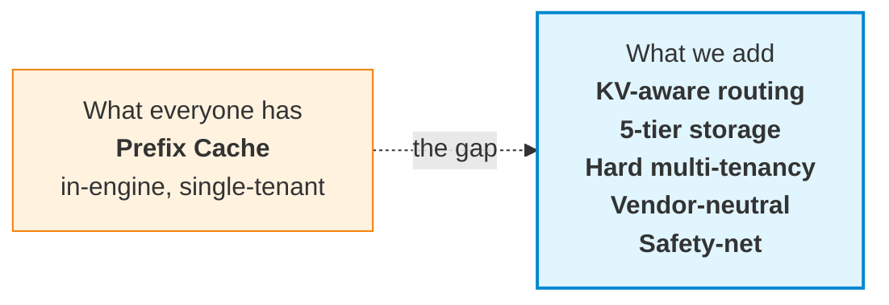
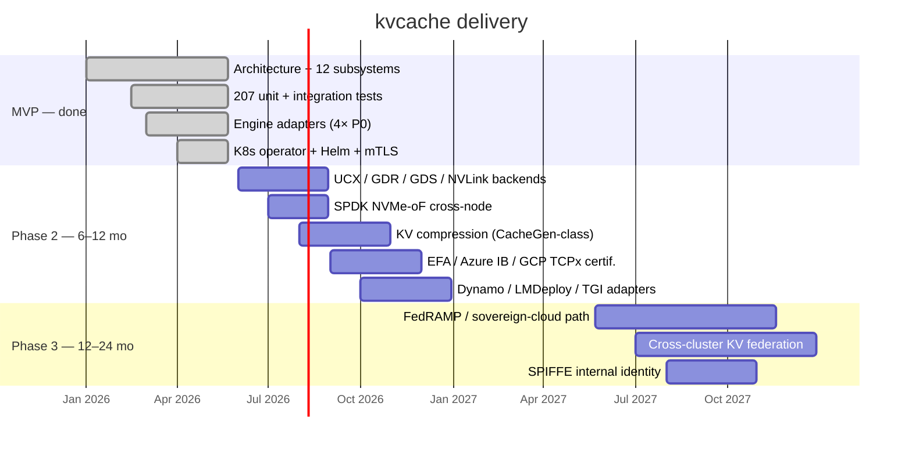

# kvcache

> **The data plane for the inference economy.**
>
> A vendor-neutral, enterprise-grade KV Cache layer for LLM inference at scale.
> Built on NIXL · 6 first principles · 83 traceable design decisions.

[](https://github.com/Stephen-Pu/kvcache/actions)
[](LICENSE)
[](https://en.cppreference.com/w/cpp/20)
[](https://go.dev/)
[]()

---

```
       17.5× faster.     94% cheaper.     $8M saved per cluster per year.
```

**One 100K-token RAG query, traced end-to-end:**

|                              |   Cold start |   With kvcache |          Δ |
| :--------------------------- | -----------: | -------------: | ---------: |
| End-to-end latency           |     **525 s** |        **30 s** | **17.5×** |
| GPU·s per query              |         4200 |            240 |     17.5× |
| Cost per query               |        $1.17 |          $0.07 |  **−94%** |
| Annual cost / cluster        |       **$8.5 M** |     **$487 K** | **−$8 M** |

<sub>Llama-3.1-70B · 8× H100 TP · 100K-token prompt with 90K shared prefix (system prompt + RAG) · 95% steady-state hit rate · cold-start prefill ~200 tok/s · $4/h H100. Your mileage depends primarily on (a) prefix-sharing rate across your workload — compliance / legal / customer-support typically 80–95%; ad-hoc chatbots are not the use case here — and (b) steady-state cache hit rate. Math: HLD §1.3 / trace: v2.0 §13.7.</sub>

---

## The thesis

LLM inference is becoming the largest line item in many AI budgets. **Three structural problems are converging**:

1. **The KV recomputation tax.** Every RAG query, every system prompt, every conversation re-runs prefill from scratch. Most clusters waste 60–90% of GPU time computing KV that already existed somewhere.
2. **Multi-tenancy is unsolved.** Production KV caches (vLLM, LMCache, Mooncake) are single-tenant. Enterprises with 50 internal teams cannot share a cluster safely without hard isolation, quotas, RBAC, and audit.
3. **Vendor lock-in is a tax.** Most distributed KV solutions assume NVIDIA + Mellanox + one cloud. Hybrid and multi-cloud customers are forced to fork or fragment.

**kvcache fixes all three. Simultaneously.**

---

## How it's different



### 1. **KV-aware routing** — the cache finds you, not the other way around

Most prefix caches route by **request affinity** (the caller gets the local cache). We route by **cache locality**:

```
Request hits Node A. Cache for this prefix lives on Node B.
  HRW(prefix_hash)            → candidates {B, C, A}
  Overlap Score from Bloom    → B has 6,200 matching chunks
  Route to B.   Inter-node NIXL Pull ~35 ms.   Recompute would cost ~500 s.
```

Net effect: **cache hit rate does not degrade with cluster size** — the failure mode of in-process caches at scale.

### 2. **Server-Pull-Only NIXL** — the prerequisite for real multi-tenancy

The data plane runs on **NVIDIA NIXL** (GDR · UCX · GDS · NVLink · TCP fallback). One rule:

> **The server pulls. The client never pushes.**

Why: only the server-side scheduler can honor per-tenant quotas, priority classes, and admission control. Client-initiated push is fundamentally incompatible with QoS — most distributed KV projects skip this and ship first-come-first-served data planes. We don't.

A 3-queue (**P0 / P1 / P2**) PriorityScheduler with 20% / 75% / 5% bandwidth reservation lives **inside the NIXL wrapper**. Idle-credit lending for anti-starvation. Per-tenant round-robin inside each class via FNV-1a-64 from the C-ABI `tenant_id`. Admissions, forced admissions, and queue depth surface as Prometheus counters; per-request `kv.lookup` / `kv.fetch` / `nixl.scheduled_pull` spans flow through OTLP/HTTP to any OTel collector. An operator can answer *"why is this Fetch slow"* — not just *"how often"*.

### 3. **Five-tier storage** with cross-tenant eviction

```
   ┌──────────┐  ┌──────────┐  ┌──────────┐  ┌──────────┐  ┌──────────┐
   │  T0 HBM  │  │ T1 Pinned│  │  T2 DRAM │  │  T3 NVMe │  │ T4  Cold │
   │  GPU-own │←─│ cudaHost │←─│  pageable│←─│ io_uring │←─│ pluggable│
   │          │  │ + NIXL MR│  │  + 2Q    │  │  / SPDK  │  │ object   │
   │          │  │          │  │  + Ghost │  │  + GDS   │  │  UFS     │
   └──────────┘  └──────────┘  └──────────┘  └──────────┘  └──────────┘
                                                                  │
                                                                  ▼
                                              S3 / OSS / GCS / Azure Blob
```

- **Lazy promotion on access** — never T4→T0 direct; always via T1 staging
- **2Q + Ghost Cache** in T2 — prevents scan pollution, recovers thrash
- **GDS for tiles > 16 MB** — NVMe → GPU direct, host CPU completely idle
- **Cross-tenant eviction** — over-quota tenants first, then descend by priority
- **Cold tier via a pluggable multi-cloud object UFS** — no reinvented storage layer

### 4. **The cache refuses to lose to recompute** — `D-PERF-1` runtime safety-net

```c
if (fetch_estimate_ms >= recompute_estimate_ms * 0.5)
    return KV_E_SAFETY_NET;   // engine falls back to recompute
```

Every fetch is gated by this check. If the cache cannot beat recompute by 2×, it **steps aside**. Catches pathological cases (cross-AZ T4 fetch for a short prefix where re-running prefill is faster) **at runtime** — not via offline policy tuning.

This turns "cache will always help" — the hidden, often-wrong assumption — into a runtime-verified invariant.

### 5. **Vendor-neutral by design**

|                       |             kvcache              | vLLM-cache | Mooncake |  LMCache  |   NVIDIA Dynamo   |
| :-------------------- | :-------------------------------: | :--------: | :------: | :-------: | :---------------: |
| GPU vendor lock-in    |               None               |    None    |   None   |   None    | **NVIDIA-only**   |
| Engine lock-in        | None (vLLM / SGLang / TRT-LLM / AIBrix via one C ABI) | vLLM-only | vLLM-only | vLLM-only | NVIDIA-aligned |
| Cloud lock-in         |    None (pluggable multi-cloud UFS) |     —      |  Single  |     —     |      Single       |
| Multi-tenant QoS      | **Hard** (3D quota + priority + RBAC + audit) | None | Soft | None | Soft |
| Process model         |    Cross-process server-pull     | In-process | Cross-process | In-process | Cross-process |
| Open source           |           Apache-2.0             | Apache-2.0 | Apache-2.0 | Apache-2.0 | Proprietary stack |

---

## Architecture

Four layers, twelve subsystems, **83 traceable design decisions**. Every line of code references the decision ID it implements (`D-PERF-1`, `L1-PS-7`, ...).

```
┌─────────────────────────────────────────────────────────────┐
│  L4 Integration  │ ⑪ Engine adapters    ⑫ Ops & telemetry   │
├─────────────────────────────────────────────────────────────┤
│  L3 Service      │ ⑨ Multi-tenant QoS   ⑩ Security + audit  │
├─────────────────────────────────────────────────────────────┤
│  L2 Coordination │ ⑥ Routing + Bloom    ⑦ Cluster           │
│                  │ ⑧ Replication (deferred — KV recomputable)│
├─────────────────────────────────────────────────────────────┤
│  L1 Engine       │ ① Locator   ② Prefix-reuse ART           │
│                  │ ③ Tiered storage   ④ Streaming ingest    │
│                  │ ⑤ NIXL data plane                         │
└─────────────────────────────────────────────────────────────┘
```

**Six first principles** drive every decision:

| # | Principle |
|---|---|
| **D-PERF-1** | Tier latency must be << GPU recompute latency (runtime-enforced) |
| **D-PERF-2** | Hot-path enterprise checks ≤ 1 µs |
| **D-PERF-3** | Stability is never traded off; everything else can be |
| **D-DEPLOY-1** | Co-located on GPU nodes by default; standalone storage is opt-in |
| **D-COMPAT-1** | Top-4 engines as first-class citizens |
| **D-NET-1** | Top-3 network fabrics as MVP-must |

---

## API surface

**Six verbs. One C ABI.** Same interface across vLLM, SGLang, TRT-LLM, AIBrix:

```c
// Look up — does the cluster have this prefix?
kv_handle_t  h;
uint32_t     matched;
kv_lookup(ctx, tokens, n_tokens, &locator, &h, &matched);

// Reserve a write slot for new KV (decode path, streaming)
kv_buffer_desc_t slot;
kv_reserve(ctx, &locator, bytes, &h, &slot);

// Publish what's been written so far (watermark in bytes)
kv_publish(ctx, h, src_desc, watermark);

// Fetch into GPU memory
kv_completion_t c;
kv_fetch(ctx, h, ranges, n_ranges, dst_desc, &c);
kv_wait(ctx, c, /*timeout_ms=*/100);

// Seal — make this prefix visible cluster-wide
kv_seal(ctx, h);
kv_release(ctx, h);

// Plus: kv_subscribe_events(ctx, callback) for invalidation
```

Async-first. Zero-copy. **Tier-opaque** (callers never see HBM / DRAM / NVMe distinction).

---

## Performance — disciplined hot path

|                                | Target  | Mechanism                                         |
| :----------------------------- | :-----: | :------------------------------------------------ |
| `kv_lookup` end-to-end p99     | **< 10 µs**  | Epoch-based lock-free ART + Bloom routing    |
| `kv_fetch` 1 GB · T1 → GPU     | **< 50 ms**  | NIXL GDR direct                              |
| `kv_fetch` 1 GB · T3 via GDS   | **< 200 ms** | NVMe → GPU direct, zero host bounce          |
| `kv_seal`                      | **< 200 µs** | RocksDB + ART atomic                         |
| Cluster-wide visibility        | **< 60 s**   | Bloom sketch 30 s tick                       |

**Zero-copy end to end** — engine writes into a Pinned slot that *is* a NIXL-registered MR; the server's Pull reads the same physical pages. No bounce buffers, no extra `memcpy`.

---

## Quickstart

```bash
git clone https://github.com/Stephen-Pu/kvcache.git
cd kvcache

# macOS:    brew install cmake ninja go python helm
# Ubuntu:   sudo apt-get install cmake ninja-build g++ python3-venv golang-1.22

python3 -m venv .venv && source .venv/bin/activate
pip install cffi pytest

make all      # zero warnings · 211/211 tests pass · ~4 min cold start
```

Expected end of `make all`:

```
# C++ ctest
100% tests passed, 0 tests failed out of 211

# Go (control-plane + operator)
ok  control-plane/internal/membership   …
ok  operator/internal/controller        …

# Python adapter / E2E
============================== 16 passed in 0.2s ===============================
```

Two opt-in K8s extras (require docker + kind):

```bash
make e2e-operator           # ~45s, operator object-shape against kind apiserver
make e2e-operator-workload  # ~3–5min, builds image and waits for pod Ready
```

Full setup: [BUILD.md](./BUILD.md).

---

## What works today

Run `make all` to verify. **207 unit tests across 38 gtest binaries**, plus Go and Python suites. The architecture is verified end-to-end on a single machine.

### L1 — Engine layer
- Real **BLAKE3** for prefix hashing, chunk identity, HRW weights (vendored)
- **Lock-free ART reads via EBR** — readers walk with one `atomic::load(acquire)` per descent; writers never block readers. Hits LLD §9.1 p99 ≤ 10 µs budget. Covered by 4-reader + 1-writer × 300 ms stress test.
- **Persistent ART with WAL-incremental durability** — every Insert/Remove `fdatasync`'d before mutation; periodic `Checkpoint()` writes a fresh snapshot with BLAKE3-256 body integrity. Boot replays `snapshot + WAL tail` in milliseconds, not minutes. CRC32-validated; torn writes truncated at last-good offset.
- **Real cross-process Pull over TCP** — two backend instances bind distinct ports, exchange opaque MR descriptors, `Pull` moves bytes through a real socket. UCX / RDMA backends slot into the same `INixlBackend` interface.
- **PriorityScheduler** with per-tenant fair queueing on the NIXL data path.

### L2 — Coordination
- **HRW + Bloom routing** with peer sketch broadcast
- **Real etcd, two C++ clients** — `HttpEtcdClient` (libcurl, runs on dev laptop, polling Watch) and `GrpcEtcdClient` (canonical etcd v3 protos vendored at `third_party/etcd-proto/`, **real bidi Watch stream** with watch_id multiplexing). Auto-enabled when `find_package(gRPC)` succeeds.
- **Go side** uses embedded etcd v3.5 in tests.

### L3 — Service
- **3D quotas** (capacity / QPS / bandwidth) · **3 priority classes** with anti-starvation
- **mTLS termination on gRPC** — `REQUEST_AND_REQUIRE_CLIENT_CERTIFICATE_AND_VERIFY`. Unauthenticated or wrong-CA clients rejected at handshake. Auto-rotation around 1/3 leaf lifetime; CA stable across rotations.

### L4 — Integration
- **vLLM / SGLang / AIBrix / TRT-LLM** adapters all ship. Three Python adapters are ~50 LOC shells on a shared `kvcache_core` `cffi` substrate; C++ TRT-LLM adapter links `libkvcache.{so,dylib}` directly.
- **gRPC `NodeData` service** — `Lookup` / `Reserve` / `Publish` / `Fetch` / `Seal` / `Release` over the wire, plus streaming `Subscribe` delivering `Add` / `Evict` / `Promote` / `Demote` events.
- **OTLP/HTTP** trace exporter · Prometheus `/metrics` · `/healthz`

### K8s
- **Helm chart** renders deployable manifests
- **Operator** — `kubectl apply -f cluster.yaml` brings up **9 resources**: StatefulSet + headless Service + ConfigMap + ServiceAccount for kvstore-node, 3-replica in-cluster etcd (skipped under `byoEtcd: true`), 3-replica control-plane wired to the same etcd, self-signed mTLS Secret mounted into every pod.
- **`KVCacheTenant` CRD** — validated (hex tenant_id, parseable quotas) and published to `/kvcache/tenants/<cluster>/<tenant_id>` for live quota propagation.
- **Two kind-cluster E2E flavours** — fast object-shape (~45s) and full-workload-Ready (~3–5 min cold).

### Honestly not done yet

Called out so nobody is misled:

- **Real RDMA backends** (UCX / GDR / GDS / NVLink) — await Mellanox CX-6/7 + IB / RoCE fabric. `INixlBackend` interface ready.
- **HttpEtcdClient Watch** is still poll-based (it talks to the JSON
  gateway, which doesn't expose the streaming Watch RPC cleanly).
  `GrpcEtcdClient` carries the real bidi Watch stream — Phase F-3 —
  so production deployments that need event-driven config push run
  the gRPC client.
- **gRPC `NodeData` cross-process Pull** — Phase M-3 B added `ReserveResponse.remote_mr_descriptor` + `FetchRequest.dst_remote_mr_descriptor` (opaque NIXL `RemoteMrDescriptor` bytes, Export/Import surfaced through the C ABI as `kv_export_mr` / `kv_import_remote_mr`). Phase M-4 closes the loop: HeadlessNode now wires `TcpBackend::RegisterRegion` as the pinned-tier `register_region` callback (NIXL backend selectable via `KVCACHE_NIXL_BACKEND={loopback,tcp}` env at first `kv_ctx_open`), so slot MRs are real and exportable. The `test_cross_process_pull` binary stands up two distinct `TcpBackend` instances and pulls a freshly-Reserved slot's bytes across a real TCP socket, verifying the wire path. Phase M-5 makes `HeadlessNode::Fetch` honour a pre-registered `dst.mr_key` (new C ABI `kv_register_local_mr` / `kv_unregister_local_mr`) so engines register their fetch buffer once at startup and skip per-call NIXL MR churn. The legacy in-process `slot_iova` / `dst_iova` path coexists for callers that share an address space.
- **Server-pushed Fetch — Phase M-6**. `INixlBackend` grows `Push(PushRequest)` + `IsRemote(MrKey)`; `TcpBackend` implements them with a new `PUT` wire op (mirror of the existing `GET`) — server connects to peer's listener and writes bytes into peer's pre-registered MR. `HeadlessNode::Fetch` dispatches Pull-vs-Push based on `backend->IsRemote(dst.mr_key)`, so the engine-side flow is: register dst → `ExportMr` → ship descriptor via `FetchRequest.dst_remote_mr_descriptor` → server handler imports + Pushes. Verified end-to-end by `CrossProcessPull.FetchPushesBytesToEngine` plus `TcpBackendTest.PushDepositsBytesIntoPeerMr`. (M-7 below routes Push through `PriorityScheduler`.)
- **Scheduled server-push — Phase M-7**. `NixlWrapper::ScheduledPush` mirrors `ScheduledPull`: same admission semantics (per-(class, tenant) round-robin, idle-credit lending, starvation overrides), same `PriorityScheduler`. The dispatcher's `PendingXfer` carries a kind tag so the same loop drives Pull or Push depending on what `HeadlessNode::Fetch` submitted. Push and Pull traffic now share the QoS layer end-to-end; verified by `NixlWrapperTest.ScheduledPushRoutesThroughScheduler` (admission-counter delta) and `ScheduledPushMixedWithPullDrainsAll` (24 concurrent mixed transfers, all admitted, scheduler quiescent at end).
- **DRAM eviction wired to ART pruning — Phase G-1**. The 2Q DramTier was already enforcing the byte budget (A1in + A1out ghost + Am), but evicting bytes used to leave a stale ART leaf claiming the chunk was still cached. G-1 adds an `on_evict` callback to `DramTier::Options` that `HeadlessNode::Init` populates with `OnDramEvict`. At Seal time we record the `(DramKey → chunk_path)` mapping; on eviction we look it up, call `art->Remove(path)`, and publish a `KV_EVENT_EVICT` so subscribers see the cache miss happen.
- **Refcount-deferred eviction sweeper — Phase G-2**. G-1's prune was unconditional and could yank a leaf out from under an in-flight reader. G-2 makes it refcount-safe: `Refcount::TryEvict()` is a CAS-1-to-0 atomic claim, mirror of `TryAcquireIfNonZero` on the producer side. `OnDramEvict` calls `TryEvictNow`, which only removes if the leaf is at baseline refcount; otherwise the path is queued in `deferred_evicts_` and a background sweeper thread retries every 50 ms (and on any `kv_release` notify). The sweeper drops queue entries whose path has been replaced by a fresh Seal. The `ArtIndex::LookupByPath` exact-path peek is the new primitive that lets the sweeper recognise "still the same leaf" vs "replaced". Verified by `RefcountTest.TryEvict_*` (atomic-claim semantics + 5000-round race) and `NodeDataFixture.DramEvictionPrunesArtLeaf` (pinned leaf stays cached; sweeper claims it after Release).
- **Per-(tenant, model) `kv_ctx_t` cache — Phase M-3 A**. `NodeDataServiceImpl` lazily opens a distinct ctx for each `(tenant_hash, model_hash)` seen on the wire via a new `kv_ctx_open_from_hashes` ABI helper, with a reverse handle→ctx map so Publish/Fetch/Seal/Release land on the same ctx that minted the handle. Verified by `LookupOpensPerTenantModelCtx`.
- **Cross-node Lookup fan-out — Phase Q-1**. Every `kvstore-node` pod self-registers in etcd at `/kvcache/nodes/<node-id>` with a leased + keepalive'd entry (`NodeRegistrar`, 10s TTL / 3s renewal, lease revoked on graceful shutdown). A `NodeDirectory` seeds + Watches the prefix and pushes the live set into `HrwRing::SetNodes`. `NodeDataServiceImpl::EnableForwarding` flips Lookup into HRW-aware mode: requests whose primary is some other node get forwarded over a cached gRPC stub with an `x-kvcache-forwarded` metadata tag for loop protection; the owner serves the local hit. The operator passes `--node-id $(KVCACHE_NODE_NAME) --advertise-host $(KVCACHE_POD_IP) --etcd-endpoints …` to every kvstore-node pod, so multi-replica `KVCacheCluster` CRs get fan-out for free. Verified by 6 `NodeRegistrar`/`NodeDirectory` unit tests and `LookupForwarding.NonPrimaryForwardsToPrimary`.
- **Sticky-write fan-out — Phase Q-2**. Reserve also routes by HRW: Locator's `tenant_id` bytes + `model_id_hash` + `prefix_hash` decide owner; non-owner forwards Reserve and remembers `(server_handle → owner)` in a `forwarded_handles_` map. Publish/Fetch/Seal/Release consult that map first — if the handle was minted upstream, the call forwards to the same owner with `x-kvcache-forwarded`. Release also clears the map entry. Documented assumption: a logical session sticks to one forwarder between Reserve and Release. The operator e2e is upgraded to NodeReplicas=2 so both pods register in etcd and the HRW ring sees a real two-node membership. Verified by `LookupForwarding.ReserveSealForwardsViaHandleMap` (entire Reserve→Publish→Seal→Lookup→Release flow against the non-primary, owner ends up holding the chunk) and `TestStatefulSetWiresFanOutFlags` (operator emits `--node-id $(KVCACHE_NODE_NAME)` / `--advertise-host $(KVCACHE_POD_IP)` / `--etcd-endpoints …` with both env vars declared on the container).
- **Real-cluster fan-out validation — Phase Q-3**. `make e2e-operator-workload` spins up a kind cluster, loads the kvstore-node + control-plane + etcd images, applies a `KVCacheCluster{NodeReplicas: 2}` CR, waits for both pods Ready, and then execs `etcdctl get /kvcache/nodes/ --prefix` inside the in-cluster etcd pod — asserting both `e2e-nodes-0` and `e2e-nodes-1` are registered. To survive a slow first dial against an etcd that's still pulling its image, the kvstore-node startup wraps `HttpEtcdClient::Create` in a 15-attempt × 2s retry loop; the bring-up script pre-loads the etcd image into kind to keep the loop's budget realistic. Verified: e2e passes end-to-end on macOS Docker Desktop, the `t.Logf` line reads `Phase Q-3 fan-out verified: 2 pods registered in etcd: [e2e-nodes-0 e2e-nodes-1]`.
- **Per-(tenant, model) ART isolation — Phase Q-5**. Pre-Q-5, `HeadlessNode::Lookup` ignored its `tenant_id` / `model_id_hash` parameters and the chunk_path was derived from tokens alone — so a Seal under tenantA could be found via a Lookup under tenantB with the same token sequence. New primitive `NamespaceFingerprint(tenant_hash, model_hash) = BLAKE3-128(tenant_hash || model_hash)[:8]` is prepended as the first chunk on every ART path; lookup-time + seal-time threads the matching hashes through `HandleState`. Same (tenant, model) hits; different tenant OR different model misses — verified by `NodeDataIsolation.CrossTenantOrModelLookupMisses`. The gRPC service path required a wire-side alignment: `HashTenantString` now derives the 16-byte fingerprint via SHA-1 (matching the Python connector's `Locator.tenant_id` derivation) so the Lookup-request-string and Reserve-locator-bytes paths resolve to the SAME ctx + namespace. Test fixtures' `BuildLocator` helpers updated accordingly. 237/237 C++ + 18/18 Python adapters all green.
- **vLLM-shaped connector — Phase P-1**. `VllmKVConnector` lives in `kvcache_vllm.connector` and mirrors the method names + lifecycle of vLLM v1's `KVConnectorBase` — `get_num_new_matched_tokens` / `update_state_after_alloc` / `build_connector_meta` / `start_load_kv` / `wait_for_layer_load` / `save` / `wait_for_save` / `get_finished` / `release`. The adapter keeps a per-request-id table so vLLM's request-id bookkeeping maps cleanly to the C ABI's opaque handles. Crucial scheduler invariant: `get_num_new_matched_tokens` returns `max(0, matched - num_computed_tokens)` so a partial-prefix hit shorter than what vLLM has already computed locally doesn't underflow into over-allocation. The package ships vllm-import-free (no runtime dependency on vLLM) — real integration sub-classes `vllm.distributed.kv_transfer.kv_connector.v1.base.KVConnectorBase` and forwards each callback to this object. Verified by `test_full_vllm_lifecycle` (full Save → Lookup → start_load_kv → wait_for_layer_load round-trip), `test_get_num_new_matched_tokens_credits_only_beyond_computed`, `test_release_is_idempotent_on_unknown_request`, `test_wait_for_save_raises_without_save`. 18/18 Python adapter tests pass against the live C ABI.
- **Control-plane CrashLoopBackOff fix — Phase Q-4**. The operator was setting the CP container's `Command` to `/usr/local/bin/control-plane` but `Dockerfile.cp` ships the binary at `/usr/local/bin/cp`. containerd's runc init failed with `no such file or directory` and the pod went into CrashLoopBackOff *before producing any stdout*, which is why the bug had hidden for a session despite `kubectl logs` returning empty. Fix: align the operator's `Command` with the Dockerfile's `ENTRYPOINT`. New unit test `TestReconcileEmitsControlPlane` pins the path so a future Dockerfile rename or operator typo can't silently regress this. Diagnostic upgrade: the e2e now dumps `LastTerminationState` (exit code + reason) + `kubectl describe pod` on CP failure, so the next such bug is one-test-run away from a smoking gun. Verified: with `KVCACHE_E2E_REQUIRE_CP=1` the whole `make e2e-operator-workload` run completes in **25.4s** (down from a 110s timeout) — kvstore-node fan-out AND CP both reach Ready.
- **Cert-manager opt-in** — operator emits self-signed certs today; `Certificate` CR pathway pending.

This is an **honest MVP**: architecture complete, end-to-end verified on a laptop, production hardening is the next phase.

---

## Roadmap



---

## Where this is going

The inference layer of the AI stack is being rebuilt right now — disaggregated prefill/decode, multi-cluster routing, hybrid hardware fleets, multi-cloud data residency. **The KV cache sits at the center of all of it.**

> **Our bet**: in three years, every serious enterprise inference platform will have a dedicated KV cache **data layer**. It will be separate from any single inference engine. It will be multi-tenant by design. It will integrate with multi-cloud data infrastructure, not reinvent it.

That's what we're building.

---

## Contributing

Issues and PRs welcome. Before sending a PR:

1. `make all` passes locally with zero warnings
2. New code carries a unit test
3. Any architectural change references an LLD decision ID (`D-PERF-1`, `L1-PS-7`, ...). If the change predates a decision, propose the decision first as an Issue.

Design documents (HLD + LLD) are available to active contributors on request.

---

## Acknowledgments

Standing on the shoulders of: **vLLM** · **SGLang** · **Mooncake** (FAST'25) · **LMCache** · **NVIDIA Dynamo** · **NIXL** · **3FS** / **DAOS** (architecture inspiration) · **BLAKE3** · **etcd** · **gRPC**.

## License

[Apache-2.0](./LICENSE)

---

<sub>Built by [Stephen Pu](https://github.com/Stephen-Pu).
Architecture documented across **6 first principles + 83 traceable design decisions**.
Every commit references the decision it implements.</sub>
