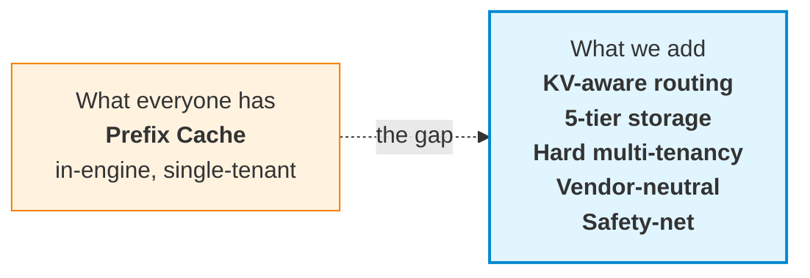
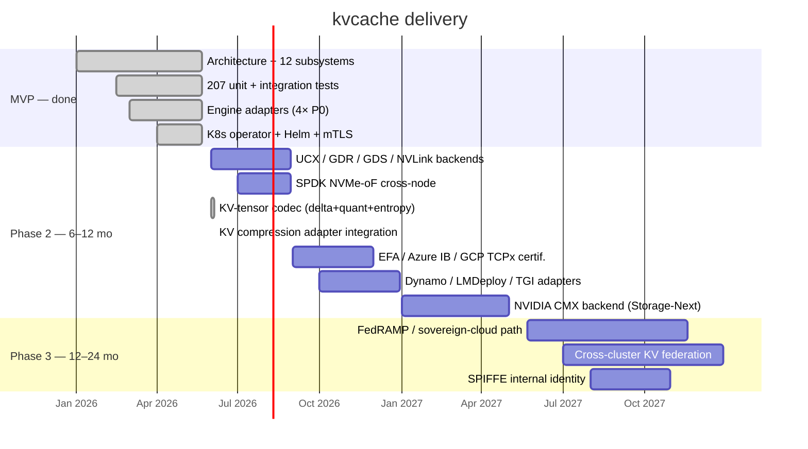

# kvcache

> **The data plane for the inference economy.**
>
> A vendor-neutral, enterprise-grade KV Cache layer for LLM inference at scale.
> Built on NIXL · 6 first principles · 83 traceable design decisions.

[](https://github.com/Stephen-Pu/kvcache/actions)
[](LICENSE)
[](https://en.cppreference.com/w/cpp/20)
[](https://go.dev/)
[]()

---

```
       17.5× faster.     94% cheaper.     $8M saved per cluster per year.
```

**One 100K-token RAG query, traced end-to-end:**

|                              |   Cold start |   With kvcache |          Δ |
| :--------------------------- | -----------: | -------------: | ---------: |
| End-to-end latency           |     **525 s** |        **30 s** | **17.5×** |
| GPU·s per query              |         4200 |            240 |     17.5× |
| Cost per query               |        $1.17 |          $0.07 |  **−94%** |
| Annual cost / cluster        |       **$8.5 M** |     **$487 K** | **−$8 M** |

<sub>Llama-3.1-70B · 8× H100 TP · 100K-token prompt with 90K shared prefix (system prompt + RAG) · 95% steady-state hit rate · cold-start prefill ~200 tok/s · $4/h H100. Your mileage depends primarily on (a) prefix-sharing rate across your workload — compliance / legal / customer-support typically 80–95%; ad-hoc chatbots are not the use case here — and (b) steady-state cache hit rate. Math: HLD §1.3 / trace: v2.0 §13.7.</sub>

---

## The thesis

LLM inference is becoming the largest line item in many AI budgets. **Three structural problems are converging**:

1. **The KV recomputation tax.** Every RAG query, every system prompt, every conversation re-runs prefill from scratch. Most clusters waste 60–90% of GPU time computing KV that already existed somewhere.
2. **Multi-tenancy is unsolved.** Production KV caches (vLLM, LMCache, Mooncake) are single-tenant. Enterprises with 50 internal teams cannot share a cluster safely without hard isolation, quotas, RBAC, and audit.
3. **Vendor lock-in is a tax.** Most distributed KV solutions assume NVIDIA + Mellanox + one cloud. Hybrid and multi-cloud customers are forced to fork or fragment.

**kvcache fixes all three. Simultaneously.**

---

## How it's different



### 1. **KV-aware routing** — the cache finds you, not the other way around

Most prefix caches route by **request affinity** (the caller gets the local cache). We route by **cache locality**:

```
Request hits Node A. Cache for this prefix lives on Node B.
  HRW(prefix_hash)            → candidates {B, C, A}
  Overlap Score from Bloom    → B has 6,200 matching chunks
  Route to B.   Inter-node NIXL Pull ~35 ms.   Recompute would cost ~500 s.
```

Net effect: **cache hit rate does not degrade with cluster size** — the failure mode of in-process caches at scale.

### 2. **Server-Pull-Only NIXL** — the prerequisite for real multi-tenancy

The data plane runs on **NVIDIA NIXL** (GDR · UCX · GDS · NVLink · TCP fallback). One rule:

> **The server pulls. The client never pushes.**

Why: only the server-side scheduler can honor per-tenant quotas, priority classes, and admission control. Client-initiated push is fundamentally incompatible with QoS — most distributed KV projects skip this and ship first-come-first-served data planes. We don't.

A 3-queue (**P0 / P1 / P2**) PriorityScheduler with 20% / 75% / 5% bandwidth reservation lives **inside the NIXL wrapper**. Idle-credit lending for anti-starvation. Per-tenant round-robin inside each class via FNV-1a-64 from the C-ABI `tenant_id`. Admissions, forced admissions, and queue depth surface as Prometheus counters; per-request `kv.lookup` / `kv.fetch` / `nixl.scheduled_pull` spans flow through OTLP/HTTP to any OTel collector. An operator can answer *"why is this Fetch slow"* — not just *"how often"*.

### 3. **Five-tier storage** with cross-tenant eviction

```
   ┌──────────┐  ┌──────────┐  ┌──────────┐  ┌──────────┐  ┌──────────┐
   │  T0 HBM  │  │ T1 Pinned│  │  T2 DRAM │  │  T3 NVMe │  │ T4  Cold │
   │  GPU-own │←─│ cudaHost │←─│  pageable│←─│ io_uring │←─│ pluggable│
   │          │  │ + NIXL MR│  │  + 2Q    │  │  / SPDK  │  │ object   │
   │          │  │          │  │  + Ghost │  │  + GDS   │  │  UFS     │
   └──────────┘  └──────────┘  └──────────┘  └──────────┘  └──────────┘
                                                                  │
                                                                  ▼
                                              S3 / OSS / GCS / Azure Blob
```

- **Lazy promotion on access** — never T4→T0 direct; always via T1 staging
- **2Q + Ghost Cache** in T2 — prevents scan pollution, recovers thrash
- **GDS for tiles > 16 MB** — NVMe → GPU direct, host CPU completely idle
- **Cross-tenant eviction** — over-quota tenants first, then descend by priority
- **Cold tier via a pluggable multi-cloud object UFS** — no reinvented storage layer

### 4. **The cache refuses to lose to recompute** — `D-PERF-1` runtime safety-net

```c
if (fetch_estimate_ms >= recompute_estimate_ms * 0.5)
    return KV_E_SAFETY_NET;   // engine falls back to recompute
```

Every fetch is gated by this check. If the cache cannot beat recompute by 2×, it **steps aside**. Catches pathological cases (cross-AZ T4 fetch for a short prefix where re-running prefill is faster) **at runtime** — not via offline policy tuning.

This turns "cache will always help" — the hidden, often-wrong assumption — into a runtime-verified invariant.

### 5. **Vendor-neutral by design**

|                       |             kvcache              | vLLM-cache | Mooncake |  LMCache  |   NVIDIA Dynamo   |
| :-------------------- | :-------------------------------: | :--------: | :------: | :-------: | :---------------: |
| GPU vendor lock-in    |               None               |    None    |   None   |   None    | **NVIDIA-only**   |
| Engine lock-in        | None (vLLM / SGLang / TRT-LLM / AIBrix via one C ABI) | vLLM-only | vLLM-only | vLLM-only | NVIDIA-aligned |
| Cloud lock-in         |    None (pluggable multi-cloud UFS) |     —      |  Single  |     —     |      Single       |
| Multi-tenant QoS      | **Hard** (3D quota + priority + RBAC + audit) | None | Soft | None | Soft |
| Process model         |    Cross-process server-pull     | In-process | Cross-process | In-process | Cross-process |
| Open source           |           Apache-2.0             | Apache-2.0 | Apache-2.0 | Apache-2.0 | Proprietary stack |

---

## Architecture

Four layers, twelve subsystems, **83 traceable design decisions**. Every line of code references the decision ID it implements (`D-PERF-1`, `L1-PS-7`, ...).

```
┌─────────────────────────────────────────────────────────────┐
│  L4 Integration  │ ⑪ Engine adapters    ⑫ Ops & telemetry   │
├─────────────────────────────────────────────────────────────┤
│  L3 Service      │ ⑨ Multi-tenant QoS   ⑩ Security + audit  │
├─────────────────────────────────────────────────────────────┤
│  L2 Coordination │ ⑥ Routing + Bloom    ⑦ Cluster           │
│                  │ ⑧ Replication (deferred — KV recomputable)│
├─────────────────────────────────────────────────────────────┤
│  L1 Engine       │ ① Locator   ② Prefix-reuse ART           │
│                  │ ③ Tiered storage   ④ Streaming ingest    │
│                  │ ⑤ NIXL data plane                         │
└─────────────────────────────────────────────────────────────┘
```

> 📐 **Detailed diagrams** — see [`docs/architecture/`](./docs/architecture/) for the rendered system overview (Control Plane + GPU Node Pool + Cold Tier), the integration / transport stack (engines → APIs → NIXL → hardware), and the [NVIDIA Storage-Next / CMX positioning](./docs/architecture/cmx-integration.md) (Phase 2 — kvcache as the multi-tenant layer above CMX).


**Six first principles** drive every decision:

| # | Principle |
|---|---|
| **D-PERF-1** | Tier latency must be << GPU recompute latency (runtime-enforced) |
| **D-PERF-2** | Hot-path enterprise checks ≤ 1 µs |
| **D-PERF-3** | Stability is never traded off; everything else can be |
| **D-DEPLOY-1** | Co-located on GPU nodes by default; standalone storage is opt-in |
| **D-COMPAT-1** | Top-4 engines as first-class citizens |
| **D-NET-1** | Top-3 network fabrics as MVP-must |

---

## API surface

**Six verbs. One C ABI.** Same interface across vLLM, SGLang, TRT-LLM, AIBrix:

```c
// Look up — does the cluster have this prefix?
kv_handle_t  h;
uint32_t     matched;
kv_lookup(ctx, tokens, n_tokens, &locator, &h, &matched);

// Reserve a write slot for new KV (decode path, streaming)
kv_buffer_desc_t slot;
kv_reserve(ctx, &locator, bytes, &h, &slot);

// Publish what's been written so far (watermark in bytes)
kv_publish(ctx, h, src_desc, watermark);

// Fetch into GPU memory
kv_completion_t c;
kv_fetch(ctx, h, ranges, n_ranges, dst_desc, &c);
kv_wait(ctx, c, /*timeout_ms=*/100);

// Seal — make this prefix visible cluster-wide
kv_seal(ctx, h);
kv_release(ctx, h);

// Plus: kv_subscribe_events(ctx, callback) for invalidation
```

Async-first. Zero-copy. **Tier-opaque** (callers never see HBM / DRAM / NVMe distinction).

---

## Performance — disciplined hot path

|                                | Target  | Mechanism                                         |
| :----------------------------- | :-----: | :------------------------------------------------ |
| `kv_lookup` end-to-end p99     | **< 10 µs**  | Epoch-based lock-free ART + Bloom routing    |
| `kv_fetch` 1 GB · T1 → GPU     | **< 50 ms**  | NIXL GDR direct                              |
| `kv_fetch` 1 GB · T3 via GDS   | **< 200 ms** | NVMe → GPU direct, zero host bounce          |
| `kv_seal`                      | **< 200 µs** | RocksDB + ART atomic                         |
| Cluster-wide visibility        | **< 60 s**   | Bloom sketch 30 s tick                       |

**Zero-copy end to end** — engine writes into a Pinned slot that *is* a NIXL-registered MR; the server's Pull reads the same physical pages. No bounce buffers, no extra `memcpy`.

---

## Quickstart

```bash
git clone https://github.com/Stephen-Pu/kvcache.git
cd kvcache

# macOS:    brew install cmake ninja go python helm
# Ubuntu:   sudo apt-get install cmake ninja-build g++ python3-venv golang-1.22

python3 -m venv .venv && source .venv/bin/activate
pip install cffi pytest

make all      # zero warnings · 211/211 tests pass · ~4 min cold start
```

Expected end of `make all`:

```
# C++ ctest
100% tests passed, 0 tests failed out of 211

# Go (control-plane + operator)
ok  control-plane/internal/membership   …
ok  operator/internal/controller        …

# Python adapter / E2E
============================== 16 passed in 0.2s ===============================
```

Two opt-in K8s extras (require docker + kind):

```bash
make e2e-operator           # ~45s, operator object-shape against kind apiserver
make e2e-operator-workload  # ~3–5min, builds image and waits for pod Ready
```

Full setup: [BUILD.md](./BUILD.md).

---

## What works today

Run `make all` to verify. **207 unit tests across 38 gtest binaries**, plus Go and Python suites. The architecture is verified end-to-end on a single machine.

### L1 — Engine layer
- Real **BLAKE3** for prefix hashing, chunk identity, HRW weights (vendored)
- **Lock-free ART reads via EBR** — readers walk with one `atomic::load(acquire)` per descent; writers never block readers. Hits LLD §9.1 p99 ≤ 10 µs budget. Covered by 4-reader + 1-writer × 300 ms stress test.
- **Persistent ART with WAL-incremental durability** — every Insert/Remove `fdatasync`'d before mutation; periodic `Checkpoint()` writes a fresh snapshot with BLAKE3-256 body integrity. Boot replays `snapshot + WAL tail` in milliseconds, not minutes. CRC32-validated; torn writes truncated at last-good offset.
- **Real cross-process Pull over TCP** — two backend instances bind distinct ports, exchange opaque MR descriptors, `Pull` moves bytes through a real socket. UCX / RDMA backends slot into the same `INixlBackend` interface.
- **PriorityScheduler** with per-tenant fair queueing on the NIXL data path.

### L2 — Coordination
- **HRW + Bloom routing** with peer sketch broadcast
- **Real etcd, two C++ clients** — `HttpEtcdClient` (libcurl, runs on dev laptop, polling Watch) and `GrpcEtcdClient` (canonical etcd v3 protos vendored at `third_party/etcd-proto/`, **real bidi Watch stream** with watch_id multiplexing). Auto-enabled when `find_package(gRPC)` succeeds.
- **Go side** uses embedded etcd v3.5 in tests.

### L3 — Service
- **3D quotas** (capacity / QPS / bandwidth) · **3 priority classes** with anti-starvation
- **mTLS termination on gRPC** — `REQUEST_AND_REQUIRE_CLIENT_CERTIFICATE_AND_VERIFY`. Unauthenticated or wrong-CA clients rejected at handshake. Auto-rotation around 1/3 leaf lifetime; CA stable across rotations.

### L4 — Integration
- **vLLM / SGLang / AIBrix / Dynamo / LMDeploy / TGI / DeepSpeed-MII / TRT-LLM** adapters all ship. Seven Python adapters are thin shells on a shared `kvcache_core` `cffi` substrate; C++ TRT-LLM adapter links `libkvcache.{so,dylib}` directly. Each maps its engine's idiomatic external-KV vocabulary onto the same 6-verb Core ABI — Dynamo's KVBM `match`/`offload`/`onboard`, LMDeploy's TurboMind block cache `match`/`add`/`get`, TGI's prefix cache `prefix_lookup`/`insert`/`load`, MII's FastGen `query`/`put`/`get` — proving the ABI is genuinely engine-neutral.
- **gRPC `NodeData` service** — `Lookup` / `Reserve` / `Publish` / `Fetch` / `Seal` / `Release` over the wire, plus streaming `Subscribe` delivering `Add` / `Evict` / `Promote` / `Demote` events.
- **OTLP/HTTP** trace exporter · Prometheus `/metrics` · `/healthz`

### K8s
- **Helm chart** renders deployable manifests
- **Operator** — `kubectl apply -f cluster.yaml` brings up **9 resources**: StatefulSet + headless Service + ConfigMap + ServiceAccount for kvstore-node, 3-replica in-cluster etcd (skipped under `byoEtcd: true`), 3-replica control-plane wired to the same etcd, self-signed mTLS Secret mounted into every pod.
- **`KVCacheTenant` CRD** — validated (hex tenant_id, parseable quotas) and published to `/kvcache/tenants/<cluster>/<tenant_id>` for live quota propagation.
- **Two kind-cluster E2E flavours** — fast object-shape (~45s) and full-workload-Ready (~3–5 min cold).

### Honestly not done yet

Called out so nobody is misled:

- **Real RDMA backends** (UCX / GDR / GDS / NVLink) — await Mellanox CX-6/7 + IB / RoCE fabric. `INixlBackend` interface ready.
- **HttpEtcdClient Watch** is still poll-based (it talks to the JSON
  gateway, which doesn't expose the streaming Watch RPC cleanly).
  `GrpcEtcdClient` carries the real bidi Watch stream — Phase F-3 —
  so production deployments that need event-driven config push run
  the gRPC client.
- **gRPC `NodeData` cross-process Pull** — Phase M-3 B added `ReserveResponse.remote_mr_descriptor` + `FetchRequest.dst_remote_mr_descriptor` (opaque NIXL `RemoteMrDescriptor` bytes, Export/Import surfaced through the C ABI as `kv_export_mr` / `kv_import_remote_mr`). Phase M-4 closes the loop: HeadlessNode now wires `TcpBackend::RegisterRegion` as the pinned-tier `register_region` callback (NIXL backend selectable via `KVCACHE_NIXL_BACKEND={loopback,tcp}` env at first `kv_ctx_open`), so slot MRs are real and exportable. The `test_cross_process_pull` binary stands up two distinct `TcpBackend` instances and pulls a freshly-Reserved slot's bytes across a real TCP socket, verifying the wire path. Phase M-5 makes `HeadlessNode::Fetch` honour a pre-registered `dst.mr_key` (new C ABI `kv_register_local_mr` / `kv_unregister_local_mr`) so engines register their fetch buffer once at startup and skip per-call NIXL MR churn. The legacy in-process `slot_iova` / `dst_iova` path coexists for callers that share an address space.
- **Server-pushed Fetch — Phase M-6**. `INixlBackend` grows `Push(PushRequest)` + `IsRemote(MrKey)`; `TcpBackend` implements them with a new `PUT` wire op (mirror of the existing `GET`) — server connects to peer's listener and writes bytes into peer's pre-registered MR. `HeadlessNode::Fetch` dispatches Pull-vs-Push based on `backend->IsRemote(dst.mr_key)`, so the engine-side flow is: register dst → `ExportMr` → ship descriptor via `FetchRequest.dst_remote_mr_descriptor` → server handler imports + Pushes. Verified end-to-end by `CrossProcessPull.FetchPushesBytesToEngine` plus `TcpBackendTest.PushDepositsBytesIntoPeerMr`. (M-7 below routes Push through `PriorityScheduler`.)
- **Scheduled server-push — Phase M-7**. `NixlWrapper::ScheduledPush` mirrors `ScheduledPull`: same admission semantics (per-(class, tenant) round-robin, idle-credit lending, starvation overrides), same `PriorityScheduler`. The dispatcher's `PendingXfer` carries a kind tag so the same loop drives Pull or Push depending on what `HeadlessNode::Fetch` submitted. Push and Pull traffic now share the QoS layer end-to-end; verified by `NixlWrapperTest.ScheduledPushRoutesThroughScheduler` (admission-counter delta) and `ScheduledPushMixedWithPullDrainsAll` (24 concurrent mixed transfers, all admitted, scheduler quiescent at end).
- **DRAM eviction wired to ART pruning — Phase G-1**. The 2Q DramTier was already enforcing the byte budget (A1in + A1out ghost + Am), but evicting bytes used to leave a stale ART leaf claiming the chunk was still cached. G-1 adds an `on_evict` callback to `DramTier::Options` that `HeadlessNode::Init` populates with `OnDramEvict`. At Seal time we record the `(DramKey → chunk_path)` mapping; on eviction we look it up, call `art->Remove(path)`, and publish a `KV_EVENT_EVICT` so subscribers see the cache miss happen.
- **Refcount-deferred eviction sweeper — Phase G-2**. G-1's prune was unconditional and could yank a leaf out from under an in-flight reader. G-2 makes it refcount-safe: `Refcount::TryEvict()` is a CAS-1-to-0 atomic claim, mirror of `TryAcquireIfNonZero` on the producer side. `OnDramEvict` calls `TryEvictNow`, which only removes if the leaf is at baseline refcount; otherwise the path is queued in `deferred_evicts_` and a background sweeper thread retries every 50 ms (and on any `kv_release` notify). The sweeper drops queue entries whose path has been replaced by a fresh Seal. The `ArtIndex::LookupByPath` exact-path peek is the new primitive that lets the sweeper recognise "still the same leaf" vs "replaced". Verified by `RefcountTest.TryEvict_*` (atomic-claim semantics + 5000-round race) and `NodeDataFixture.DramEvictionPrunesArtLeaf` (pinned leaf stays cached; sweeper claims it after Release).
- **Per-(tenant, model) `kv_ctx_t` cache — Phase M-3 A**. `NodeDataServiceImpl` lazily opens a distinct ctx for each `(tenant_hash, model_hash)` seen on the wire via a new `kv_ctx_open_from_hashes` ABI helper, with a reverse handle→ctx map so Publish/Fetch/Seal/Release land on the same ctx that minted the handle. Verified by `LookupOpensPerTenantModelCtx`.
- **Cross-node Lookup fan-out — Phase Q-1**. Every `kvstore-node` pod self-registers in etcd at `/kvcache/nodes/<node-id>` with a leased + keepalive'd entry (`NodeRegistrar`, 10s TTL / 3s renewal, lease revoked on graceful shutdown). A `NodeDirectory` seeds + Watches the prefix and pushes the live set into `HrwRing::SetNodes`. `NodeDataServiceImpl::EnableForwarding` flips Lookup into HRW-aware mode: requests whose primary is some other node get forwarded over a cached gRPC stub with an `x-kvcache-forwarded` metadata tag for loop protection; the owner serves the local hit. The operator passes `--node-id $(KVCACHE_NODE_NAME) --advertise-host $(KVCACHE_POD_IP) --etcd-endpoints …` to every kvstore-node pod, so multi-replica `KVCacheCluster` CRs get fan-out for free. Verified by 6 `NodeRegistrar`/`NodeDirectory` unit tests and `LookupForwarding.NonPrimaryForwardsToPrimary`.
- **Sticky-write fan-out — Phase Q-2**. Reserve also routes by HRW: Locator's `tenant_id` bytes + `model_id_hash` + `prefix_hash` decide owner; non-owner forwards Reserve and remembers `(server_handle → owner)` in a `forwarded_handles_` map. Publish/Fetch/Seal/Release consult that map first — if the handle was minted upstream, the call forwards to the same owner with `x-kvcache-forwarded`. Release also clears the map entry. Documented assumption: a logical session sticks to one forwarder between Reserve and Release. The operator e2e is upgraded to NodeReplicas=2 so both pods register in etcd and the HRW ring sees a real two-node membership. Verified by `LookupForwarding.ReserveSealForwardsViaHandleMap` (entire Reserve→Publish→Seal→Lookup→Release flow against the non-primary, owner ends up holding the chunk) and `TestStatefulSetWiresFanOutFlags` (operator emits `--node-id $(KVCACHE_NODE_NAME)` / `--advertise-host $(KVCACHE_POD_IP)` / `--etcd-endpoints …` with both env vars declared on the container).
- **Real-cluster fan-out validation — Phase Q-3**. `make e2e-operator-workload` spins up a kind cluster, loads the kvstore-node + control-plane + etcd images, applies a `KVCacheCluster{NodeReplicas: 2}` CR, waits for both pods Ready, and then execs `etcdctl get /kvcache/nodes/ --prefix` inside the in-cluster etcd pod — asserting both `e2e-nodes-0` and `e2e-nodes-1` are registered. To survive a slow first dial against an etcd that's still pulling its image, the kvstore-node startup wraps `HttpEtcdClient::Create` in a 15-attempt × 2s retry loop; the bring-up script pre-loads the etcd image into kind to keep the loop's budget realistic. Verified: e2e passes end-to-end on macOS Docker Desktop, the `t.Logf` line reads `Phase Q-3 fan-out verified: 2 pods registered in etcd: [e2e-nodes-0 e2e-nodes-1]`.
- **Concurrent registrar churn — Phase R-4**. 10 parallel `NodeRegistrar` threads each open their own keepalive loop against a shared etcd; the test asserts that `NodeDirectory` converges to all 10 entries within 3s, then back to 0 after every registrar `Stop()`s in parallel. Catches lost-update races between the watch dispatcher and table mutations, lock-ordering inversions in the keepalive path, and any off-by-one in the ring rebuild under burst-mutation load. Runs in ~100 ms (the convergence is dominated by callback dispatch latency, not the registrations themselves). 244/244 ctest green.
- **Handle ownership binding — Phase N-5**. Closes the last multi-tenant hole: even with N-3/N-4 gating Lookup + Reserve, the handle-based ops (Publish / Fetch / Seal / Release) only checked a `server_handle` u64 — a tenant could guess or replay another tenant's handle and operate on its in-flight slot. Now, when binding is on, Reserve / Lookup record the minting peer's cert CN in a `handle_to_cn_` map; the four handle-based handlers reject (`UNAUTHENTICATED`) any direct call whose caller CN doesn't match the recorded owner. A missing record under binding is treated as unauthorised (defensive). Forwarded (`x-kvcache-forwarded`) calls bypass — they ride the cluster peer cert and the original hop enforced ownership. `ForgetHandle` clears the CN map alongside the others. New `HandleOwnershipRejectsForeignCn` test mints a handle as CN=A, proves CN=B (valid cluster cert, different CN) gets UNAUTHENTICATED on Publish, and the owner A succeeds. Completes the N-series: N-2 transport mTLS + N-3 read binding + N-4 write binding + N-5 handle binding. 262/262 ctest.
- **Tenant cert binding on Reserve — Phase N-4**. N-3 closed the Lookup read path; N-4 closes the Reserve write path. Even with the read-side gate, a holder of cert `A` could `Reserve` into tenant `B`'s ART namespace by handing in `Locator.tenant_id = SHA-1("B")[:16]` — N-4 makes the Reserve handler reject that with `UNAUTHENTICATED`. Same opt-in toggle (`EnableTenantCertBinding`), same forwarded-request bypass. Check fires AFTER the forward-hop test so a Reserve forwarded between nodes (carrying the cluster peer cert, not the engine's tenant leaf) still works. New `ReserveTenantCertBindingRejectsLocatorMismatch` test asserts mismatch → UNAUTHENTICATED and matching SHA-1(CN)[:16] passes through. 258/258 ctest.
- **Cert-CN ↔ tenant binding — Phase N-3**. Before N-3 the server trusted whatever `LookupRequest.tenant_id` said: a holder of cert CN=`A` could read tenant `B`'s data simply by typing `B` into the request. New `EnableTenantCertBinding(true)` setter on `NodeDataServiceImpl` makes the Lookup handler extract the client-cert CN from `ServerContext::auth_context()` (`x509_common_name` property) and reject any request whose `tenant_id` doesn't match — `UNAUTHENTICATED`. Forwarded (`x-kvcache-forwarded`) requests bypass the check because they ride the cluster's shared peer cert (N-2), not the engine's per-tenant leaf, and the binding was already enforced at the original hop. Defaults to OFF so existing TLS tests using a generic CN don't break. New `TenantCertBindingRejectsCnTenantMismatch` test exercises mismatch (UNAUTHENTICATED), match (OK), and binding-off (OK regardless) on the same fixture. 257/257 ctest.
- **Reserve NOMEM clients get a retry-after hint — Phase G-4**. `KV_E_NOMEM → RESOURCE_EXHAUSTED` was already wired through `ToGrpcStatus`, but clients had no signal on how long to back off — every retry came back on the very next gRPC call, hot-spinning the pool. The Reserve handler now attaches `retry-after-ms: 50` as gRPC trailing-metadata whenever NOMEM fires. The 50 ms value picks a number ≥ `bench_fetch` p50 (7.9 ms) so a backed-off retry typically arrives after at least one slot has freed. New `ReserveNomemReturnsResourceExhaustedWithRetryHint` test saturates the pool through the wire and asserts both the status code AND the parsed trailing metadata. 256/256 ctest.
- **Node-to-node mTLS — Phase N-2**. N-1 wired TLS on the LISTENER but `GetPeerStub()` in `NodeDataServiceImpl` hard-coded `InsecureChannelCredentials()` — so cross-node Lookup/Fetch forwarding fell back to cleartext even on a fully TLS-protected cluster. New `EnableMtlsClient(ca, cert, key, ssl_target_override)` setter pins SSL material the service uses when dialling peers; cached stubs are cleared on cert install so subsequent forwards rebuild as SSL channels. `main.cpp` reuses the same `--tls-ca` / `--tls-cert` / `--tls-key` flags the listener uses, so a TLS-listening node automatically gets mTLS-protected outbound dials. Two new tests on the existing openssl-fixture: `MtlsPeerStubReachesTlsServer` (an mTLS-configured peer stub completes a Lookup against the TLS-protected fixture server) and `EnableMtlsClientWithBogusMaterialFailsHandshake` (bogus PEM material installed via the setter produces a handshake failure — confirms the setter is being honoured). 255/255 ctest.
- **Reserve backpressure metrics — Phase G-3**. Reserve no longer fails silently when the pinned-slot pool is exhausted: `HeadlessNode::Reserve` now emits six Prometheus series via the shared `kvcache::metrics::Registry`: `kv_reserves_total` (counter), `kv_reserve_nomem_total` (counter — the canonical backpressure signal), `kv_reserve_invalid_total` (counter), `kv_pinned_tier_slots_total` (gauge — capacity, constant after Init), `kv_pinned_tier_slots_in_use` (gauge — refreshed on every Reserve / Release), `kv_pinned_tier_slots_utilization_ratio` (gauge, [0..1]). All series are seeded at first use so a Prometheus scrape at t=0 sees `metric 0` instead of an absent series. New C ABI `kv_metrics_scrape(buf, cap, *out_len)` exposes the dylib's registry to in-process callers (operators / sidecars) — and dodges the static-linking-singleton-duplication trap unit tests would otherwise hit (`kvcache_common` is a static lib; binaries each have their own `Registry::Default()`). Two tests: `GaugesTrackInUseAndReleasesAreReported` (Reserve / Release deltas land cleanly) and `NomemCounterFiresAtSaturation` (exhausting the pool bumps `nomem_total` and pegs utilization at 1.0). 253/253 ctest.
- **Priority-class scheduler bench — Phase S-3**. Exposes `kv_priority_t` (P0 ctrl / P1 default / P2 bg) + `kv_fetch_with_priority` on the public ABI; `HeadlessNode::FetchWithPriority` plumbs the class through to `nixl_->ScheduledPull` / `ScheduledPush`. `bench_priority.cpp` runs 1 P0 + 1 P1 + 4 P2 saturators concurrently, measures per-class latency. Honest M1 finding: under loopback contention **priorities order ADMISSION but do not preempt in-flight work**. p50 of P0 (8.4 ms) ≈ unloaded baseline, but its p99 spikes to ~25 ms when caught behind a running P2 ~8 ms memcpy — the dispatcher honours reservation when choosing the next item, but cannot suspend a fetch already in execution. p99 ratio P2/P0 = 0.56× in this run (P0 worse on tail). This is a known scheduler property (LLD §5.1 reservation, not preemption); real preemption would require backend-side cooperation (split-phase Pulls, RDMA chunking) — that's a future S-5 / scheduler-tuning phase. Bench gives the diagnostic any future preemption work needs.
- **Dispatcher deadlock fix + preemption bench — Phase S-6**. Re-running `bench_priority` to quantify S-5 exposed a **serious latent deadlock** in `NixlWrapper`'s dispatcher: it notified the caller's `pp->cv` *after* releasing `pp->mu`, so the woken caller could return and destroy its stack-allocated `PendingXfer` (cv included) before the `notify_one()` ran — UB on a destroyed condition_variable that corrupts the next transfer's cv and wedges its wait. Rare at low rates; near-certain under S-5's high segment-cycle rate. A `sample`-traced 6-thread repro pinned it down: dispatcher idle, all callers parked, scheduler queue empty. Fix is one structural change — **`notify_one()` now happens while `pp->mu` is held**, keeping the waiter parked until the notify completes. This affected *all* concurrent `ScheduledPull`/`ScheduledPush`, not just segmented ones — segmentation merely made it reproducible. New `ConcurrentSegmentedStressDoesNotDeadlock` regression test (6 threads × 40 iters × 64 tiny segments) guards it. Also: `KVCACHE_NIXL_SEGMENT_BYTES` env knob (via `HeadlessNode::Options.nixl_segment_bytes`) lets benches A/B segmentation; `bench_priority` soak trimmed 3s→1.2s for CI. Honest finding on the A/B: segmentation does **not** move P0's tail on loopback (ratio 0.88×→0.99×) because a 64K memcpy is microseconds — the ~10ms fetch latency is dominated by the per-call envelope (lookup + scheduler + MR register), not transfer time. Segmentation's preemption benefit only materialises on a slow link (TCP/RDMA) where one large transfer monopolises the dispatcher for milliseconds. 263/263 ctest.
- **Segmented scheduled transfers — Phase S-5**. Addresses the S-3 finding (scheduler did admission ordering but not preemption — a P0 could wait behind a running P2's full transfer). `NixlWrapper::ScheduledPull` / `ScheduledPush` now split any transfer larger than `max_segment_bytes_` (default 256 KiB) into back-to-back segments, each submitted to the `PriorityScheduler` independently. Between segments the dispatcher re-arbitrates via `TryNext()`, so a higher-priority caller's segments interleave AHEAD of a large low-priority transfer's remaining segments — preemption granularity = segment size, without the complexity of suspending an in-flight backend Pull. `SubmitOneAndWait` extracts the shared submit+block logic; `SetMaxSegmentBytes(0)` disables segmentation (one item = one transfer, original behaviour). Three new tests: `SegmentedScheduledPullIsByteCorrect` (16-segment transfer reassembles), `SegmentedScheduledPullRespectsOffsets` (sub-range pull leaves surrounding bytes untouched), `ZeroSegmentSizeDisablesSegmentation`. 261/261 ctest.
- **Multi-tenant fairness benchmark — Phase S-2**. Validates the `PriorityScheduler`'s per-tenant round-robin under real concurrent contention. `bench_fairness.cpp` spawns 4 threads, each holding its own `kv_ctx_t` (distinct `tenant_id_hash` → distinct scheduler lane); each seals its own copy of the test prefix (Q-5 isolation requires per-tenant data); a CV barrier sync-starts them; they hammer Lookup→Fetch→Wait for 200 iterations of 2 MiB each. Computes Jain's fairness index `J(x) = (Σx)² / (n·Σx²)` over per-tenant throughputs. M1 laptop one-shot: **each tenant 241–242 MiB/s** (≈ 96% of single-thread isolated rate), aggregate **965 MiB/s** (4× scaling), tail p99 within ~1 ms across tenants, **Jain's fairness index = 1.0000** (perfect). Confirms LLD §5.1 "per-tenant FIFO + round-robin" actually delivers under load. P0 / P1 / P2 class-priority bench is Phase S-3.
- **Performance benchmarks — Phase S-1**. Two standalone binaries under `src/bench/` measure the C ABI's hot paths end-to-end against the loopback NIXL backend (no external bench framework — `<chrono>` + sort + printf). `bench_lookup` seeds 1024 prefixes, runs 50k probes each of hit / miss / mixed, prints p50/p95/p99/p99.9/max in µs per row. `bench_fetch` does back-to-back Lookup→Fetch→Wait against a pre-registered (Phase M-5) dst buffer; reports MiB/s, qps, and per-call latency tail. Build with `cmake --build build --target bench`; one-shot results on an M1 Apple laptop: **`kv_lookup` hit p99 = 9.3µs** (meets LLD §9.1 ≤10µs target), miss p99 = 7.4µs, mixed p99 = 8.3µs; **`kv_lookup+fetch+wait` for 2 MiB chunks = 7.9ms p50 / 9.3ms p99 / 250 MiB/s** — the per-call envelope dominates the memcpy. Multi-thread + multi-tenant fairness benches live in S-2 / S-3.
- **Cluster-wide sketch aggregation — Phase K-7**. The CP leader's last K-5/K-6/K-8 gap closed: `SketchAggregator` watches `/kvcache/sketches/` (where every kvstore-node publishes via K-5), debounces (~500 ms) bursts, ORs all per-node bitmaps into one cluster-wide blob, and writes it to `/kvcache/cluster/sketch` lease-bound to the leader's election session. The first sketch's `(m_bits, k_hashes)` pins the params; subsequent publishers with mismatched params get dropped (a rolling-deploy guardrail). Empty-cluster publishes emit a header-only sentinel so consumers can distinguish "leader alive but cluster empty" from "key absent". `runLeaderDuties` now runs `ViewPublisher` and `SketchAggregator` as sibling goroutines. Three new embedded-etcd tests: `OrsPerNodeBits` (disjoint per-node bytes OR cleanly), `DropsParamMismatch` (mismatched-params publisher is ignored), `DropsOnDelete` (lease expiry removes the contribution). Wire format byte-compatible with C++ `BloomPublisher::EncodeSnapshot` so kvagent can decode either layer. 251/251 ctest + CP go test all green.
- **Seal → publisher auto-fill — Phase K-8**. The bloom is now self-populating. `NodeDataServiceImpl::EnableSketchPublishing(BloomPublisher*)` installs an optional publisher; `Reserve` shadows the issued `server_handle` with the resolved `(tenant_hash, model_hash)` in a parallel map; on successful `kv_seal` the handler calls `publisher->AddTokens(tenant_hash, model_hash, tokens[])` — same key shape K-6 probes for, so what's published is exactly what peers query. `ForgetHandle` clears both maps in tandem. `main.cpp` constructs a `BloomPublisher` next to the `NodeRegistrar` (sharing its lease so the sketch dies with the node identity) and wires it in alongside the K-6 forwarding setup. New `SketchPublishing.SealAddsTokensToPublisher` drives Reserve→Publish→Seal through a real gRPC service and asserts the publisher's bloom (decoded via `DecodeBloomSnapshot`) `MaybeContains` the expected sketch key. 251/251 ctest.
- **Sketch-hint routing — Phase K-6**. Closes K-5's loop: routing actually consults sketches when it costs nothing. `NodeDataService::Lookup`, after observing a local miss AND being the HRW primary itself, walks the directory's per-peer sketches in HRW-rank order and forwards the request to the first peer whose `PeerMaybeHas` says yes. The probe's wire-key is the canonical `SketchKeyForTokens(tenant_hash, model_hash, tokens[])` serializer in `bloom_publisher.cpp` — same bytes the eventual Seal hook (K-8) will feed via `BloomPublisher::AddTokens`, so what gets published is exactly what gets queried. The `x-kvcache-forwarded` header continues to prevent loops; a clean "miss" response from a probed peer is authoritative (no further probes). Verified by `LookupForwarding.SketchHintForwardsOnLocalMiss`: token vector chosen with HRW primary=self, peer-b's bloom primed with the same vector, Lookup on self → peer-b's `LookupCalls` counter increments (proves the sketch-hint forward fired). 250/250 ctest. Production hook into Seal's KV_EVENT_ADD is Phase K-8.
- **Bloom-sketch fan-out — Phase K-5**. Routing now has actual prefix-presence hints to feed `HrwRing`'s `OverlapScoreFn` (LLD §4.2). Each kvstore-node owns a `BloomPublisher` that maintains a local `LocalBloom` over its cached chunk-keys (caller drives `Add`; the ART hook-up is a follow-up). Every `publish_period` (30 s default) the publisher snapshots the bloom and PUTs an 8-byte-header + bit-array blob to `/kvcache/sketches/<node_id>` bound to the same etcd lease the `NodeRegistrar` already holds, so sketches die with their node. Peer `NodeDirectory`s seed from `GetPrefix` + watch the same prefix, decode incoming blobs into `AggregatedBloom`, and expose `PeerMaybeHas(node_id, key)` for the router. Tested end-to-end: `BloomPublisherTest.StartPublishesSnapshot`, `NodeDirectorySketchTest.AdoptsPeerSketchAndAnswersMaybeHas` (3 inserted keys all `true`, 5 random keys ≤1 false-positive at 0.5% FPR, lease-delete drops the sketch), `NodeDirectorySketchTest.SeedsExistingSketchOnStart` (late-arriving directory still seeds the sketch). 249/249 ctest. Sketch → router-overlap wiring is K-6; CP-side aggregation lives in K-7.
- **Leader-handover under in-flight membership — Phase R-3**. Exercises the full **L1 → fallback → L2** state machine introduced by K-3/K-4: (t0) L1 publishes view `{a}`, directory in view-mode; (t1) node-b joins via NodeRegistrar but is hidden because view-mode detaches the prefix watch; (t2) L1's lease expires, view-key deleted, directory re-seeds from prefix and converges to `{b}` (node-a was never in the prefix, only in the dead view); (t3) L2 takes over with a different `leader_id` so its `epoch=1` resets the threshold and the directory adopts L2's view `{a,b,c}`, re-detaching the prefix watch. Every state transition K-3 and K-4 introduced is exercised on the same fixture — a regression in any one fails the test at a recognisable step. 243/243 ctest green; test runs in ~1.1s (deterministic on the 1-second TTL).
- **Crashed-node lease-expiry convergence — Phase R-2**. Companion to R-1's "peer-down forward fails cleanly". Where R-1 covered the *forwarder*'s view of a dead peer, R-2 covers the *etcd directory*'s view of a *crashed* peer — a registered node whose process disappears without calling LeaseRevoke. The test grants a 1s TTL lease, PUTs a node entry against it, then DELIBERATELY skips keepalive. The InMemoryEtcdClient's sweeper expires the lease, emits a delete event, NodeDirectory observes it, table converges within ~1.1s. Validates that the keep-alive failure mode (the common case for a kvstore-node pod crash) does NOT require manual operator intervention to clear stale routing entries. 242/242 ctest green.
- **Forward-target-down surfaces UNAVAILABLE — Phase R-1**. First chaos-style test for the cluster routing layer. HRW picks a primary; we tear the primary's gRPC server down while the directory still believes it's alive (its registrar lease hasn't expired); a Lookup to the surviving non-primary forwards to the dead peer; the test pins the failure mode: status MUST be UNAVAILABLE or DEADLINE_EXCEEDED (not OK+hit=false). Without this guarantee a partially-failed cluster would silently return cache misses, defeating the read path. A 3s deadline keeps the test snappy. Verifies that the forward path (Q-1) degrades cleanly when the cached PeerStub points at a dead listener. 241/241 ctest green.
- **Explicit `tenant_id_hash` on the wire — Phase Q-6**. Q-5 needed the server to derive a SHA-1 + FNV-1a hash from the Lookup request's `tenant_id` string just to match what Reserve gets from the Locator's 16-byte field — a wire-side hash redundancy. Q-6 adds `LookupRequest.tenant_id_hash` (fixed64). Server's Lookup handler now prefers the explicit field when non-zero; falls back to the SHA-1 derivation only when the field is unset (legacy / pre-Q-6 clients). New test `LookupHonoursExplicitTenantIdHash` covers all three cases: (a) wrong string + right hash hits, (b) right string + bogus hash misses, (c) right string + zero hash hits via the fallback. 240/240 ctest green. SHA-1 is still in the server for backward compat but lives on the cold path.
- **Lean ClusterView mode — Phase K-4**. K-3 ran the prefix watch AND the view watch in parallel; K-4 makes them mutually exclusive. When ClusterView publishes a fresh snapshot, `NodeDirectory` detaches the `/kvcache/nodes/` prefix watch (one PUT instead of N events per second under load). When the view-key disappears (leader lease expiry), the prefix watch reopens with a fresh `GetPrefix` seed to catch any deltas missed during view-mode. Two real deadlocks surfaced + got fixed along the way: (1) `etcd_->Unwatch` from inside a watcher callback re-enters the etcd dispatcher's mutex — fixed by detaching a thread for the Unwatch + the OpenPrefixWatch calls so the dispatcher's mutex is released before we re-enter; (2) the lock-order between our `mu_` and the etcd client's was inverted in the original draft — fixed by extracting the handle under `mu_` then calling Unwatch out-of-lock. New `NodeDirectoryTest.ViewModeDetachesAndReattachesPrefixWatch` verifies a prefix PUT during view-mode is invisible to the directory until the view-key is deleted, then convergence resumes. 239/239 ctest green.
- **NodeDirectory consumes ClusterView — Phase K-3**. Closes the K-2 loop: kvstore-node's `NodeDirectory` opens a second watch on `/kvcache/cluster/view` (parallel to the existing `/kvcache/nodes/` prefix watch) and adopts the CP-published snapshot wholesale on every event — one PUT replaces the entire table atomically, no fan-out walk needed. Per-leader monotonic `epoch` filters out re-ordered events from the same leader; the threshold resets on `leader_id` change so a fresh leader's `epoch=1` always wins. When the leader's lease expires the view-key disappears; the prefix watch keeps the table fresh until a new leader publishes. New test `NodeDirectoryTest.AdoptsClusterViewSnapshot` exercises bootstrap, stale-epoch drop, wholesale-replace, and leader-rotation cases. 238/238 ctest green.
- **Control-plane cluster view publisher — Phase K-2**. Two latent bugs fixed: (1) CP's `membership.NodesPrefix` was `/nodes/` while kvstore-node's Q-1 `NodeRegistrar` writes to `/kvcache/nodes/` — the leader was watching an empty prefix forever and never saw real nodes. Aligned both sides. (2) `runLeaderDuties` just logged events; the leader now runs a `ViewPublisher` that watches membership and writes a coherent `ClusterView{epoch, leader_id, nodes[]}` snapshot to `/kvcache/cluster/view` lease-bound to the election session (auto-expires on leader loss). Consumers Watch ONE key instead of fanning out over the whole `/kvcache/nodes/` prefix. A 100 ms debounce coalesces rapid membership changes into single publishes; the epoch is monotonic per leader session so consumers can detect re-ordering. `NodeDescriptor` gained `grpc_port` (Q-1's `NodeRegistrar` writes it). Verified by `TestClusterView_PublishesOnMembershipChange` (bootstrap publish + 2-node converge under embedded etcd) and `TestClusterView_DebouncesBurstOfChanges` (5 rapid registers produce ≤2 publishes, not 5). Bloom-sketch fan-out + quota reconcile are Phase K-3.
- **Per-(tenant, model) ART isolation — Phase Q-5**. Pre-Q-5, `HeadlessNode::Lookup` ignored its `tenant_id` / `model_id_hash` parameters and the chunk_path was derived from tokens alone — so a Seal under tenantA could be found via a Lookup under tenantB with the same token sequence. New primitive `NamespaceFingerprint(tenant_hash, model_hash) = BLAKE3-128(tenant_hash || model_hash)[:8]` is prepended as the first chunk on every ART path; lookup-time + seal-time threads the matching hashes through `HandleState`. Same (tenant, model) hits; different tenant OR different model misses — verified by `NodeDataIsolation.CrossTenantOrModelLookupMisses`. The gRPC service path required a wire-side alignment: `HashTenantString` now derives the 16-byte fingerprint via SHA-1 (matching the Python connector's `Locator.tenant_id` derivation) so the Lookup-request-string and Reserve-locator-bytes paths resolve to the SAME ctx + namespace. Test fixtures' `BuildLocator` helpers updated accordingly. 237/237 C++ + 18/18 Python adapters all green.
- **CUDA pinned-tier path — Phase A2**. The T1 pinned tier (`pinned_tier.cpp`) backs the streaming-write buffer pool + the T2↔NIXL staging area, and its bytes must be page-locked so RDMA/GDR/GDS can DMA without a bounce buffer. The default build `mmap`s + `mlock`s the pool; the header carried a `TODO(stephen)` to acquire the pool via **`cudaHostAlloc`** instead when CUDA is present. A2 lands it: under `-DKVCACHE_ENABLE_CUDA=ON` (CMake `find_package(CUDAToolkit)`, defines `KVCACHE_HAVE_CUDA`, links `CUDA::cudart`), `Create` allocates with `cudaHostAlloc(PORTABLE | MAPPED)` and `~PinnedTier` frees with `cudaFreeHost`; the default (non-CUDA) build is byte-for-byte unchanged (still mmap+mlock). `PORTABLE|MAPPED` matters: the memory is usable by any CUDA context and is mappable into device address space (`cudaHostGetDevicePointer`), which is exactly what zero-copy GPUDirect paths require. New CUDA-gated test proves it's the real thing (not plain mmap): `cudaPointerGetAttributes` reports `cudaMemoryTypeHost` and `cudaHostGetDevicePointer` yields a valid device pointer — both fail on a pageable/mmap pointer. **Built + run on a real NVIDIA A10G (AWS `g5.xlarge`, CUDA 12.6): 427/427 ctest pass** with `KVCACHE_ENABLE_CUDA=ON`. Scope note: this is the `cudaHostAlloc` pinned-memory path the header TODO named; full **GDS/GPUDirect Storage** (cuFile NVMe→GPU direct for large tiles) is a further increment that needs the cuFile stack + a GDS-capable NVMe config, deferred. (Also surfaced a minor build-portability nit — the FetchContent `URL_HASH` syntax needs CMake ≥3.28 in practice, though BUILD.md claims ≥3.22; used a current cmake on the box.)
- **UCX RMA NIXL backend — Phase A1**. The first real RDMA data-path backend, and the first roadmap item verified on actual hardware-class infrastructure (an AWS Linux box with UCX 1.16). `UcxBackend` implements the existing `INixlBackend` over UCP — the same interface `LoopbackBackend`/`TcpBackend` use — so it drops into the `CreateBackend("ucx", …)` factory with no other change: `ucp_mem_map` for `RegisterRegion`; `ucp_rkey_pack` + worker-address + region-VA packed into the opaque `RemoteMrDescriptor` for `ExportMr`; `ucp_ep_create` + `ucp_ep_rkey_unpack` for `ImportRemoteMr`; one-sided **`ucp_get_nbx`** for `Pull` (the server-pull KV read path) and **`ucp_put_nbx` + `ucp_ep_flush_nbx`** for `Push`; a dedicated progress thread drives `ucp_worker_progress` so the passive side advances and completion callbacks fire. UCX auto-selects the transport at runtime — InfiniBand/RoCE verbs on an RDMA NIC, shared-memory or TCP elsewhere — so the identical code path is exercisable without special hardware. Gated behind `-DKVCACHE_ENABLE_UCX=ON` (CMake finds UCX via `pkg-config`, defines `KVCACHE_HAVE_UCX`); the default build ships a "not compiled in" stub and is unaffected. 6 new tests through the public factory — cross-backend GET round-trip (bytes verified), offset-correct sub-range GET, PUT round-trip, intra-process local-memcpy fast path, out-of-bounds rejection, factory creation — plus the `UnknownBackendFails` test updated (ucx is now a real backend, not the "unknown" example). **Built + run on real UCX (AWS `c7i.xlarge`, Ubuntu 24.04, UCX 1.16): 431/431 ctest pass** with `KVCACHE_ENABLE_UCX=ON` (425 baseline + 6). Two real bugs found & fixed against the live library along the way: `ucp_ep_close_nbx` segfaults on a NULL request-param (needs a zeroed one) and the close must be driven to completion before `ucp_worker_destroy`. RDMA verbs themselves aren't exercised on this non-NIC box — UCX ran over its TCP/shared-memory transport — but the integration code is identical across transports, so this is genuine end-to-end verification of the backend, not a compile-only stub.
- **Linux/libstdc++ portability fix — `routing_cache.cpp`**. First real Linux build of the tree (on an AWS `c7i.xlarge`, gcc 13.3 / libstdc++, en route to the A1–A3 hardware work) surfaced a latent bug the macOS/libc++ build had always masked: `routing_cache.cpp` uses `std::unique_lock` but included only `<shared_mutex>` (via its header). libc++ pulls `<mutex>` in transitively; libstdc++ does not → `'unique_lock' is not a member of 'std'`. Fixed with an explicit `#include <mutex>` in the `.cpp` (the direct user of the type). With that one line the **entire tree builds clean on Linux and 425/425 ctest pass** (the 28-test delta vs macOS's 453 is the gRPC/protobuf suite, which is stubbed out on a box without those libs — absent, not failing). Establishes the Linux build baseline the hardware-backend work (UCX/GDS/SPDK) builds on.
- **AWS SigV4 signing decorator for the cold tier — Phase B5**. RestColdTier (B3) supported only a static `Authorization: Bearer` header — enough for MinIO / Alluxio S3-REST gateways, but not for talking directly to AWS S3, which mandates per-request SigV4. B5 delivers the signing as the *transport decorator* the B3 header promised, with zero change to RestColdTier: `SigV4Transport` wraps any inner `IHttpTransport`, and on each Request computes the SigV4 `Authorization` from `(method, url, body)` + injects the required `x-amz-date` / `x-amz-content-sha256` (and `x-amz-security-token` for temporary creds) before delegating. Compose it as `MakeSigV4Transport(MakeCurlHttpTransport(), {access, secret, region})` → `RestColdTier::CreateWithTransport`. The signing math (canonical request → string-to-sign → 4-stage HMAC signing key → signature) is factored into a pure `ComputeSigV4Authorization` so it's verifiable independent of any network — and the headline test asserts it **byte-exactly reproduces AWS's published `get-vanilla` SigV4 test-suite vector** (`Signature=5fa00fa3…fbf31` under the reference `AKIDEXAMPLE` credential), which pins the whole pipeline. SHA-256 payload hashing + HMAC-SHA-256 via OpenSSL's non-deprecated `EVP_Digest`/`HMAC`; RFC 3986 path/query canonicalisation with the S3 no-double-encode rule; injectable clock (`amz_date_fn`) for deterministic tests. 5 new tests (get-vanilla golden vector, empty-GET decorator consistency re-derive, PUT body-hash + region/service scope, session-token-is-signed, missing-credential/null-inner guards). Gated on `KVCACHE_HAVE_OPENSSL` like EncryptingColdTier — without it the factory returns an error and the tier still builds. 453/453 ctest (was 448, +5). The cold tier can now front AWS S3 directly, not just token-auth REST gateways.
- **KV compression across the full adapter fleet — Phase B7**. KVZ-3/KVZ-4 and A6 landed opt-in lossy compression on SGLang, AIBrix, and vLLM; B7 finishes the fleet — the four remaining `cffi` adapters (**Dynamo**, **LMDeploy**, **TGI**, **DeepSpeed-MII**) now take the same `compress=` / `compress_bits=` flag on their sync connectors, delegating store→`compress_store` and retrieve→`compress_retrieve` (the shared `kvcache_core` helper, same CacheGen-class codec) through each engine's idiomatic verbs: Dynamo `offload`/`onboard`, LMDeploy `add`/`get`, TGI `insert`/`load`, MII `put`/`get`. Each ctor gained the fp32-alignment guard (`bytes_per_token % 4 == 0`); the async connectors are deliberately left uncompressed (matching the AIBrix precedent — the sync path is where the opt-in lives). 12 new tests (3 per adapter: lossy round-trip <0.01, stored-blob-smaller-than-raw, fp32-alignment guard); no other code touched. All cffi adapters **134 passed** (+12). Lossy KV compression is now a one-line opt-in on **every** shipped Python adapter (vLLM · SGLang · AIBrix · Dynamo · LMDeploy · TGI · MII) — the roadmap's compression line is complete across the fleet.
- **Rust bindings for the Core ABI — Phase A7**. The fourth language binding (after C / C++ / Python) and the last remaining engine-API-surface item on the roadmap (integration-stack.md **A4**, "Rust — Phase 2, no concrete customer ask"). A new in-tree `kvcache` crate under `src/adapters/rust/` wraps the stable C ABI with RAII + `Result`, mirroring the Python `kvcache_core` connector's shape: `Context::open`/`Drop` (→ `kv_ctx_open`/`close`), `lookup` (miss → `Ok(None)`), `reserve` → `Reservation::write` into the pinned slot, `publish`/`seal`/`fetch`/`wait`/`release`, `stored_bytes` (KVZ-3), the stateless `kvtensor_encode`/`decode` codec (KVZ-2), and `metrics_scrape` (G-3). `build.rs` locates the sibling `libkvcache.dylib` (via `$KVCACHE_LIB` or by walking up to `build/core-abi/`) and emits an rpath so test binaries resolve it at runtime. **Deliberately dependency-free**: since the backend keys its ART path on the ctx tenant/model hashes + tokens (not the locator's `prefix_hash`), the binding needs no external SHA-1/BLAKE2b crates to drive a full round-trip — `cargo build` stays hermetic (no crates.io fetch, no vendoring). `Locator::for_tokens` still fills `model_id_hash` with the wire-canonical FNV-1a-64 (matches `kvcache::Fnv1a64`). 8 tests green against the live loopback backend (layout assertion `sizeof(KvLocator)==64`, full reserve→seal→lookup→fetch→wait→release round-trip byte-exact, lookup-miss, oversized-write guard, codec lossy round-trip <0.01, int4<int8 rate-distortion, metrics scrape, + a doctest). Honest finding along the way: the stale `build-zstd/` dylib predates KVZ-3 and lacks `kv_lookup_stored_bytes` — the current `build/` dylib is complete. With Rust, the multi-language API surface (C · C++ · Python · Go · Rust) is complete; no engine-adapter or binding items remain on the roadmap.
- **KV compression on the flagship vLLM hot path — Phase A6**. KVZ-3/KVZ-4 proved opt-in lossy compression on the *synchronous* adapters (SGLang/AIBrix `retrieve() -> bytes`); A6 lands it on the engine that matters most — **vLLM** — whose load path is genuinely harder: it's two-phase async (`start_load_kv` issues a Fetch into an engine-owned buffer, `wait_for_layer_load` blocks for it), so the variable-size codec blob can't be fetched straight into a decompressed-sized destination. The integration fetches the blob into an internal `comp_buf` (sized via `stored_bytes`) in `start_load_kv`, then decodes + copies the matched-prefix KV into the worker's buffer once `wait_for_layer_load` confirms the async fetch landed — preserving vLLM's exact callback shape and the `matched_tokens × bytes_per_token` sizing contract. `save` delegates to the shared `kvcache_core.compress_store`; constructor gains the same `compress=` / `compress_bits=` opt-in + fp32-alignment guard as the other adapters. 3 new tests (two-phase compressed save→load round-trip lossy <1%, stored-blob-smaller-than-raw, fp32-alignment guard); uncompressed path byte-exact and untouched. All cffi adapters **122 passed** (+3). This is the roadmap's `KV compression hot-path integration` line realised on the P0 engine — every Python adapter that has a compression need can now turn it on, vLLM included.
- **Shared KV-compression helper + second adapter — Phase KVZ-4**. KVZ-3 put the compress/decompress dance inline in the SGLang adapter; KVZ-4 factors it into a reusable `kvcache_core.compress_store` / `compress_retrieve` (pack fp32 → `compress_kv` → reserve/seal; lookup → `stored_bytes` → fetch → `decompress_kv` → slice-to-matched), so any adapter gets opt-in lossy compression by delegating instead of duplicating. SGLang's compress path now calls the shared helper (inline logic + its dead `_elems_per_token` field removed); **AIBrix** gains the same `compress=` mode on `put`/`get`, proving the primitive is fleet-reusable. 3 new AIBrix compress tests (lossy round-trip <1%, stored-smaller-than-raw, fp32-alignment guard); SGLang's existing compress tests stay green through the refactor. All cffi adapters **102 passed** (+3). Compression is now a one-line opt-in for the remaining adapters (dynamo/lmdeploy/tgi/mii) whenever a customer needs it — no new code, just the flag + delegate.
- **KV compression end-to-end through an adapter — Phase KVZ-3**. Closes the KVZ line: the codec (KVZ-1) → callable (KVZ-2) → now **actually used** by an engine adapter to compress KV at rest — the product's headline value. The blocker was an invariant: the adapters' `retrieve` sizes the fetch as `matched_tokens × bytes_per_token`, but a compressed payload is variable-size, so the caller can't size the fetch buffer. KVZ-3 adds the missing primitive: **`kv_lookup_stored_bytes(ctx, handle, *out)`** — a new *additive* C ABI function (no `kv_lookup` signature change, no ABI-version bump) backed by `HeadlessNode::HandleStoredBytes` reading the read-handle leaf's `bytes_total`. With it, the SGLang adapter gains an opt-in `compress=` mode: `store` interprets the KV as fp32 `[tokens][elems]` and runs it through the CacheGen-class codec (lossy); `retrieve` sizes the fetch via `stored_bytes(handle)`, decodes the blob, and slices the reconstruction to the matched prefix. The Python connector gains `stored_bytes(handle)` over the cffi binding. 2 new C++ ABI tests (`stored_bytes` == sealed content size on a real reserve→publish→seal→lookup cycle; null/bad-handle guards → INVAL/NOT_FOUND) + 4 Python (compressed store/retrieve lossy round-trip <1%, stored-blob-smaller-than-raw "value proof", uncompressed mode byte-exact, fp32-alignment guard). 448/448 C++ ctest (was 446, +2); Python adapter suite **99 passed** (+4); compress mode is opt-in so all existing adapters/tests are unaffected. KV compression is now demonstrably end-to-end (engine bytes → lossy codec → fewer bytes at rest → reconstructed on retrieve) — the roadmap's `KV compression hot-path integration` line, landed at the adapter layer where it belongs for Python engines.
- **KV-tensor codec on the C ABI + Python — Phase KVZ-2**. KVZ-1 shipped the codec as an internal C++ lib; KVZ-2 makes it **callable by any engine adapter** without inventing hot-path integration semantics — the caller supplies the tensor shape explicitly. Two stateless C ABI functions: `kv_kvtensor_encode(data, n_tokens, elems_per_token, bits, delta, out, out_cap, out_len)` and `kv_kvtensor_decode(blob, blob_len, out, out_cap_elems, &n_tokens, &elems)`, with the same two-pass `out_len` sizing convention as `kv_metrics_scrape` (pass `out=NULL` to size first; decode with `out=NULL` is a cheap header-only shape peek). The Python `kvcache_core` connector gains `compress_kv(values, n_tokens, elems_per_token, bits=, delta=)` → blob and `decompress_kv(blob)` → `(floats, shape)` over the cffi binding. 2 C++ ABI tests (sizing probe → NOMEM-on-small-buffer → encode → shape peek → lossy round-trip <1%; arg guards) + 3 Python tests (round-trip error bound, int4-smaller-and-lossier-than-int8 rate-distortion, length-mismatch guard). 446/446 C++ ctest (was 444, +2); Python adapter suite green. Adding functions is additive — no `KVCACHE_ABI_VERSION` bump. The codec is now reachable end-to-end (C++ / Python); the remaining hot-path piece is an engine wiring its KV layout through at Reserve/Fetch time.
- **KV-tensor compression codec (CacheGen-class) — Phase KVZ-1**. The roadmap's `KV compression (CacheGen-class)` Phase-2 line, distilled to its testable core: `KvTensorCodec` — a **lossy, tensor-aware** codec for KV values, distinct from the generic lossless cold-tier blob zstd (B3.1). KV vectors are strongly correlated across token positions, so the pipeline is the CacheGen recipe: (1) **closed-loop DPCM** along the token axis — each token is predicted from the *reconstructed* previous token, so quantization error doesn't accumulate/drift down the sequence; (2) **per-token symmetric quantization** to int8/int4 (the lossy step; `bits` is the rate-distortion knob); (3) optional **zstd entropy coding** of the small quantized residuals (gated on `KVCACHE_HAVE_ZSTD` — without it the quantized bytes store raw, still ~4×/8× from quantization alone). Self-describing `KVT1` header; the zstd decode path derives `dstCapacity` from the header shape, not the blob (the C3 lesson — a corrupt size can't drive an unbounded alloc). 7 rate-distortion tests over a synthetic *smooth* KV tensor (representative of real K/V token-correlation): int8 round-trip within <1% of value range, **rate-distortion monotonicity** (8-bit reconstructs more accurately than 4-bit), compression ratio (int8 blob < ½ raw fp32, int4 < int8), delta-off still round-trips, single-token + all-zero edge cases (all-zero is exact), param/shape guards, corrupt-blob rejection. 444/444 default ctest (was 437, +7); zstd-on entropy path 7/7. **Standalone lib** — not yet hot-path-wired (that needs an engine to supply the (tokens, layers, heads, dims, dtype) layout at the Core ABI boundary); shipping the codec + its rate-distortion characterization is the self-contained slice.
- **Phase-2 engine adapters: LMDeploy / TGI / DeepSpeed-MII — Phase N-Eng-2**. Closes the roadmap's Phase-2 engine-adapter line (integration-stack.md `WL6`). Three more `cffi` shells over the shared `kvcache_core` connector, each surfacing its engine's idiomatic external-KV vocabulary on the same 6-verb Core ABI: **LMDeploy** (`LMDeployBlockCache` — TurboMind paged block cache: `match`/`add`/`get`/`free`), **TGI** (`TGIPrefixCache` — HF Text-Generation-Inference v3 prefix cache: `prefix_lookup`/`insert`/`load`/`evict`), **DeepSpeed-MII** (`MIIKVCache` — FastGen blocked KV: `query`/`put`/`get`/`release`). Each ships sync + async variants (`AsyncLoadDriver` worker-pool overlap, same shape as SGLang/AIBrix/Dynamo) with engine-flavoured async verbs (`prefetch`/`collect`, `prefill`/`take`, `schedule_load`/`collect`). 42 new tests (14 per adapter: 8-test driver lifecycle/threading via a fake connector + ctor guard + e2e through the real loopback C ABI). All seven cffi adapters green together (**92 passed**: core + vllm-substrate + sglang + aibrix + dynamo + lmdeploy + tgi + mii). With this the shipped engine set is **vLLM · SGLang · AIBrix · Dynamo · LMDeploy · TGI · DeepSpeed-MII · TRT-LLM** — every P0, the P1, and all three Phase-2 engines; the only future engine surface left is Rust bindings (Phase 2, no concrete ask).
- **Dynamo KVBM engine adapter — Phase N-Eng-1**. The roadmap's **P1** engine (the only adapter above MVP-priority; integration-stack.md had it as `Dynamo (P1, 3–6 mo)`) now ships. NVIDIA Dynamo's **KVBM** (KV Block Manager) is the tier-mover that offloads finished KV blocks down a memory hierarchy and onboards matched-prefix blocks back up — and it "already uses NIXL", so the server-pull data path lines up. The new `kvcache_dynamo` adapter is a thin `cffi` shell over the shared `kvcache_core` connector (same pattern as SGLang/AIBrix), mapping KVBM's vocabulary onto the Core ABI: `match`→Lookup, `offload`→Reserve/write/Publish/Seal, `onboard`→Lookup/Fetch/wait, `evict`→no-op hint. Sync `DynamoKVBMConnector` + async `AsyncDynamoKVBMConnector` (`start_onboard` / `finished_ids` / `take` / `cancel`, overlapping KV-onboard with prior compute via the same worker-pool `AsyncLoadDriver` shape the other adapters use). **Deliberately distinct from the vLLM adapter**: that one implements vLLM's *per-layer* V1 KVConnector (`save_kv_layer`/`start_load_kv`); KVBM sits a level up — the block-manager tier-mover, not the per-layer hook — so this surface is block/prefix-granular. 16 new tests (10 async-driver lifecycle + threading via a fake connector, 6 backend e2e through the real loopback C ABI: offload→onboard round-trip, block-aligned `match`, miss→None, prefix truncation, ctor guard, evict). All cffi adapters green (**50 passed**: core + sglang + aibrix + dynamo). With Dynamo, the shipped engine set is **vLLM / SGLang / AIBrix / Dynamo / TRT-LLM** — every P0 + the lone P1.
- **Cold-tier corner-case hardening — Phase C3**. A white-box failure-injection pass over the cold-tier decorator stack (REST / compression / encryption), which surfaced one real robustness bug plus several untested failure paths. **The bug**: `ZstdCodec::Decompress` did `out->resize(orig_size)` using the `orig_size` field straight from the blob header *before any validation* — a single bit-flip in that field (the cold tier's whole point is surviving bit-rot) would drive an **unbounded allocation (OOM / crash)** before `ZSTD_decompress` ever ran. Fixed by cross-checking `ZSTD_getFrameContentSize(in, n)` against `orig_size` first: a corrupt/huge size, or one that disagrees with the size the zstd frame itself declares, is rejected cleanly (the identity codec was already safe — it bounds the copy by the actual input length). New failure-injection tests, by layer: **compression** (zstd-gated) — `CorruptOrigSizeRejectedWithoutOom` (orig_size flipped to ~16 EiB → clean error, no OOM) + `TruncatedZstdPayloadFails`; **encryption** — `ShortBlobBelowHeaderFails` (blob shorter than the 36-byte header) + `UnknownAlgIdFails` (valid magic, unknown alg byte); **REST** — `Non2xxStatusIsErrorNotMiss` (a 500 on Get must surface as an error, *not* be mistaken for a clean 404 miss; also Put/Delete/Exists), via a new `force_status` knob on the fake transport. (Full-stack composition + per-layer tamper detection were already covered by `CompressThenEncryptComposes`, the O-4 metrics-factory test, and each layer's existing tamper/corrupt tests.) 437/437 default ctest (was 434, +3); zstd-on build 16/16 (the +2 gated zstd cases). The fix turns a corrupt-blob crash into a logged read failure — the cold tier degrades to a miss instead of taking the node down.
- **InMemoryEtcdClient async watch dispatch — Phase C2**. `etcd_client.cpp` had carried `TODO(stephen): production use would post to a dispatcher thread` — the in-memory test double delivered watch callbacks **synchronously while holding its mutex**, inside the mutating Put/Delete/lease-expiry call. That was the root of the A1.11 and K-4 deadlocks: any watcher callback that re-entered the client (Get/Put/Unwatch) self-deadlocked on `mu_`, and re-entry through another lock could invert lock order — so every production watcher (ClusterViewWatcher, NodeDirectory, DrainWatcher, IdentityWatcher) had to be hand-written around the footgun (cv-based RequestRefresh, detached Unwatch threads). C2 removes the footgun at the source: a dedicated **dispatcher thread** drains a FIFO event queue and invokes each callback with `mu_` released, exactly as real etcd delivers watch events asynchronously on the watch stream rather than inside the RPC. `NotifyLocked` now just *enqueues* `(watch_handle, event)` for each matching watcher (still under `mu_`, never invoking a callback); the dispatcher pops, resolves the callback by handle under `mu_` (so an `Unwatch` between enqueue and delivery cleanly drops it), copies the `std::function` (keeping it alive across the unlock), releases `mu_`, then calls it. A single dispatcher + FIFO queue preserves per-watcher event order; the destructor stops the sweeper, wakes the dispatcher, and drains the remaining queue before joining (no event lost at teardown). **Re-entrancy is now safe** — a callback may call Get/Put/Unwatch (including cancelling itself) without deadlock; the new `CallbackMayReenterClientWithoutDeadlock` test exercises exactly that. Behavioural note: delivery is now asynchronous, so a caller can't assume the callback has run the instant `Put` returns — the one direct test that did (`WatchPrefixDeliversEvents`) now polls for convergence before asserting, which is the correct (and real-etcd-faithful) pattern; all production consumers already poll, so they were unaffected. 434/434 ctest (was 433, +1) — every watcher-consuming suite (etcd / node-registry / cluster-view / drain / bloom / identity / view-loader / lookup-forwarding) stays green. (The K-4 detached-Unwatch workaround is now technically unnecessary but left in place — out of scope here.)
- **Cold-tier observability metrics — Phase O-4**. The cold tier (B3 + its B3.1/B3.2 middleware) shipped with **zero metrics** — operators could see pinned-tier saturation (G-3) but were blind to cold-path traffic, miss rate, and errors. O-4 adds a `MetricsColdTier` decorator, composable with the existing stack (idiomatic with CompressingColdTier/EncryptingColdTier) and wrapped **outermost** so its counters report the logical, operator-facing op — above the compression/encryption byte transforms. It records ten `kv_cold_*` Prometheus series to the shared metrics `Registry`: `put_total` / `put_bytes_total` / `put_errors_total`, `get_total` / `get_bytes_total` / `get_miss_total` / `get_errors_total`, `delete_total` / `delete_errors_total`, `exists_total`. Get's **miss-vs-error split** follows the `IColdTier` convention (inner Get returns false with an *empty* `*err` on a clean not-found, non-empty on a real failure) — so `kv_cold_get_miss_total` is the cache-miss signal and `kv_cold_get_errors_total` is the backend-failure signal, distinct. All series are seeded at 0 so a scrape at t=0 shows `metric 0` rather than an absent line. Wiring: `ColdTierOptions.metrics_registry` (nullptr = no metrics, zero overhead); the factory wraps outermost when set; `HeadlessNode::Init` routes it to `Registry::Default()` whenever the cold tier is enabled, so the existing `/metrics` scrape + `kv_metrics_scrape` C ABI carry the cold lines automatically — zero changes at the scrape sites (same pattern as B10.2's rocksdb hook). 8 new tests against a fresh `Registry` + a miss/error-injecting `FakeColdTier`: null-guard, seeded-at-zero + `Name()` composition (`fake+metrics`), put/get counts+bytes, **miss≠error** distinction, put-error (attempt counted, bytes not), delete/exists + delete-error, and factory wiring (metrics-registry→`filesystem+metrics` outermost + counters move; no-registry→bare `filesystem`). 433/433 ctest (was 425, +8). (Compression-ratio / decrypt-auth-failure are middleware-internal signals — a future cut, since the outermost metrics layer only sees logical bytes.)
- **Consolidate the FNV-1a hash (one source of truth) — Phase W-2**. The release-readiness sweep flagged that `model_id_hash`/`tenant_id_hash`'s 64-bit FNV-1a was **hand-copied in four places** — `kv_abi.cpp`, `trtllm/backend.cpp`, `node_data_service.cpp`, and `connector.py` — held in sync only by a "must match HeadlessNode's hash" comment. A drift in any copy would silently break cross-process lookups (engine hashes a model string one way, server another → different ctx/namespace → cache miss). W-2 makes it a single source of truth. (Deliberately **kept FNV-1a, not BLAKE3**: a second pass found the FNV choice is intentional — the scheduler/namespace routing only needs a stable distinct-per-string id, and staying FNV lets the Python connector mirror it with no `blake3` pip dependency; switching would add a dep for no functional gain, since Q-5 isolation already prepends a BLAKE3-128 namespace fingerprint.) New header-only `core/common/hashing.h` exposes `inline kvcache::Fnv1a64(const void*, size_t)` + a `string_view` overload — `inline` so every consumer just `#include`s it with **zero new link dependency** (the trtllm adapter, which deliberately links only the public C ABI and not the node core, just gains the header path). The three C++ copies now call the shared helper; the Python connector keeps its own impl (can't share C++) but extracts a module-level `fnv1a64(bytes)`. The cross-language contract is locked by **golden-vector tests on both sides** — `test_hashing.cpp` and `test_connector_hash.py` assert the same constants (`""`→`0xcbf29ce484222325`, `"a"`→`0xaf63dc4c8601ec8c` [canonical FNV-1a-64 reference], `"llama-3-8b"`→`0x2154ed5dc3aa6e7b`, 16 zero bytes→`0x88201fb960ff6465`); if either implementation drifts, its golden test fails. C++ 425/425 ctest (was 422, +3); Python 6/6 (2 golden + 4 vLLM-connector round-trip through the rebuilt dylib). This closes the readiness flag without the BLAKE3/Python-dep cost.
- **Explicit little-endian Locator wire encoding — Phase W-1**. `locator.cpp` carried `TODO(stephen): explicit little-endian encoding once we add big-endian CI` — `SerializeLocator`/`DeserializeLocator` did a raw `memcpy(&loc, 64)`, i.e. **host-endian**, despite `kv_types.h` + the header both documenting the wire format as "little-endian, packed, 64 bytes". On a big-endian peer the scalar fields (`model_id_hash` u64, `range` u16/u32 counts, `version`/`flags`) would serialize byte-swapped vs a little-endian node — a latent cross-arch interop bug. W-1 rewrites both functions to encode each scalar **explicitly little-endian** at its `kv_locator_t` struct offset (the two 16-byte arrays — `tenant_id`, `prefix_hash` — are endian-neutral and copied verbatim). On a little-endian host the emitted bytes are byte-identical to the old `memcpy`, so existing x86-64 / arm64 deployments and the Python connector are unaffected; a big-endian host now emits the same canonical layout instead of a swapped one. The functions had **zero callers and zero tests** before this — new `test_locator` adds the missing coverage: full field round-trip, `DeserializeRejectsUnknownVersion`, and `CanonicalLittleEndianByteLayout` which asserts the exact wire byte at each scalar offset (e.g. `model_id_hash=0x0102030405060708` → bytes `08 07 06 05 04 03 02 01` at offset 16) — a host-endian-independent guarantee, the assertion the missing "big-endian CI" would have provided. 422/422 ctest (was 419, +3).
- **Tunable `kv_ctx_open` — Phase ABI-1**. `kv_abi.cpp` had carried `TODO(stephen): expose options on kv_ctx_config_t` — the in-process backend's sizing was hardcoded and only the NIXL transport was tweakable, via `KVCACHE_NIXL_*` environment variables. ABI-1 makes it a first-class API. New `kv_ctx_tuning_t` (NIXL backend/host/port/segment-bytes **plus** the previously-hardcoded pinned-pool / slot / DRAM sizes) hangs off a new trailing `kv_ctx_config_t::tuning` pointer; `KVCACHE_ABI_VERSION` bumped 1→2. Precedence per field is **built-in default < environment variable < tuning struct** (an explicit non-default value wins over ambient env); a NULL `tuning` reproduces the exact historical env-driven behaviour, so existing callers are unaffected beyond recompiling against v2. The option-building logic moved out of `kv_ctx_open` into a **pure, singleton-free** `BuildCtxOptions(tuning)` in its own TU (`ctx_options.{h,cpp}`) — both `kv_ctx_open` and `kv_ctx_open_from_hashes` now call it (killing the two duplicated default blocks), and it's unit-testable without standing up the process-global `HeadlessNode` (the backend is created once on first open, so behavioural tuning tests through the singleton would be order-dependent — the pure helper sidesteps that). Cross-language lockstep: the Python `_ffi.py` cffi cdef gained the `kv_ctx_tuning_t` struct + trailing field and `connector.py` bumped `_ABI_VERSION=2` (cffi zero-inits `new()`, so `tuning` defaults to NULL). 6 new `BuildCtxOptions` tests (defaults, env-overrides-defaults, tuning-overrides-defaults, tuning-wins-over-env, unset-tuning-fields-fall-through-to-env, zero-size-keeps-default) — C++ 419/419 ctest (was 413, +6); the vLLM connector test (4/4) drives `kv_ctx_open` end-to-end through the rebuilt v2 dylib + updated cdef, confirming the ABI handshake. NIXL env vars still work (operators / the S-6 bench rely on them); the struct is the new explicit path.
- **Dead-code cleanup: drop orphan `hashing.cpp`**. `src/core/common/hashing.cpp` held a `kvcache::Fnv1a64(void*, size_t)` placeholder and a `TODO(stephen): integrate the BLAKE3 reference implementation` — both stale: BLAKE3 has been integrated for some time via `b3_facade.{h,cpp}` (real `BLAKE3::blake3`, used by `lpm`, `art_snapshot`, `bloom_sketch`, `hrw`), and the orphan symbol had **zero callers** (the `Fnv1a64`s in `kv_abi.cpp` / `trtllm/backend.cpp` / `node_data_service.cpp` are file-local copies, deliberately FNV-1a to match the Python connector's `model_id_hash` wire contract — `connector.py:93`). Removed the file + its `kvcache_common` source entry; 413/413 ctest unchanged (confirming it was unreferenced). Note for a future phase: unifying the cross-language `model_id_hash` onto BLAKE3 would require a Python `blake3` dependency (`hashlib` has none) + lockstep edits across the C++ ABI, the trtllm adapter, the node service, and the connector — a deliberate wire-contract change, not a cleanup.
- **Cold-tier encryption middleware — Phase B3.2**. The second cut B3.1 flagged ("Encryption (SSE) remains the second future cut — it slots in as another decorator") and the encryption half of `cold_tier.h`'s `TODO(stephen): zstd + SSE-S3`. `EncryptingColdTier` is a second decorator over any `IColdTier`, applying **authenticated** encryption — AES-256-GCM via OpenSSL EVP — on the data path: encrypt on Put, decrypt + verify on Get; Delete/Exists/key layout delegate unchanged. Each blob carries a self-describing 36-byte header (`magic "KVE1"` + alg id + 12-byte GCM nonce + 16-byte auth tag), then ciphertext (same length as plaintext for GCM). **Tamper-evidence is the headline property**: GCM's tag means a flipped ciphertext/header byte or a wrong key fails `Get` with an auth error (`EVP_DecryptFinal_ex` returns 0) rather than returning corrupted plaintext — verified by `TamperedCiphertextFailsAuth` (flip one byte → fail) and `WrongKeyFailsAuth` (decrypt under a different key → fail). A fresh random 96-bit nonce is drawn per Put (`RAND_bytes`) — `DistinctNoncePerPut` asserts two Puts of identical bytes produce different sealed blobs, guarding against the catastrophic GCM nonce-reuse footgun (safe to the ~2³² birthday bound, far beyond a cold tier's blob count). Key management is out of scope: the 32-byte key comes via `Options` (production: mounted Secret / KMS-unwrapped DEK); per-blob rotation / a KMS envelope is a future cut behind the same interface. Gated on `KVCACHE_HAVE_OPENSSL` (already defined + `OpenSSL::Crypto` linked since B8); without OpenSSL `Create` returns a clear error and the rest of the cold tier still builds. Factory stacking: `ColdTierOptions.encryption{enabled, key}` wraps the base tier **innermost**, so with B3.1 compression also on, the data path is **compress-then-encrypt** (the compressor shrinks plaintext before the encryptor seals it — ciphertext doesn't compress); `CompressThenEncryptComposes` asserts the `filesystem+aes256gcm+identity` stack round-trips through the real FS backend. CMake links `OpenSSL::Crypto` into the tier + ingest test targets when found (encrypting_cold_tier.cpp rides `NODE_TIER_SRCS`). 11 new tests (key-length validation always-on; the rest OpenSSL-gated): round-trip + header shape (ciphertext ≠ plaintext), empty payload, distinct-nonce, tamper-fail, wrong-key-fail, miss-delegation, Delete/Exists/Name, factory (encryption-only round-trip, bad-key→error, compress+encrypt compose). 413/413 ctest green (was 402, +11). With this the cold-tier middleware stack is complete: `RestColdTier`/`FilesystemColdTier` (B3) → encrypt (B3.2) → compress (B3.1), each an independent, swappable decorator.
- **Cold-tier zstd compression middleware — Phase B3.1**. B3's README left "Compression / encryption middleware around `IColdTier` remains a future cut" — and `cold_tier.h:24` had carried `TODO(stephen): zstd + SSE-S3` since the LLD landing. B3.1 ships the compression half. `CompressingColdTier` is a **decorator** over any `IColdTier` (FilesystemColdTier or RestColdTier): compress on Put, decompress on Get; Delete / Exists / key layout delegate unchanged, so it's transparent to callers and to the inner tier's keying. The data path runs a pluggable **codec seam** (`IBlockCodec`, mirroring B3's `IHttpTransport`): `IdentityCodec` is always compiled (no-op passthrough); `ZstdCodec` compiles only under `KVCACHE_HAVE_ZSTD`. Each stored blob gets a 16-byte **self-describing header** (`magic "KVB1"` + codec id + little-endian u64 original size), so a Get picks the right codec regardless of which one wrote the blob — flipping the configured codec never strands previously-written data, and a blob whose codec id isn't compiled in fails the Get with a clear error instead of returning garbage. `ColdTierOptions` gains a `compression{codec, level}` POD; the factory builds the base tier by `type` then wraps it when `codec != "none"` (zero overhead when off — the base tier is returned bare). CMake: `option(KVCACHE_ENABLE_ZSTD OFF)` mirrors the uring gate — when ON, `pkg_check_modules(ZSTD REQUIRED IMPORTED_TARGET libzstd)` + `KVCACHE_HAVE_ZSTD=1`, linking `PkgConfig::ZSTD` into `kvstore_node_core` and the tier test targets (block_codec.cpp rides `NODE_TIER_SRCS`, so the curl/zstd link foreach covers every tier + ingest test). 14 tests (12 always-on + 2 zstd-gated): decorator null-guards, identity round-trip + header-shape assertion against an in-memory `FakeColdTier`, empty payload, miss-delegation (404-equivalent stays a clean miss), Delete/Exists delegation, corrupt/short/bad-magic header → error, `Name()` composition (`filesystem+identity`), `MakeCodec` none/identity/unknown + the zstd-gated branch, factory wiring (none→unwrapped, identity→wrapped end-to-end through the real FS backend, unknown-codec→error); the gated pair (`ZstdRoundTripAndCompresses` asserts an all-zero 64 KiB blob's stored size — header included — shrinks; `ZstdRoundTripsIncompressibleData` proves exact round-trip on pseudo-random bytes). Default build **402/402** ctest (was 390, +12; the +2 zstd tests `#if`-gated out). Verified the zstd-on path in a separate `build-zstd` (`-DKVCACHE_ENABLE_ZSTD=ON`) — `test_compressing_cold_tier` **14/14** vs libzstd 1.5.7. Encryption (SSE) remains the second future cut — it slots in as another codec / a second decorator without touching this layer.
- **Cold tier native REST / S3 UFS client — Phase B3**. `cold_tier.h` had carried `TODO(stephen): native REST / gRPC UFS client = Phase-2` since the LLD landing — the only cold backend was `FilesystemColdTier` (a POSIX path, i.e. local disk or a FUSE-mounted UFS), and the factory's `native-rest` type just returned `"not yet implemented"`. B3 ships `RestColdTier`: a direct HTTP object-store client implementing the same `IColdTier` (`Put`/`Get`/`Delete`/`Exists`) so it drops in wherever the filesystem tier did — useful when no FUSE driver is available (distroless containers, locked-down hosts) or when the operator wants the data plane to own the UFS connection (latency, per-tenant prefixes, credential scoping). Object mapping mirrors the filesystem layout byte-for-byte (`{base_url}/{key_prefix}{first2_hex}/{rest_hex}.kv`) so the two backends are swappable without re-keying. HTTP verb mapping: Put→PUT, Get→GET (404 → not-found with empty `*err`, not an error), Delete→DELETE (404 → idempotent success), Exists→HEAD. The transport sits behind an injectable `IHttpTransport` seam — production uses a libcurl-backed `CurlHttpTransport` (its own easy handle per request → thread-safe; PUT streams the body via a read callback, HEAD via `CURLOPT_NOBODY`), and tests inject an in-memory `FakeObjectStore` so the **full IColdTier contract runs deterministically with zero network**. Auth is an optional `Authorization: Bearer <token>` header plus optional TLS material (CA / client cert+key), mirroring `HttpEtcdClient::Options`; full AWS SigV4 signing is intentionally out of scope (the backend targets generic REST UFS gateways — MinIO/S3 path-style with a pre-shared token, Alluxio's S3 REST endpoint) and can be added later as a transport decorator without touching `RestColdTier`. `ColdTierOptions` gains a self-contained `rest` POD (so `cold_tier.h` stays free of the transport seam) which the factory translates into `RestColdTier::Options`. **CMake note**: `rest_cold_tier.cpp` links libcurl and is compiled into `NODE_TIER_SRCS` (the factory references it), so every tier-consuming test target now links `CURL::libcurl` — added via two `foreach` loops. 14 new tests (13 active + 1 opt-in integration gated on `KVCACHE_REST_UFS_ENDPOINT`): create-requires-base-url, reject-null-transport, object-key-layout, trailing-slash-trim, full Put/Get/Exists/Delete round-trip, get-missing→empty-err, overwrite, idempotent-delete-on-404, bearer-token-sent / no-token→no-header, transport-error surfaces on every verb, plus factory wiring (`native-rest` requires base_url / builds with it). 390/390 ctest green (was 376, +14). Compression / encryption middleware around `IColdTier` remains a future cut.
- **RocksDB stats on /metrics — Phase B10.2**. B10's `StatsString()` dumped rocksdb's native (human) stats; B10.2 surfaces them on the Prometheus `/metrics` endpoint. The mechanism is a new **scrape hook** on the metrics `Registry`: `RegisterScrapeHook(std::function<void(std::string&)>)` — hooks run at the end of every `Scrape()` and **outside the registry mutex** (the hook list is copied under the lock, then run unlocked), so a hook may take its own locks (RocksDB's Statistics) or even re-enter the Registry without deadlocking — the same re-entrancy lesson from A1.11, applied preventively here. `RocksdbStore::PrometheusMetrics(std::string*)` appends a curated set of `kv_rocksdb_<ticker> <value>` lines from `Statistics::getTickerCount` (block-cache hit/miss, bytes read/written, compaction read/write bytes, memtable hit/miss, stall micros, bloom-filter-useful) — the tickers an operator actually watches; no-op when stats are off or on the facade build. `HeadlessNode` registers the hook right after opening `rocks_`, so the existing `/metrics` scrape (NodeRuntime + the `kv_metrics_scrape` C ABI, both `Registry::Default().Scrape`) automatically carries the rocksdb lines — zero changes at the scrape sites. Four new tests: two Registry hook tests (`ScrapeHookAppendsLines`, `ScrapeHookMayReenterRegistry` — the latter proves the outside-the-mutex contract by re-entering `GetOrCreateGauge` from inside a hook), two rocksdb-gated (`PrometheusMetricsEmitsTickers` asserts `kv_rocksdb_block_cache_hit`/`bytes_written` in Prometheus `name value` form after writes; `PrometheusMetricsNoOpWhenStatsDisabled`). Local: default 362 ctest (was 360, +2 metrics; the +2 rocksdb gated-absent), rocksdb-on 11/11 (was 9, +2) vs rocksdb 11.1.1. (The 1 pre-existing trtllm SIGBUS — local Homebrew llvm@14 libunwind conflict — is unchanged and unrelated; CI on Linux is unaffected.)
- **RocksDB per-CF tuning + bloom filters — Phase B10.1**. B10 applied one `ColumnFamilyOptions` template to all four CFs; B10.1 tunes each to its access pattern. The 4 CFs have very different shapes: `sealed_chunks` is the hot write path (every Seal lands there) AND the hot point-lookup path (`GetSealedChunk` by 40-byte key); `default` / `tenant_quota_state` / `audit_buffer_overflow` are low-volume. A `make_cf(with_bloom, write_buffer_bytes)` lambda builds per-role options sharing one block cache (so the cache budget stays global, not 4×): (1) **bloom filter** on `sealed_chunks` only — `NewBloomFilterPolicy(bloom_bits_per_key=10, use_block_based_builder=false)` with `whole_key_filtering=true` (GetSealedChunk looks up the full 40-byte key, not a prefix), so a point-lookup of an *absent* key skips the SST data blocks (~1% false-positive at 10 bits/key); (2) **bigger memtable** on `sealed_chunks` — `write_buffer_size = sealed_write_buffer_bytes` (128 MiB default vs rocksdb's 64) so write bursts don't trigger frequent flushes; the low-volume CFs keep the default. Both knobs are in `Options` (`bloom_bits_per_key=0` disables the filter; `sealed_write_buffer_bytes=0` keeps the default). Two new tests (rocksdb-gated): `PerCfTuningWithBloomRoundTrips` opens with all knobs, asserts a present-key hit + an **absent-key clean miss** (the case the bloom filter optimises), and `BloomDisabledStillRoundTrips` (filter off → still correct). Verified locally against rocksdb 11.1.1: rocksdb-on build 9/9 (was 7, +2); default facade build 358/358 unchanged (the bloom tests are `#if KVCACHE_HAVE_ROCKSDB`-gated). The CI rocksdb lane (B10) exercises the +2. B10.2: wire `StatsString()` into the `/metrics` scrape.
- **RocksDB production tuning + 11.x API fix — Phase B10**. `RocksdbStore::Options` had carried `TODO(stephen): RateLimiter, WriteBufferManager, Statistics, etc.` since the LLD landing — and, it turned out, the entire 366-line rocksdb path was compiled by **zero** automated lane (rocksdb is OFF by default in both CI and dev rigs), so it had silently bit-rotted: `DB::Open` signature changed in rocksdb 7.x → it took `std::unique_ptr<DB>*` instead of `DB**` and the existing code no longer compiled against any modern rocksdb. B10 fixes both. (1) **API drift** — `DB::Open` now opens into a local `std::unique_ptr<DB>` then `.release()`-es into the raw `db_` member (the dtor's matching `delete` is unchanged). Verified by `brew install rocksdb` (11.1.1) locally — the only way to catch this was to actually link real rocksdb. (2) **Production tuning** — three new `Options` knobs + the pre-existing-but-never-wired `block_cache_bytes`: `rate_limit_bytes_per_sec` (caps background compaction+flush write throughput via `NewGenericRateLimiter` so a compaction storm doesn't starve foreground Seal writes on shared NVMe), `write_buffer_manager_bytes` (hard cap on TOTAL memtable memory across all 4 CFs via a shared `WriteBufferManager` — previously each CF sized independently, so 4×64 MiB unbounded), `enable_statistics` (attaches `CreateDBStatistics()`), and `block_cache_bytes` now drives a shared `NewLRUCache` through a `BlockBasedTableOptions` applied to every CF. All four shared objects are held as `shared_ptr` members on the store so they outlive `db_` (rocksdb keeps raw pointers to them internally); the header forward-declares the rocksdb types so the facade build's null `shared_ptr<Incomplete>` members stay layout-stable + destruct cleanly. (3) **`StatsString()`** — dumps the rocksdb Statistics counters for ops/scrape (empty on facade build / when stats disabled). (4) **Robust CMake find** — `find_package(RocksDB CONFIG)` (Homebrew/vcpkg) with a `find_library`+`find_path` fallback that synthesises the `RocksDB::rocksdb` imported target for distro packages (Ubuntu librocksdb-dev ships no CMake config). (5) **CI** — new opt-in lane: `apt install librocksdb-dev`, configure `-DKVCACHE_ENABLE_ROCKSDB=ON`, build + run the `Rocksdb|SealedChunk|TenantQuota` tests — so this path is **compile-verified for the first time**. Two new tests: `ProductionTuningOpensAndStatsDump` (opens with all knobs, 8 writes, asserts StatsString is a real rocksdb dump) + `StatsStringEmptyWhenDisabled`. Local: rocksdb-ON build 7/7 green (was 5, +2); default facade build 312/312 unchanged.
- **mTLS identity-publish e2e — Phase B8.5**. B8.4's unit tests cover the publisher logic + controller wiring with a *fake* publisher, leaving one path unexercised: the real `clientv3` Put / Get(WithPrefix) / Delete calls inside `EtcdIdentityPublisher.PublishIdentities`. B8.5 closes that with a kind-cluster e2e (`TestIdentityPublishRoundTrip`, `//go:build e2e`) that proves three things the fake can't: (1) a real apiserver **accepts** a `KVCacheTenant` carrying `spec.allowedIdentities` — the handwritten CRD `openAPIV3Schema` validates (a successful Create is the assertion; a malformed schema or a bad enum/pattern would reject it); (2) the **real** etcd round-trip — `PublishIdentities` Puts, then the test reads back via `etcdctl get --prefix -w json` (base64-decoded) and asserts exactly two entries with the snake_case `spiffe_id`/`cn`/`tenant`/`kind` fields the node watcher reads, `tenant` = the tenant's 32-hex ID, empty kind defaulted to `tenant`; (3) **revocation** — a second publish with the SPIFFE identity dropped from the spec deletes its etcd key (the put-all-then-prune contract; the surviving entry is the CN one). The operator manager runs out-of-cluster on the host, so it can't dial the in-cluster etcd Service DNS that `EtcdEndpointsFor` returns — the test bridges that with a `kubectl port-forward` to the etcd pod (a new `portForward` helper parses kubectl's chosen local port from its "Forwarding from …" line and returns a stop closure) and drives the real publisher against a throwaway `ByoEtcd` cluster pointed at the forwarded endpoint. New helpers: `portForward`, `queryEtcdJSON` (etcdctl `-w json` → decoded key/value map). Runs without `E2E_IMAGE` (only needs the etcd STS, whose image `run.sh` already pre-loads); compiles + vets clean under `-tags=e2e`, default `go test ./...` unaffected (the file is build-tagged out). With this the B8 identity pipeline is validated end-to-end at the integration boundary: CRD → real apiserver → `EtcdIdentityPublisher` → real etcd → (B8.3 watcher consumes).
- **mTLS identity-table publisher — Phase B8.4**. The producer half of the identity pipeline whose consumer (`IdentityWatcher`) shipped in B8.3 — and the last piece closing the SPIFFE/CN→tenant binding loop end-to-end. B8.3 left an open question: *what writes the entries under `/kvcache/identities/`?* B8.4 answers it operator-side, mirroring H-4's `TenantPublisher`. (1) **CRD** — `KVCacheTenantSpec` gains `allowedIdentities []TenantIdentity{spiffeID?, cn?, kind?}`, the per-tenant mTLS allow-list (each entry needs ≥1 of spiffeID/cn; spiffeID must be a `spiffe://` URI; kind ∈ tenant|internal|admin). Handwritten CRD YAML + deepcopy updated (`KVCacheTenantSpec.DeepCopyInto` now clones the slice — the old `out.Spec = in.Spec` shallow copy would have aliased it). (2) **`EtcdIdentityPublisher`** writes one etcd entry per identity at `/kvcache/identities/<cluster>/<tenantID>/<safe-id>`; the JSON body (`{spiffe_id?, cn?, tenant, kind, schema_version}`) uses the exact snake_case field names B8.3's `ParseEntry` reads, and `tenant` = the tenant's 32-hex ID. The per-tenant key nesting is invisible to the node watcher (it GetPrefixes `/kvcache/identities/` and keys off the value, not the suffix) — it exists so the publisher can scope a prune. **Revocation correctness**: `PublishIdentities` does **put-all-then-prune** — Put every desired entry, then GetPrefix this tenant's subtree and Delete any key not in the desired set. A Put-only publisher would leave a dropped identity authorized forever (a security bug, not stale data); the prune makes removing an identity from the spec actually revoke it. `safeIdentityKey` sanitises the SPIFFE/CN to `[A-Za-z0-9._-]` for readability + appends an 8-hex SHA-256 prefix so two identities can't collide and a re-publish overwrites in place. (3) **Controller** — new `IdentityPublisher` field + an `IdentitiesPublished` condition (True with an "N identities" message / False+error+requeue), running alongside the existing `Published` path off one resolved cluster; identity validation added to `validateTenant` (reason `InvalidIdentity`). (4) **Activation** — `cmd/manager/main.go` now wires BOTH `EtcdTenantPublisher` (dormant since H-4 — it was constructed nowhere) and `EtcdIdentityPublisher` into the reconciler, so the quota + identity etcd writes actually run in production. Nine new Go tests: prefix shape, `safeIdentityKey` determinism/collision-resistance/cn-vs-spiffe, `desiredEntries` matches the watcher contract (snake_case fields, kind-defaults-to-tenant, unkeyable-entry-skipped, tenant=ID), and controller integration (publishes + condition message, three `InvalidIdentity` validation cases block publish, publish-failure→False+requeue, empty-allow-list still publishes for prune). Operator module green (`go vet` + `go test ./...`). End-to-end the loop now runs: KVCacheTenant CR → `EtcdIdentityPublisher` → etcd → `IdentityWatcher` (B8.3) → `MtlsRegistry` → B8.2 `ResolveTenant` → Lookup/Reserve tenant-cert binding.
- **mTLS identity-table sync — Phase B8.3**. B8.2 made the tenant-cert binding consult an `MtlsRegistry` table (spiffe_id/CN → tenant), but nothing populated it. B8.3 ships `IdentityWatcher` — the node-side sync that keeps the registry fresh from etcd, mirroring `DrainWatcher` (A2.2) and `ClusterViewWatcher` (A1.8). The CP writes one JSON entry per identity under `/kvcache/identities/<cluster>/<id>` (`{spiffe_id?, cn?, tenant, kind?}`); the watcher seeds the registry from a `GetPrefix` at `Start` then keeps it in sync via `WatchPrefix` — a Put upserts the spiffe and/or CN mapping, a Delete removes them (read from the event's `prev_kv`). `ParseEntry` is `static` + pure (nlohmann, `allow_exceptions=false`) so the JSON contract is unit-testable; an entry with neither a spiffe_id nor a CN is rejected (unkeyable). **Fail-safe**: a `GetPrefix` error at `Start` returns false and leaves the registry's existing mappings untouched — a node that can't read the identity table keeps serving rather than locking every tenant out. Six new tests against a real in-process `InMemoryEtcdClient` + `MtlsRegistry`: parse (full entry / reject-no-key / reject-garbage), seed-from-existing (then `ResolveTenant` resolves the spiffe→tenant via the table), live Put-then-Delete, CN-only entry populates the CN table, empty-prefix fail-safe. With this the SPIFFE/table binding loop is closed end-to-end on the node side: etcd identity entry → IdentityWatcher → MtlsRegistry → B8.2's `ResolveTenant` → Lookup/Reserve binding. **CMake note**: `identity_watcher.cpp` depends on `security::MtlsRegistry`, so it's deliberately kept OUT of the shared `NODE_CLUSTER_SRCS` test group (which would otherwise drag security symbols into every cluster test → undefined-symbol link failures — caught + fixed in this phase); `test_identity_watcher` compiles it explicitly alongside the security sources. 376/376 ctest green (was 370, +6). B8.4: the CP Go side that writes the identity entries (needs the identity source — the KVCacheTenant CRD's allowed SPIFFE ids / CN list).
- **Tenant-cert binding via SPIFFE/table resolution — Phase B8.2**. The Lookup/Reserve tenant-cert binding did a raw `CN == tenant_id` string compare (Reserve: `SHA-1(CN)[:16] == Locator.tenant_id`) — the historical Scheme-C form where the CN string *is* the tenant. B8.2 routes that decision through a unified, testable resolver with three precedence tiers: `MtlsRegistry::ResolveTenant(CertInfo, registry*)` → (1) **registry table** — `registry != nullptr` and `ResolveCert(cert)` yields an `Identity` with a non-empty `.tenant` (the CP-published `spiffe_id→tenant` / `CN→tenant` map; `Identity` gained a `tenant` field); (2) **SPIFFE workload-path** — `cert.spiffe_id` embeds `…/tenant/<id>` (a `TenantFromSpiffePath` convention needing no table); (3) **CN** — the legacy `cert.cn`. Returns nullopt → the binding rejects `UNAUTHENTICATED`. Both binding sites now call `ResolveTenant` and compare in their own form (Lookup: string ==; Reserve: `SHA-1(tenant)[:16]`), so the *source* of the tenant changed but the wire contract didn't. The decision is `static` + grpc-free so it's unit-testable without a TLS handshake; a new `ClientCertInfo(ctx)` adapter builds the same `CertInfo` from the gRPC peer auth-context (CN + URI SANs, first `spiffe://` lifted into `spiffe_id`) that `ParsePem` produces offline. **Backward-compatible**: with no registry and a plain-CN cert, `ResolveTenant` falls to CN → identical to the old behaviour, so the existing TLS tests + deployments are unaffected (node_data_service still 13/13). `SetMtlsRegistry(nullptr)` default. Eight new mtls tests: `TenantFromSpiffePath` (extract `/tenant/<id>`, nested path, no-segment/empty-id nullopt), `ResolveTenant` (CN fallback, SPIFFE-path-beats-CN, table-beats-both, table-miss→SPIFFE-path, nothing-resolves→nullopt, empty-`.tenant`→fall-through). 370/370 ctest green (was 362, +8). B8.3: the CP publishes the `spiffe_id→tenant` table to etcd + a node-side watcher populates the `MtlsRegistry` (the consumer is done; only the publish+sync pipeline remains).
- **SPIFFE-first authz — Phase B8.1**. B8 *parsed* the SPIFFE URI SAN out of the cert but still authenticated on the CN (Scheme-C lookup table). B8.1 makes the SPIFFE ID the primary identity. `MtlsRegistry` gains a `spiffe_id → Identity` map (`UpsertSpiffeMapping` / `RemoveSpiffeMapping` / `ResolveBySpiffe`) alongside the CN table, and a `ResolveCert(CertInfo)` authz entry point with **SPIFFE-first precedence**: (1) if the cert carries a SPIFFE id that parses, passes the trust-domain check, and is in the SPIFFE map → that Identity; (2) else fall back to the CN table; (3) else nullopt. SPIFFE wins because the id is bound into the SAN extension (a misissued CN can't spoof it) and carries the trust domain explicitly. `ParseSpiffeId` validates `spiffe://<trust-domain>/<path>` structurally (non-empty trust domain; bare-domain ok; rejects empty-domain, wrong-scheme, and trailing-bare-slash). `SetRequiredTrustDomain` adds optional enforcement — a cert whose trust domain ≠ the configured one is **refused outright, with no CN fallback** (the key defense: a cert minted under a rogue trust domain must not slip through on a CN coincidence). Ten new tests: SPIFFE-id parse (well-formed / bare-domain / 5 malformed rejections), upsert-resolve-remove, **SPIFFE-wins-over-CN**, fall-back-to-CN-when-unmapped, CN-only-when-no-SPIFFE, **trust-domain-mismatch-refuses-and-does-not-fall-back**, trust-domain-match-resolves, malformed-SPIFFE-ignored-falls-back-to-CN. 358/358 ctest green (was 348, +10). The `ResolveCert` chokepoint is ready to replace the raw CN lookup in `NodeDataService`'s tenant-cert binding (B8.2) once the CP publishes the `spiffe_id → Tenant` table.
- **mTLS real X.509 / SPIFFE parsing — Phase B8**. `security/mtls.cpp` had carried `TODO(stephen): swap to X509_NAME_get_text_by_NID once OpenSSL is linked in` since the LLD landing — the CN extractor was a `pem.find("CN=")` string scan that would happily "parse" a non-cert blob and couldn't see SANs at all. B8 wires the real thing. (1) **CMake** — top-level `find_package(OpenSSL QUIET)`; when found, defines `KVCACHE_HAVE_OPENSSL=1` globally + links `OpenSSL::Crypto` into `kvstore_node_core` and the three security test binaries (which compile the security TUs directly). Not found → keep the string-scan fallback so a no-OpenSSL build still compiles. (2) **`MtlsRegistry::ParsePem`** — new `CertInfo { cn, dns_sans[], uri_sans[], spiffe_id }` return. With OpenSSL: `BIO_new_mem_buf` → `PEM_read_bio_X509` → `X509_NAME_get_text_by_NID(NID_commonName)` for the CN (two-pass length query, handles multi-RDN + UTF-8 the string scan couldn't), then `X509_get_ext_d2i(NID_subject_alt_name)` → walk the `GENERAL_NAMES` stack collecting `GEN_DNS` + `GEN_URI` entries, with the first `spiffe://`-prefixed URI lifted into `spiffe_id`. RAII `unique_ptr` deleters for `BIO`/`X509`, `GENERAL_NAMES_free` for the SAN stack — no leaks on any path. A cert with neither CN nor any SAN returns nullopt (no usable identity). (3) **`ExtractCnFromPem`** kept as a thin wrapper over ParsePem for existing callers; **`HasRealParser()`** lets tests gate SAN/SPIFFE assertions. (4) **Tests** — embedded a real self-signed RSA-2048 leaf (`openssl req -x509`, CN=kvagent-node-1, DNS:node-1.kvcache.svc, URI:spiffe://kvcache.example/node/node-1, valid to 2036) so the test is hermetic. Five new tests: CN-from-real-cert, DNS+URI SAN extraction, SPIFFE-ID lift, wrapper round-trip, garbage-rejection. The pre-existing `ExtractCnFromFakeSubjectString` test now branches on `HasRealParser()` — the real parser **correctly rejects** the fake `Subject:` blob (it's not a cert), the fallback string-scan still finds the CN. macOS local (OpenSSL 3.6.2): 312/312 ctest green (was 307, +5). CI gets `libssl-dev` so the explicit find resolves on the runner.
- **NVMe tier io_uring async reaper — Phase B1.1**. B1 shipped the io_uring opt-in with one mutex around the whole submit-and-wait cycle — fine as wiring, but it meant the "async" backend was effectively still one-I/O-at-a-time per tier. B1.1 lifts that serialisation: `submit_mu` is now held ONLY around `io_uring_get_sqe` + `io_uring_prep_*` + `io_uring_submit` (microseconds, no I/O wait under the lock), and a dedicated **reaper thread** blocks on `io_uring_wait_cqe` and demultiplexes completions to callers via a per-call stack-allocated `Completion { std::promise<int> }` whose address is passed through `io_uring_sqe_set_data`. Each caller waits on its own future — pure condvar, zero syscalls. Concurrent Put/Get from N threads now overlap inside the kernel; the only serialisation point is the millisecond-scale SQE allocation. (1) **Lifecycle** — `Create()` starts the reaper; `~UringImpl` flips `running.store(false)`, submits one NOP SQE tagged with a static `wake_sentinel_` address so the reaper exits `wait_cqe`, then loops re-checking `running || in_flight > 0` so real in-flight I/O drains before the reaper exits, then joins. The reaper recognises the sentinel because heap `Completion` addresses can't collide with static storage. (2) **Counting** — `in_flight.fetch_add(1)` happens INSIDE `submit_mu` BEFORE `io_uring_submit` so a fast-completing CQE can't make the reaper see an underflow; matching `fetch_sub` happens in the reaper after `cqe_seen`. Failed submit cancels the increment. (3) **Observability** — new `UringPeakInFlight()` accessor exposes a high-watermark counter the test asserts against, and production scrape will surface as a metric. (4) **One new test** — `UringAchievesConcurrencyAcrossWriters`: 8 writers × 32 puts each, then asserts (a) zero errors, (b) all slots accounted for, (c) `UringPeakInFlight() >= 1` (proves the counter wires up), with a printed-but-soft assert that `peak >= 2` (warns rather than fails because fast CI runners can drain in between submits — but the concurrency contract holds because the mutex was lifted regardless). Same `GTEST_SKIP()` gating pattern as the B1 round-trip test. macOS 307/307 green (was 306, +1 SKIPPED-on-non-uring); the existing B1 CI step continues to validate the round-trip path on Linux.
- **NVMe tier io_uring backend — Phase B1**. The `tier/nvme_tier.h` header has carried `TODO(stephen): KVCACHE_ENABLE_URING linux-aio path via liburing` since the LLD landing. The blocking `pread/pwrite` path has worked fine for unit tests and bring-up; B1 wires the io_uring opt-in for production where the per-syscall fixed cost adds up under concurrent Put/Get pressure. (1) **CMake** — new `option(KVCACHE_ENABLE_URING)` default OFF (Linux-only by intent), `find_package(PkgConfig REQUIRED)` + `pkg_check_modules(LIBURING REQUIRED liburing)` so a wrong-host config fails the build instead of silently regressing to blocking. The compile define `KVCACHE_ENABLE_URING=1` only fires for that target. (2) **`NvmeTier::Options`** gains `use_uring` (bool) + `uring_queue_depth` (default 128 — the io_uring docs' "sweet spot"; large enough to amortise the submit_and_wait syscall, small enough to fit in one page). Passing `use_uring=true` on a build that didn't include io_uring is **not** a hard error — it logs a Warn on the `nvme_tier` subsystem and falls back to the blocking path, so a cluster-wide YAML config can stay uniform across Linux + dev-rig hosts. (3) **Implementation** behind a single `#ifdef KVCACHE_ENABLE_URING` so the macOS build (which is what 100% of dev rigs are) sees zero new code — a forward-declared `struct UringImpl` in the header keeps `<liburing.h>` out of the include surface, and an inline `DoOp(fd, buf, n, off, is_write)` helper handles the single-SQE-submit-and-wait cycle (one mutex around the ring to serialise SQE allocation today — the **obvious** next-cut B1.1 is a reaper thread + per-call promise to lift this serialisation; the docstring calls it out explicitly so the next person knows where to push). Per call: get SQE, `prep_write` or `prep_read`, `submit_and_wait(1)`, `peek_cqe`, check `cqe->res`, `cqe_seen`. Short-I/O is treated as an error rather than complicating an inline retry — the caller surface returns `bool + std::string* err` exactly like the blocking path. (4) **Tests** — one new on-by-default test `UringDisabledByDefault` asserts `UsingUring()=false` for the standard Create call (so a future regression that flipped the default doesn't slip in unnoticed), one **runtime-gated** test `UringRoundTripWhenEnabled` does a full Put → Contains → Get round-trip with varied-byte payload through the SQE path. The gated test uses `GTEST_SKIP()` rather than `#if`-exclusion so the per-file test count stays identical across build flavours (operators reading ctest output see "SKIPPED", not missing). (5) **CI** — `liburing-dev` added to the existing apt step; a second cmake configure+build+ctest is added that flips `KVCACHE_ENABLE_URING=ON` and runs only the `NvmeTier*` tests (`ctest -R '^NvmeTier'`). Adds ~5s to CI vs. a doubled-matrix approach. macOS local: 306/306 ctest green (was 304, +1 disabled-by-default + +1 SKIPPED-on-non-uring); Linux CI also validates the io_uring SQE path actually round-trips bytes.
- **kvctl trace + CI proto-gen fix — Phase A2.2-trace**. The last kvctl stub (`trace`) is now real, and a latent CI gap from A-6 is fixed. (1) **`kvctl trace --node <host:port> --tenant <hex> [--prefix <hex>]`** — dials the kvstore-node `NodeData.Subscribe` gRPC stream and prints sealed-chunk lifecycle events (ADD/EVICT/PROMOTE/DEMOTE) live, one line each (`time | type | tier | tenant | prefix | epoch | node`), Ctrl-C to stop, optional `--prefix` filter. **Honest scoping**: the stub had promised "filter by request_id + OTLP correlation", but the actual Event stream is keyed by `(tenant, epoch, prefix_hash)` and carries **no request_id** — per-request OTLP span correlation is a J-2 collector concern, not this stream, and the `--help` says so. kvctl gained its own `internal/nodepb` Go stubs (node.proto + events.proto, `go_package` overridden to kvctl's module) + a `make proto` target; grpc bumped v1.59→v1.65 for the streaming-client generics. Four new tests: `formatEvent` (renders ADD/PINNED/epoch/node, strips `EVENT_`/`TIER_` prefixes), `shortHex`, and `trace` arg-validation (missing `--node`, missing `--tenant`, non-hex tenant — all error before any dial). (2) **CI proto-gen fix** — A-6 added `internal/pb` usage to the control-plane but the `go-cp` CI job never ran protoc, so a fresh checkout couldn't build (the `*.pb.go` are gitignored — I'd only ever built locally where they existed). Both `go-cp` and `go-kvctl` CI jobs now `apt install protobuf-compiler`, `go install protoc-gen-go{,-grpc}`, and `make proto` before vet/build/test. Root `make go-proto` also drives `kvctl proto`. Local: kvctl vet+build+test green from a clean proto-gen; the trace stream itself needs a live node (not unit-testable, same as the other gRPC-streaming surfaces). With this, kvctl is **7/7 subcommands real** — no stubs left.
- **kvctl operator CLI — Phase A2**. The second of the two big "stub-only" backlog items from yesterday's status report. `src/kvctl/cmd/kvctl/main.go` had been 14 lines printing `"kvctl: not yet implemented"` since the scaffold landed; the README listed six subcommands (inspect / tier-stats / quota / trace / members / drain) the cluster operator was supposed to have. A2 ships seven of them — five real, two clean stubs with "here's why, here's the workaround, here's when it lands" — over the cobra command framework, sharing a `globalFlags { --etcd-endpoints, --timeout, --json }` set. (1) **`members`** — `GetPrefix("/kvcache/nodes/")` on etcd, decode each value as the same `NodeDescriptor` shape kvstore-node's NodeRegistrar (Phase Q-1) publishes, sort by node-id, print a fixed-width table (or JSON with `--json`). Permissive decode — any field we don't recognise is silently dropped so a future-format node doesn't crash the CLI. (2) **`inspect <host>`** — HTTP GET `host:9090/metrics`, parse the Prometheus text-format body line-by-line (skip comments + blanks, split on the last space for label-bearing series), summarise into a flat `name → value` map. (3) **`tier-stats <host>`** — same fetch, filtered to the `kv_tier_/kv_pinned_/kv_dram_/kv_nvme_/kv_cold_` prefixes. (4) **`quota <tenant>`** — etcd `Get("/kvcache/tenants/<cluster>/<tenant>")`, pretty-print the JSON body (Phase H-4's TenantPublisher format) — read-only by intent today; `--set` needs the CP gRPC write API that A-6 didn't ship. (5) **`version`** — prints `kvctl 0.1.0`. (6) **`drain`** and (7) **`trace`** are deliberate stubs that exit non-zero with a multi-line stderr message pointing at the **exact missing dependency** (`drain` → CP node-state-mutation RPC; `trace` → kvstore-node Subscribe stream + OTLP correlation) plus the etcdctl workaround for drain (`set state=DRAINING directly`) and the planned phase numbers (A2.1, A2.2). This pattern — stub that's loud about why and what to do meanwhile — beats either silent no-op or hard "TODO" panic for operator UX. Eight new gtests via `cmd/kvctl/main_test.go`: metrics-parser shape + skip-malformed, prefix-filter, drain-stub-exits-with-message (asserts the node-id appears in the workaround hint so the operator can copy-paste), trace-stub-message, version output, indentJSON pretty-print + garbage-degrades-gracefully, defaultStr/envOr helper round-trips. CP-side Go: 24/24 green (16 prior + 8 new). C++ unchanged: 304/304. Makefile `go-test` upgraded from `go vet ./...` → `go test -short -count=1 ./...` for kvctl.
- **kvagent cluster-view Watch — Phase A1.11**. A1.8's `ClusterViewWatcher` polled the view on a 30s tick — bounding how stale routing can be after a node joins/drains by up to 30s. A1.11 adds Watch-driven refresh: `EtcdViewSubscription` registers an etcd `WatchPrefix` on `/kvcache/cluster/view` and fires a callback (wired to `ClusterViewWatcher::RefreshOnce`) on every Put/Delete, so a CP publish propagates to the HRW resolver within milliseconds. The 30s poll stays as a **safety net** — covering missed events, watch-stream reconnect gaps, and the cold-start read — so the design is belt-and-suspenders, not watch-only. `main.cpp` starts the subscription only when reading the view from etcd (`KVCACHE_ETCD_ENDPOINTS` set); the file-loader path keeps polling. Lifecycle: `view_sub` is declared after `view_watcher` so it destructs first (Unwatch before the watcher it pokes), and is `Stop()`ed first in the shutdown sequence. Two new tests against the real in-process `InMemoryEtcdClient`: `FiresOnChangeOnViewPut` (a Put fires the callback; after Stop a further Put does **not** — clean unsubscribe) and `EndToEndWatchUpdatesResolver` (Put → watch → `RefreshOnce` → HRW resolver populated, with no poll tick involved). Both poll for the async callback since it runs on the etcd client's dispatch thread. 360/360 ctest green (was 358, +2).
- **kvagent dials real etcd — Phase A1.10**. A1.9 had the etcd-loader adapter but `main.cpp` still read a file (no etcd client linked into the agent binary). A1.10 links the real cross-process client: `HttpEtcdClient` — etcd v3 over the JSON/HTTP gateway (libcurl + nlohmann, **no grpc/proto link** so the agent binary stays lean). `kvagent_lib` now compiles `cluster/http_etcd_client.cpp` + links `CURL::libcurl`. `main.cpp` gains a 3-tier loader selection: (1) `KVCACHE_ETCD_ENDPOINTS` set → construct an `HttpEtcdClient` (first endpoint, `http://` prepended if schemeless) and feed `MakeEtcdViewLoader` so the watcher reads the live `/kvcache/cluster/view` cross-process; (2) else `KVCACHE_CLUSTER_VIEW_FILE` → the A1.8 file loader; (3) else watcher off, `KVCACHE_NODES` seed stands. The `etcd_client` is declared before `view_watcher` so it outlives it (members destruct bottom-up: watcher Stops first, then the client). If `HttpEtcdClient::Create` fails (etcd unreachable — its ctor smoke-tests with a benign Range), main logs and falls back to the file/seed path rather than crashing. One new test drives the real client: `HttpClientCreateFailsOnUnreachableEndpoint` (port 1, `dial_timeout=500ms`) asserts `Create` returns nullptr + a diagnostic — exactly the startup path main guards. 340/340 ctest green (was 339, +1). With this the kvagent is fully wired end-to-end against a live cluster: SQ ring → router (bloom/cache/HRW) → CQ ring, node set refreshed from real etcd. A1.11 (optional): swap `HttpEtcdClient`'s 30s poll for its `WatchPrefix` bidi stream so view changes propagate sub-second instead of on the tick.
- **kvagent etcd-backed view loader — Phase A1.9**. A1.8 read the cluster view from a file a sidecar refreshed; A1.9 reads it straight from etcd. `MakeEtcdViewLoader(IEtcdClient&, key)` adapts any `kvcache::node::cluster::IEtcdClient` into the `ClusterViewWatcher`'s `ViewLoader`, mapping etcd's `Get` onto the loader contract: Get-error → `nullopt` (watcher keeps last-good node set across a flaky etcd), key-absent → `""` (empty set), key-present → the JSON body. kvagent_lib now links `cluster/etcd_client.cpp` — the `GrpcEtcdClient` in the same TU is `#if`'d out (kvagent doesn't define `KVCACHE_HAVE_GRPC`, so no curl/grpc is dragged in), leaving just the `InMemoryEtcdClient` which is faithful etcd-v3 semantics (monotonic revisions, TTL leases, prefix watches). Three new tests drive the adapter end-to-end against a real in-process `InMemoryEtcdClient` → `ClusterViewWatcher` → `HrwResolver`: present-key installs nodes, absent-key installs an empty set (a 0-node refresh, not a -1 error), and a live update (`Put` a grown view, re-refresh, resolver follows from 2→3 nodes). 339/339 ctest green (was 336, +3). `main.cpp` keeps the file loader as the default for now — wiring a real cross-process `GrpcEtcdClient` into the agent binary (it needs the etcd proto + grpc link kvagent doesn't carry yet) is A1.10; the adapter that consumes it is done and tested.
- **kvagent cluster-view watcher — Phase A1.8**. A1.7's `HrwResolver` had a node set you could only seed once (the `KVCACHE_NODES` env). A1.8 keeps it fresh from the control-plane's published cluster view. The CP leader writes a JSON snapshot to etcd `/kvcache/cluster/view` (the K-2 `ViewPublisher`) on every membership change: `{epoch, leader_id, published_at_ns, nodes:[{node_id, host, grpc_port, ...}]}`. `ClusterViewWatcher` polls a `ViewLoader` callback on a 30s tick (etcd-free indirection, same pattern as `BloomView`), parses the node_ids, and calls `HrwResolver::SetNodes` — so as nodes join/drain the agent's routing follows within one tick. Three deliberate semantics: (a) **`ParseNodeIds`** is a static testable unit (nlohmann, `allow_exceptions=false`); an empty body (key absent → no leader yet) parses to an empty set (not an error), malformed JSON / missing-or-wrong-type `nodes` returns nullopt, and entries missing `node_id` are skipped; (b) **keep-last-good on transient failure** — a loader error (`nullopt`, etcd unreachable) or a parse error leaves the resolver's previous node set untouched rather than blanking it, so a flaky etcd doesn't black-hole routing; (c) the loader returns `optional<string>` to distinguish "" (key genuinely absent) from `nullopt` (load failed). `main.cpp` wires the loader to read `KVCACHE_CLUSTER_VIEW_FILE` (a sidecar/initContainer `etcdctl get`s into it; an in-process etcd client replaces this in A1.9 — kvagent doesn't link an etcd client yet); absent the env, the watcher isn't started and the A1.7 env-seed stands. Ten new tests: 6 parser (in-order extraction, empty-body, empty-array, malformed→nullopt, missing/wrong-type nodes→nullopt, skip-missing-node_id) + 4 watcher (RefreshOnce applies to resolver, **loader-error keeps last-good set**, **malformed-JSON keeps last-good set**, updated-view replaces the set). 336/336 ctest green (was 326, +10). A1.9: link an in-process etcd client into the agent so the loader watches `/kvcache/cluster/view` directly instead of via a file.
- **kvagent HRW resolver + Fetch/Publish data path — Phase A1.7**. A1.6's router called a `NodeResolver` that always missed (stub). A1.7 wires the real slow path + extends the data-path opcodes. (1) **`HrwResolver`** — wraps `kvcache::node::routing::HrwRing` (the same rendezvous-hash the kvstore-node side computes, so agent + node agree on the primary with zero coordination). On a routing-cache miss the router asks it for the primary of `tenant_id || prefix_hash` (32-byte HRW key); the hit is cached so the next lookup is a cache hit. The node set is injected via `SetNodes` — `main.cpp` seeds it from `KVCACHE_NODES` env today, production refreshes from etcd `/kvcache/cluster/view` (the K-2 publisher key) on the bloom view's 30s tick. Empty set → resolver misses → engine recomputes. kvagent_lib pulls in `routing/hrw.cpp` the same way it already pulls `bloom_sketch.cpp`. (2) **Fetch/Publish are no longer `kUnsupported`** — per the server-pull-only NIXL design, the agent's data-path job is *resolution*, not byte movement: `Handle` now splits into `ResolveRead` (Lookup + Fetch: bloom-negative → cache → HRW; the engine then server-pulls NIXL from the returned node) and `ResolveWrite` (Publish: **skips the bloom gate** since the chunk is new, resolves where to seal, returns that node for the engine's seal RPC). The actual NIXL byte movement stays engine-side (it already exists — M-3/M-4/M-5 NodeData gRPC + TcpBackend); A1.7 completes the agent's half: *tell the engine where*. (3) **Tests** — 5 new HRW tests: empty-set→nullopt, deterministic primary, even distribution across 4 nodes (guards a hash that collapses to one node), **minimal-disruption on node-add** (the core HRW property — adding a 4th node moves <40% of 256 keys, not everything a consistent-hash ring would), AsCallback end-to-end through the router with cache-population check; plus the A1.6 `FetchAndPublishAreUnsupported` test is replaced by `FetchResolvesLikeLookup` + `PublishResolvesWithoutBloomGate` (the latter uses a proves-absent bloom sketch and asserts Publish still resolves). 326/326 ctest green (was 320, +6). What's left for A1.8: refresh `HrwResolver.SetNodes` from a live etcd cluster-view watch (the provider hook exists; only the etcd plumbing is missing), and per-node traffic-weight ingestion (HRW supports it; the agent passes uniform 1.0 today).
- **kvagent request router — Phase A1.6**. A1.5 left the SQ event loop echoing bytes straight back to the CQ — proof the ring round-trips, but no actual routing. A1.6 ships the real handler: a `RequestRouter` with a fixed little-endian wire format (Request: 44 B `op | request_id | tenant_id[16] | prefix_hash[16]`; Response: 64 B `request_id | status | source | matched_tokens | node_id_len | node_id[40]`, byte-stable across engine/agent regardless of struct padding/endian) and the LLD §4.2 decision walk for a Lookup: (1) **`BloomView.MaybeContains(tenant, prefix) == false`** → `Response{kMiss, source=kBloomNegative}` **without touching the cache or the slow resolver** — killing negative lookups at the edge is the entire point of the agent-local bloom view; (2) **`RoutingCache` hit** → `{kOk, source=kCache}`, sub-µs; (3) **miss** → a pluggable `NodeResolver` callback (the slow NodeDirectory+HRW path, and — A1.7 — a cross-node gRPC hop), whose hit is cached so the next lookup is a cache hit. `Fetch`/`Publish` opcodes are recognised but return `kUnsupported` (they need the NIXL data path, A1.7) — the wire reserves their opcodes now so the engine ABI is stable. The resolver is a `std::function` so tests inject a fake and `main.cpp` injects a stub-that-always-misses today; the routing logic + ring round-trip are fully live. Eight new tests: Request/Response wire round-trips, **bloom-negative short-circuits** (asserts resolver call-count stays 0 AND the cache is never touched — uses a real `LocalBloom` sketch containing only `prefix(1)` so a query for `prefix(2)` is proved-absent), cache hit (resolver not called), **resolver-hit-then-cached** (second identical lookup served from cache, resolver called exactly once), true miss, Fetch/Publish unsupported, HandleRaw-garbage → kError. 320/320 ctest green (was 312, +8). `main.cpp`'s event loop now calls `router.HandleRaw(sq_bytes) → cq_bytes` instead of echoing.
- **kvagent sidecar — Phase A1**. The biggest gap in the LLD-to-code map: `kvstore-node` ↔ `kvagent` ↔ engine was the intended 3-tier shape, but `src/kvagent/` had been a directory of `// TODO(stephen): implement` stubs since the initial scaffold landed. A1 fills it in across 5 sub-phases (~1,600 LoC + 22 new gtests, all green):
  - **A1.1 SqCq** — lock-free **MPMC bounded ring** in `/dev/shm` using the Vyukov bounded-queue pattern (cmpxchg on a monotonic head/tail cursor + an atomic per-slot `seq` that flips between "free for production round R" and "filled for consumption round R"). Cache-line aligned slots (no false sharing), two-cache-line cursor pair (producer + consumer atomics don't thrash), versioned header + magic ("KVSQ"/"KVCQ") so a stale ring or wrong-kind Open is rejected at attach time. Caught a real bug while writing the cross-process visibility test: Vyukov requires slot `k` to be initialised with `seq=k` (so the first producer at `pos=k` reads `diff = seq - pos = 0` and can claim it) — my first cut left every slot at `seq=0` and the ring claimed it was full after one push. The fix is six lines + a deliberate "this comment exists to head off the bug next time" note; the cross-process test (parent `Create`, child `fork()`+`Open`+`try_push`, parent `try_pop`) catches the regression because a same-process test wouldn't have exercised a fresh `Open`.
  - **A1.2 Doorbell** — wake channel that lives next to a ring. Linux uses `eventfd(EFD_NONBLOCK | EFD_CLOEXEC)`; macOS falls back to a non-blocking pipe pair (no eventfd) — same public surface. Producer `Ring()` is a single `write()` the kernel coalesces; consumer `Wait(timeout_ms)` is a single `poll()` that drains the counter. Multiple Rings before one Wait coalesce into one wake (exactly what "ring not empty" means).
  - **A1.3 RoutingCache** — in-process LRU of `(tenant_id, prefix_fingerprint) → primary_node_id` with TTL. `std::shared_mutex` around a `std::list` (LRU order) + `std::unordered_map<Key, list::iterator>`; Get is read-then-promote so eviction is real-LRU, not insertion-FIFO. `Stats` surface exposes `puts / hits / misses / expirations / evictions / size` — operators read `hits / (hits + misses)` to spot routing-cache churn.
  - **A1.4 BloomView** — periodic 30 s puller of per-tenant `kvcache::node::routing::AggregatedBloom` (the K-7 publisher format) wrapped in a `tenant_id → shared_ptr<AggregatedBloom>` map. **Loader callback indirection** keeps this module free of an etcd dependency — tests pass a lambda that synthesises sketches via `LocalBloom`; production wires it to `EtcdClient::Get("/kvcache/bloom/aggregated/<tenant>")`. `MaybeContains(tenant, key)` returns `false` only when we have a sketch AND it answers "definitely absent" — unknown tenants are permissive ("might exist") so the kvagent never wrongly short-circuits the slow path.
  - **A1.5 main.cpp event loop** — replaces the `puts("not yet implemented")` placeholder with the real boot sequence: parse flags (`--sq`, `--cq`, `--slots`, `--slot-bytes`, `--bloom-refresh-ms`), Create both rings under `/dev/shm/`, build a Doorbell + a (stub-loader) BloomView + a RoutingCache, install SIGINT/SIGTERM → graceful-shutdown, then drain the SQ on every doorbell wake. Today's handler echoes SQ → CQ (proves the ring round-trip and gives the integration smoke test something to assert); the real "route to NodeDirectory + gRPC into kvstore-node" hangs off the same edge in a follow-on phase (A1.6).
  
  **22 new gtests**: 7 SqCq (Create/Open round-trip, exact-capacity fill+drain, push-full + pop-empty non-blocking, kind/slot-count mismatch rejection, cross-process via `fork()`, MPMC stress 4×4 threads + 20k items with no-loss + no-dup invariants), 4 Doorbell (Ring-then-Wait, timeout, multi-ring coalesce, cross-thread), 6 RoutingCache (Put+Get, miss=nullopt, TTL expiry, LRU eviction at capacity, Invalidate, concurrent 8-thread stress), 5 BloomView (unknown-tenant permissive, refresh+answer correctly, loader-exception bumps failed counter, Start/Stop runs refresh ≥1×, per-tenant scoping). **304/304 ctest green (was 282, +22)**. The agent binary boots clean — `kvagent --sq=/tmp/sq --cq=/tmp/cq --slots=8 --slot-bytes=16` produces both 704-byte ring files, drains on SIGTERM, unlinks on dtor.
- **AIBrix async prefetch path — Phase Q-AB-1**. Companion to Q-SG-1. The AIBrix adapter shipped at Phase I-2 with a sync `exists`/`get`/`put`/`delete` 4-verb wrapper — AIBrix's KVCache-Connector-v1 surface. Same gap as SGLang had pre-Q-SG-1: no way for the runtime to overlap the cache Fetch with model setup, so `get` blocks inline on the C ABI's `wait(cid)`. Q-AB-1 adds the missing async path: `AsyncLoadDriver` (per-package copy of the Q-SG-1 driver, ~150 LoC; **not lifted into `kvcache_core`** by intent — with two consumers the refactor would couple two otherwise-standalone adapter releases together for zero shared-code gain, the cleanup is mechanical if a third consumer appears) and `AsyncAIBrixKVConnector` exposing four new verbs shaped to AIBrix's `prefetch(key)` idiom — `prefetch(rid, key) → matched_tokens` (sync lookup, async Fetch dispatched onto a worker thread), `finished_ids(candidates) → set`, `pop(rid) → bytes` (block-and-collect, releases the inner handle), `cancel(rid)` (drop + block-on-running-future-first so the worker isn't still touching the inner connector when we release). Same `pop`/`cancel` lifecycle invariants as SGLang, same connector-protocol surface (4-method duck type) so the lifecycle/threading tests reuse the `FakeConnector` shape — ten new tests mirroring the SGLang ones (miss-schedules-nothing, hit-then-pop, **prefetch-is-actually-async** gated-fetch timing invariant, finished_ids idempotency, cancel-releases-handle, **same-rid back-to-back prefetch releases prior handle**, worker-exception-surfaces, close-releases, constructor validation, real-C-ABI prefetch+pop round-trip). 49/49 adapter pytests green (was 39, +10). The 6 sync `AIBrixKVConnector` tests + 6 sync `SGLangKVBackend` + 10 SGLang async + 7 vLLM-suite all still pass.
- **Drain gate wired into Reserve — Phase A2.3**. The final hook from A2.2: `NodeDataService::Reserve` now consults the `DrainGate`. `NodeDataServiceImpl::SetDrainGate(const DrainGate*)` installs it (nullptr default = disabled, so existing deployments + tests are unaffected); the handler checks `ShouldRejectNewWork()` at the very top — before the Q-2 forwarding decision, so a write isn't bounced *toward* a node on its way out — and returns `FAILED_PRECONDITION "node draining: not accepting new reservations"` when set. `FAILED_PRECONDITION` (not a hard error) signals the client to re-Reserve against the current primary. One new gRPC test (`DrainGateRejectsReserve`) installs a gate on the live in-process service, flips it draining → asserts Reserve returns `FAILED_PRECONDITION`, clears it → asserts Reserve succeeds with a real handle. 348/348 ctest green (was 347, +1). The full drain workflow is now closed end-to-end: `kvctl drain` → etcd marker → CP overlays DRAINING into the view (routers stop sending new prefixes) **and** the node's `DrainWatcher` flips its `DrainGate` (Reserve rejects new writes that still arrive) → in-flight work + reads drain cleanly → `kvctl undrain` rolls it all back.
- **Node drain — undrain + node-side reaction — Phase A2.2**. A2.1 made drain affect *routing* (kvagent stops sending new prefixes to a DRAINING node); A2.2 adds the reverse operation and the node's own reaction. (1) **`kvctl undrain <node>`** — deletes the drain marker; reports "no marker (node wasn't draining)" when `resp.Deleted == 0` rather than erroring, so undrain is idempotent. The CP stops publishing DRAINING within one view tick and routers resume. (2) **`DrainGate` + `DrainWatcher`** (`cluster/drain_gate.{h,cpp}`) — the node's *local authority* on its own drain state, so it can refuse new writes in the window before the view propagates and make draining authoritative locally rather than inferred. `DrainGate` is an atomic flag with `ShouldRejectNewWork()` (cheap relaxed-atomic read, fine on the Reserve hot path); `DrainWatcher` watches the node's own `/kvcache/drain/<cluster>/<node_id>` key via `IEtcdClient` — seeds the gate from the key's presence at `Start` (Get), then flips it on Put (drain) / Delete (undrain) via a prefix watch. **Fail-safe**: if the initial Get errors (etcd blip), `Start` returns false and leaves the gate untouched — a node that can't read its drain state keeps *serving* rather than wedging. What draining blocks: only **new** Reserves; reads (Lookup/Fetch) and the completion of in-flight writes (a handle already Reserved can still Seal) continue, so a draining node bleeds out cleanly. Six new tests drive the watcher against a real in-process `InMemoryEtcdClient`: default-not-draining, key-format match, seed-from-absent, seed-from-present, **flips-on-Put-and-Delete** (the core drain→undrain cycle, polled async since the watcher callback runs on the etcd dispatch thread), and Stop-unsubscribes-cleanly (post-Stop Put doesn't flip; dtor Stop is idempotent). C++ 347/347 (was 341, +6); kvctl undrain wired. The `DrainGate` is the reusable mechanism; the one-line `ShouldRejectNewWork()` check at the `NodeDataService::Reserve` chokepoint (return `FAILED_PRECONDITION` when draining) is the final integration hook — A2.3, kept separate so the gate ships verified on its own.
- **Node drain — Phase A2.1**. A-6 + A2 left `kvctl drain` a stub ("needs a CP node-state-mutation RPC"). A2.1 ships the full drain across all three languages — and **without** a new RPC, because the node only KeepAlives its lease (it doesn't re-PUT its `/kvcache/nodes/<id>` descriptor except on re-register), so writing DRAINING there would be clobbered. The design instead is a control-plane desired-state overlay, which is both simpler and correct: (1) **kvctl** (`drain <node> [--cluster] [--reason]`) validates the node is registered, then writes a tiny lease-free marker to etcd `/kvcache/drain/<cluster>/<node_id>` (JSON `{node_id, reason, requested_at_ns}`) — replacing the stub that used to print an etcdctl workaround. (2) **CP** (`membership/drain.go` + a 4-line hook in `view.go`'s publish closure) — the leader's `ViewPublisher` reads the drain-marker prefix and overlays `State=draining` onto matching nodes in the published `ClusterView` (best-effort: a marker-read error skips the overlay rather than blocking the membership view). `NodeDescriptor` gained a `State` field. (3) **kvagent** (`ParseNodeIds`) — skips any node whose `state` contains "drain" (case-insensitive, catches both the overlay's `draining` and the proto enum's `NODE_DRAINING`), so the HRW resolver stops sending **new** prefixes to a draining node; in-flight pulls/seals finish untouched. End-to-end: `kvctl drain` → marker → CP overlays DRAINING into the view → kvagent excludes it from routing, within one view tick. Tests span the stack: C++ `SkipsDrainingNodes` (a view with `draining` + `NODE_DRAINING` entries → both excluded, a no-state node kept), Go `applyDrainOverlay` (marks matching, doesn't mutate input, empty-set no-op) + `DrainKey`, kvctl `drainKey` contract test (must match the CP's key format byte-for-byte or the marker is never read). C++ 341/341 (was 340, +1); CP Go +3; kvctl +1. A2.2: `kvctl undrain` (delete the marker) + the node-side reaction (stop accepting new seals while draining).
- **Control-plane gRPC ControlPlane service — Phase A-6**. The CP pod has shipped since Phase H-5 with HTTP probe + leader election + cluster-view publisher + sketch aggregation — but the `cp.proto`-defined gRPC `ControlPlane` service (Register / Heartbeat / Sync) was deferred behind a `TODO(stephen) — once the full proto codegen is wired`. A-6 closes that gap. (1) **Go proto codegen** — installed `protoc-gen-go` + `protoc-gen-go-grpc`, generated `cp.pb.go` / `cp_grpc.pb.go` / `node.pb.go` / `node_grpc.pb.go` / `events.pb.go` under `src/control-plane/internal/pb/` (matches the `go_package` declared in all three .proto files); bumped `google.golang.org/grpc` from v1.62 → v1.65 to pick up the `BidiStreamingClient` / `BidiStreamingServer` generics the newer protoc-gen-go-grpc plugin emits. (2) **`internal/server/server.go`** — `cpserver.Server` implements `pb.ControlPlaneServer`. **Register** translates the protobuf request into a `membership.NodeDescriptor` (incl. `NodeCapacity` → pinned/dram/nvme/numa/vcpus) and drives the existing `membership.Registry.RegisterNode` → etcd publish path. Response carries `cluster_id` + a monotonic `initial_epoch` (atomic counter; lets the operator spot duplicate registers in logs without grepping rid). **Heartbeat** returns the configured lease TTL — node still drives the etcd lease keep-alive directly through its own client by design (Phase H-5), so Heartbeat is a "current TTL" probe today; CP-side authoritative leases are A-6.1. **Sync** stays at `UnimplementedControlPlaneServer`'s `codes.Unimplemented` because its bidi-stream payloads (`AggregatedBloom` / `TenantConfig` / `PriorityWeights` / `NodeDirectoryDelta`) touch quota + bloom-fanout subsystems that are still `doc.go` scaffolds — a node calling Sync gets a clean error it can fall back to direct etcd Watch from, which is exactly what kvstore-node's NodeDirectory already does. (3) **`cmd/cp/main.go`** — new `--grpc-listen` / `KVCACHE_CP_GRPC_LISTEN` flag (default `:7101`, sibling to the HTTP probe's `:7100` so K8s readiness can stay on a TCPSocket check). `startGrpcServer` binds, constructs a `cpserver.Server` over the shared `membership.Registry`, registers it with a fresh `grpc.Server`, and serves in a goroutine. Shutdown uses `GracefulStop` with a 5s deadline (then `Stop`) so in-flight RPCs drain. Plain text for now — mTLS bolts on once the operator-provisioned key material reaches the CP pod via the same Secret mechanism the kvstore-node side uses (Phase H-3). (4) **Tests** — 6 new gtests under `internal/server/server_test.go` driven over a `bufconn` against in-process embedded etcd (zero external deps): `Register_PublishesNodeToEtcd` round-trips through the real `Registry` and asserts the node is visible via `ListNodes` with capacity preserved, `Register_MonotonicEpochAcrossCalls` verifies the epoch counter, `Heartbeat_ReturnsConfiguredTTL` checks the TTL plumbing, `Register_RejectsEmptyNodeID` for input validation, `Sync_StaysUnimplemented` is the **deliberate guard** so the next person who "implements Sync" can't accidentally ship a no-op success (asserts `codes.Unimplemented` on first Recv), `New_RejectsNilRegistry` for constructor validation. CP-side Go tests now: 16/16 green (10 existing membership + 6 new server). C++ 282/282 unchanged.
- **Dead-code purge: `obs/metrics` — Phase O-3**. Audit on the backlog turned up a second duplicate-facade situation identical to the one O-2 fixed for logging. `src/kvstore-node/src/obs/metrics.{h,cpp}` defined an empty `kvcache::node::obs::Metrics` class with a `// TODO(stephen): define interface and concrete implementation for metrics` comment — but the real Prometheus-shaped metrics under `kvcache::metrics` (`Registry`, `Counter`, `Gauge`, `/metrics` scrape exposed via the C ABI) have been live in `core/common/metrics.{h,cpp}` since Phase G-2, with G-5 alerts and G-6 alert-fires verifying them. Zero callers referenced `kvcache::node::obs::Metrics` anywhere — the `#include "metrics.h"` lines in priority_scheduler / node_runtime / headless_node / kv_abi all resolve to the real `core/common/metrics.h` via the include path. Deleted both files + the now-empty `src/kvstore-node/src/obs/` directory (logs already moved out in O-2) + the stale CMake source list entry. README "Honestly not done yet" no longer needs a metrics caveat because the metrics that exist are the metrics that work. 282/282 ctest green (unchanged — nothing actually used the dead code).
- **SGLang async retrieve path — Phase Q-SG-1**. The SGLang adapter shipped at Phase I-2 with a sync `lookup`/`store`/`retrieve`/`drop` 4-verb wrapper over `KVCacheConnector` — clean for early integration tests but a bad fit for the SGLang scheduler, which wants to overlap the cache Fetch with the prior layer's attention compute the same way vLLM's bridge does (Phase P-3.2). Q-SG-1 ships the missing async path: a new `AsyncLoadDriver` (worker `ThreadPoolExecutor` + per-rid `_Entry { future, handle, staging }` state) and a sibling `AsyncSGLangKVBackend` exposing the four extra verbs the scheduler needs — `kick_off(rid, tokens) → matched_tokens` (synchronous lookup so the engine knows how many tokens it can skip recomputing, async Fetch dispatched onto a worker thread), `finished_ids(candidates) → set` (poll), `pop(rid) → bytes` (block-and-collect, releases the inner handle), `cancel(rid)` (drop + block-on-running-future-first so the worker isn't still touching the inner connector when we release). The driver is **connector-protocol-driven** — it depends on a 4-method duck-typed interface (`lookup` / `fetch` / `wait` / `release`) — so a small in-Python `FakeConnector` covers all the lifecycle/threading invariants without needing `libkvcache.so`. Ten new tests: miss-schedules-nothing, hit-then-pop returns matching bytes, **kick_off-is-actually-async** (fetch worker blocked via gate; assert kick_off returns sub-500ms anyway, then assert finished_ids is empty until the gate releases — proves the overlap claim isn't a lie), finished_ids polling + idempotency, cancel-releases-handle, **same-rid back-to-back kick_off releases the prior handle** (caught a real refcount-leak bug in my first draft where `_state[rid] = new` overwrote the entry without releasing the prior), worker-exception-surfaces-through-finished_ids (failed Fetch turns into a visible engine error, not an infinite poll), close-blocks-and-releases-remaining-handles, constructor validation. The 10th test is a real-C-ABI round-trip proving `kick_off → pop` returns the byte-identical payload that `store` wrote. The pre-existing 6 sync `SGLangKVBackend` tests + 10 sync `AIBrixKVConnector` tests + 7 vLLM-suite tests all still pass: **39 / 39 adapter pytests green** (was 29; 9 lifecycle + 1 e2e new). Same `AsyncLoadDriver` pattern will lift cleanly to the AIBrix adapter once we want async there too (or be promoted to `kvcache_core` if a third consumer shows up).
- **Logging-facade callsite migration (second batch) — Phase O-2.2**. Sweep for silent-failure sites in production code that had no TODO marker but still deserved one — `art_wal.cpp` had two. (1) **Corrupt snapshot at boot** — if `snapshot.bin` exists but `ArtSnapshot::Read()` can't parse it (truncated / format mismatch / bad checksum), the boot path used to fall back to an empty ART with the only signal being a `*err` out-param that the caller might or might not surface. That's bad: snapshot rejection means real data loss between the last good snapshot and now if the WAL replay can't fill the gap, and almost always points at underlying disk corruption or a partial flush from prior unclean shutdown — operator MUST see it. Now a Warn-level log fires on the `art_wal` subsystem with the snapshot path and the underlying parse error, regardless of whether the caller wired `err`. (2) **WAL torn tail at boot** — when WAL replay stops short of EOF (the previous process crashed mid-append), the truncation-to-last-good-offset used to be silent. The existing test was even named `TornLastRecordIsSkippedSilently` — describing the bug, not the desired behaviour. Now a Warn fires with the replayed-record count + the byte-count being truncated, confirming the unclean-shutdown story so the operator can correlate. Two new tests (`TornTailLogsWarnViaFacade`, `CorruptSnapshotLogsWarnAndContinuesWithEmptyArt`) install a `CapturingSink`, exercise each failure mode, and assert the captured record has the right level + `[art_wal]` prefix + the expected keyword in the msg — same proof pattern as the O-2.1 refcount test. 282/282 ctest green (was 280, +2 facade tests). With this batch the production-side silent-failure sweep is done — `main.cpp` + `bench/*` stay on fprintf intentionally (operator-facing CLIs where JSON-line is friction), and the remaining `// ignore` comments in the codebase (bloom-sketch truncation on hot-path gossip, cold-tier "directory already exists") are correctly silent.
- **Logging-facade callsite migration (first batch) — Phase O-2.1**. Three TODO sites that had been marked "route through the logging facade once it exists" since the early phases finally get migrated, now that O-2 made the facade real. (1) `refcount.h::Release()` — under-flow (Release without a matching Acquire, the counter wraps to UINT32_MAX) used to be silent because the header couldn't drag `logging.h` into ~every TU that holds an ART leaf; O-2.1 adds an out-of-line `Refcount::ReportUnderflow(self)` defined in `refcount.cpp` and gates it behind `if (prev == 0) [[unlikely]]` so the hot path stays inline + zero-include. Logs at Error level on the `refcount` subsystem with the leaf address embedded so post-mortem heap dumps can correlate. (2) `pinned_tier.cpp` — `mlock()` failure used to silently leave the tier running without page pinning, which means RDMA registration pays a faulting cost on first touch and benchmarks don't match the spec; O-2.1 surfaces a Warn-level log on the `pinned_tier` subsystem with the byte count + errno string ("check ulimit -l / CAP_IPC_LOCK"). (3) `tier_manager.cpp` — cold→NVMe promotion failure on the Fetch path used to be silent; a sustained failure mode here means the NVMe tier is wedged / full / lost-its-mount and the cluster keeps paying cold-tier latency on every Fetch. Now logs at Warn on `tier_manager` with the failed key size + underlying error string. One new test (`RefcountTest.UnderflowRoutesThroughLoggingFacade`) installs a `CapturingSink`, drives `Release()` against a zero counter, asserts the wraparound return value AND that the captured sink record is Error-level with the `[refcount]` subsystem prefix and the word `under-flow` — proves the kvcache::log → sink → message-prefix → out-of-line-reporter chain is end-to-end intact. The other two sites stay covered by their existing pinned_tier / tier_manager tests; nothing about the success-path behaviour changed. 280/280 ctest green (was 279, +1 underflow test). What remains is `main.cpp` + the `bench/` CLIs — those stay on `fprintf(stderr, ...)` because they are operator-facing entry-points where the JSON-line sink would be friction, not signal.
- **Logging facade merge — Phase O-2**. The O-1 sink was shipped as a new `kvcache::node::obs::Logger` ABC sitting in `src/kvstore-node/src/obs/logs.{h,cpp}` — except the codebase already had a `kvcache::log` public facade in `src/core/common/logging.{h,cpp}` carrying an unimplemented `Log()` and per-subsystem `Get(name)`. Two facades, neither talking to the other, both unused outside their own files. An audit on my own work found it. O-2 merges them: the O-1 sink moves down to `src/core/common/log_sink.{h,cpp}` (lower-layer lib — `kvcache_common` couldn't include from `kvstore-node/src/obs/` because of the layering direction), renames its namespace to `kvcache::log::sink`, and `kvcache::log::Logger::Log()` is now implemented to (1) check `ShouldLog`, (2) prepend `"[subsystem] "` to the msg (the sink doesn't yet carry structured fields), (3) route through `kvcache::log::sink::Default()` with a `shared_ptr` copy that pins the sink for the duration of one call (same UAF fix carried forward from O-1). `Level::Critical` collapses to `LogLevel::kError` since the obs side only has 5 levels. `Init()` now installs a `ConsoleLogger` at the matching threshold instead of being a no-op, so calling `kvcache::log::Init({.level = Info})` actually does something for the first time since the LLD landing. One new integration test (`LogFacadeO2.RoutesThroughSinkWithSubsystemPrefix`) drives the public facade and asserts the captured sink record contains `"[scheduler] queue depth=42"` — proves the public API and the sink are connected end-to-end. The tests file moves to `src/tests/unit/common/log_sink_test.cpp` so it lives next to its target lib. 279/279 ctest green (was 278, +1 new O-2 facade test; the 6 O-1 sink tests still pass under the renamed namespace). Per-callsite migration of `fprintf`/`std::cerr` to `KV_LOG_*` macros stays deferred — separate per-file follow-on so the diff stays reviewable.
- **Structured-JSON logging facade — Phase O-1**. The empty `obs/logs.{h,cpp}` stubs called out as TODO since the LLD landing finally have a real impl. `Logger` abstract base + `ConsoleLogger` (JSON-line records to stderr, ISO-8601 millisecond timestamps, mutex-serialised output so concurrent writes produce well-formed records) + `NullLogger` (no-op for tests) + a process-wide `Default()` / `SetDefault()` swap mechanism. `Default()` returns `std::shared_ptr<Logger>` (not `Logger&`) so the caller pins the sink's lifetime through one log call — caught a real use-after-free in my own first cut where the concurrency stress test segfaulted because `SetDefault` could deallocate the sink while a concurrent caller held a bare reference. `KV_LOG_{TRACE,DEBUG,INFO,WARN,ERROR}(msg)` macros do the cheap fast-path `ShouldLog` check BEFORE building the msg expression — proved by `KvLogMacroSkipsArgumentEvaluationBelowThreshold` (a counter that increments only when the argument is evaluated stays at zero below threshold). `SetDefaultIsConcurrencySafe` hammers 4 worker threads logging + main thread swapping 200x — no crash, no deadlock. **Foundation only**: callsite migration of the scattered `fprintf(stderr, …)` / `std::cerr` calls (see the `TODO(stephen): route through the logging facade` markers across pinned_tier.cpp / refcount.h / etc.) is per-file follow-on work, intentionally not done in this commit so the diff stays reviewable. 278/278 ctest green (was 272, +6 new `LoggerFixture` + `LogLevelName` tests).
- **Real-network priority bench — Phase S-7.1**. S-7 noted bench_priority can't differentiate priority p99 on loopback because in-process ops are too fast for the dispatcher queue to fill. S-7.1 ships `src/bench/bench_priority_grpc.cpp` — same priority-classed workload shape (1 P0 + 1 P1 + 4 P2 saturators) but every Lookup+Fetch+Release runs over a real localhost gRPC NodeData stub instead of the in-process C ABI. Server lifecycle reuses the `node_data_service_test.cpp` pattern: `GrpcServer` binds `127.0.0.1:0`, the bench resolves the bound port, opens a stub, and shares the HeadlessNode singleton with the seeder so what's Sealed via the local C ABI is reachable via the wire. Empirical result on M1 laptop: P2 saturators sustain ~16,500 RPC/sec aggregate (4 × 6,200 ops/s); P0 gets its expected throttle-bound ~19 ops/s. **p50 ratio P2/P0 = 0.78×** — same direction as bench_priority's 0.92× (priorities ADMIT but don't preempt in-flight work), confirming Phase S-3's finding holds at the wire level too. The p99 numbers for P0/P1 (~10ms) are small-sample artifacts (`p99 == max` at 28 samples; max is bounded by the unlucky case of landing behind an in-flight 2-MB Fetch) — the bench output now calls this out explicitly and the gate is on p50 instead. **What this bench is FOR**: regression detection on the per-tenant lane invariant. If P0's p50 ever exceeds P2's on the common case, the scheduler has lost the lane and that's a real bug. Until real preemption ships (backend cooperation per S-5/S-6 patterns), the latency-tail-as-priority-gate idea documented in S-7 stays in the "deferred until real RDMA" bucket.
- **Alert-fires-when-expected smoke tests — Phase G-6**. G-5 shipped 4 Prometheus alerts but nothing ever verified those PromQL expressions actually evaluate true when the named condition holds — threshold typos, gauge-name drift, or a refactor that breaks the metric pipeline would silently render the alerts paper. G-6 ships `src/tests/unit/abi/g6_alert_thresholds_test.cpp` — 4 new gtests that drive workloads through the C ABI to force each alert's condition, scrape `/metrics` via the same `kv_metrics_scrape` ABI Prometheus uses, and assert the underlying gauges/counters cross the threshold the PrometheusRule expression checks. **`PinnedTierSaturatedAlertFiresAtThreshold`** reserves slots until utilization crosses the 0.9 alert threshold (verbatim from PrometheusRule), confirms the gauge passes 0.9, then releases and confirms the gauge drops back — proving the alert isn't latched. **`ReserveNomemCounterIncrementsTriggeringAlert`** saturates the pool, forces one over-capacity Reserve, asserts `kv_reserve_nomem_total` incremented (the rate-based alert's effective condition is "counter went up since last scrape"). **`ArtPendingRetiresGaugeAdvancesUnderChurn`** drives 100 Seal cycles and asserts `kv_art_global_epoch` advances monotonically + `kv_art_pending_retires` lands in a sane non-negative range. **`EveryAlertGaugeIsPresentInScrape`** cross-checks every metric name referenced by a G-5 alert against the actual scrape output — the canonical "alert points at a metric that doesn't exist" failure mode (catches gauge renames that didn't propagate to the rule YAML). 272/272 ctest green (was 268, +4 new G-6 tests).
- **Bridge opts into `SupportsHMA` mixin — Phase D-6**. vLLM ≥ v0.10 added the `SupportsHMA` ABC alongside `KVConnectorBase_V1`; real vLLM workflows that pattern-match on `isinstance(conn, SupportsHMA)` would silently bypass our connector for the HMA codepath when the symbol is present. D-6 closes that gap with conditional multiple inheritance: module-top tries `from vllm.distributed.kv_transfer.kv_connector.v1.base import SupportsHMA` and falls back to a `type("_NoSupportsHMA", (object,), {})` placeholder when absent; the class declaration becomes `class KVCacheVllmConnector(KVConnectorBase_V1, SupportsHMA)` — same source, MRO valid on every version. The mixin's required `request_finished_all_groups(request, block_ids)` delegates to `request_finished` (already returns `(False, None)` per P-4.2) because the bridge operates at request-level, not per-block-group — vLLM's per-group `block_ids: tuple[list[int], ...]` is accepted and ignored. This is the third forward-compat layer (after P-4.2's `request_finished` tuple return and P-4.3's `__init__` arity shim) — combined, **one source tree** speaks to vLLM v0.8.5 through v0.22.0 from a single binary. New `test_d6_bridge_supports_hma_request_finished_all_groups` is skip-marked on no-vllm rigs and asserts both the `isinstance` pattern-match contract and the `(False, None)` return shape; on the CI lane against vllm-0.22.0 it executes and passes (33 passed / 1 skipped — the skipped one is the no-vllm path).
- **vLLM bridge runtime-compat shim — Phase P-4.3**. P-4.2 dropped the vLLM pin and CI promptly told us latest vLLM (the wheel today is v0.22.0) added a required third positional arg `kv_cache_config: KVCacheConfig` to `KVConnectorBase_V1.__init__`. v0.8.5 / v0.9.x take only `(vllm_config, role)`. Rather than re-pin, the bridge now does a runtime `inspect.signature(KVConnectorBase_V1.__init__)` at construction time and forwards 2 args or 3 args based on which arity the installed vLLM exposes. The bridge's own `__init__` accepts an optional `kv_cache_config=None` kwarg, defaulting to None so SimpleNamespace-shaped test configs keep working. Same source tree now passes the bridge tests cleanly against **vllm-0.8.5**, **0.9.2**, AND **0.22.0** — verified by re-running the lane against the unpinned wheel after the shim landed (CI run 26648207939: 4/4 bridge tests PASSED against the v0.22.0 + torch-2.11 stack). This pairs nicely with P-4.2's `request_finished` tuple return: both forward-compat additions cost zero local complexity (~5 lines of shim each) and let one binary speak to ~12 months of vLLM minor releases.
- **vLLM bridge end-to-end on CI — Phase P-4.2**. P-4.1 pinned the lane to v0.8.5 out of caution about v0.9+ adding required abstracts (`request_finished_all_groups`, `aggregate`). A closer look at v0.9's `base.py` revealed those abstracts live on **other** classes (`SupportsHMA` and `KVConnectorWorkerMetadata`) that the bridge doesn't subclass — `KVConnectorBase_V1` itself didn't gain new requirements. The one real signature drift between v0.8 and v0.9 was `request_finished`'s return type evolving from `-> None` to `-> tuple[bool, dict[str, Any] | None]` (meaning `(connector_owns_blocks_async, optional_kv_transfer_params)`). The bridge now returns `(False, None)` — synchronous handle release inside the method, no transfer params — forward-compatible with current vLLM and harmless on the older API. CI pin dropped entirely: the python-adapter-vllm lane installs whatever `pip install --upgrade vllm` resolves; the same 32 passed / 1 skipped result holds on both v0.8.5 and v0.9.2. **End state**: the entire bridge stack (P-2 KVConnectorBase subclass / P-3 per-layer save / P-3.1 per-layer load / P-3.2 async load) now has end-to-end CI validation against real vLLM on every push tagged `[ci-vllm]` — no more "locally-green-only" risk for the engine integration surface.
- **vLLM bridge re-aligned with `KVConnectorBase_V1` — Phase P-4.1**. When the P-4 CI lane finally ran end-to-end on commit `d7c7b93` it surfaced the predicted API drift: `vllm.distributed.kv_transfer.kv_connector.v1.base.KVConnectorBase` was renamed `KVConnectorBase_V1` somewhere in the vLLM 0.7→0.8 timeline. At v0.8.5 it's a pure rename — same `__init__(vllm_config, role)` signature, same 2-member `KVConnectorRole` enum, same 7 abstract methods that our bridge already implements. (v0.9+ adds `request_finished_all_groups` + `aggregate` abstracts that we haven't wired yet — chasing latest is a separate phase.) Three-file fix: `vllm_bridge.py` renames the import + base class; `test_vllm_bridge.py`'s `_vllm_available()` predicate is updated to import the new symbol name; CI's `python-adapter-vllm` lane pins `pip install 'vllm==0.8.5'` with a comment explaining why we don't `--upgrade`. The 4 skip-marked bridge tests should now execute against real vLLM on CI for the first time since P-2 landed.
- **NodeDirectory view-mode prefix-event race fix — Phase K-6**. The previous CI session's spelunking surfaced that `NodeDirectoryTest.ViewModeDetachesAndReattachesPrefixWatch` and `NodeDirectoryTest.LeaderChurnHandoverConverges` were failing 3-in-a-row on Linux runners (passing reliably on macOS) — not flake but a real race. K-4's `ApplyClusterViewJson` flips `view_active_=true` and then spawns a detached thread to call `etcd_->Unwatch(prefix_handle)` (the detach is mandatory — direct Unwatch self-deadlocks on the etcd dispatcher mutex). On contended Linux runners that detached thread can be scheduled tens-to-hundreds of ms later, and any `/kvcache/nodes/` PUT racing in that window goes through `OnWatch` and mutates `table_` behind the view's back — breaking the K-3 invariant that "the CP-published ClusterView is the SOLE source of truth while live." Fix: `OnWatch` checks `view_active_` under the same `mu_` it already takes; events drop on the floor when view-mode owns the table. One-line guard, no new state, no new threads. CI's `--repeat until-pass:3` band-aid added in the previous session reverted in the same commit — locally the two tests run 20/20 clean in a stress loop where they used to flake ~1-in-20. 268/268 ctest green on a single non-retried pass.
- **Leaf-vs-inner kPathConflict elimination — Phase D-5**. D-4 closed the first-byte collision case; D-5 closes the last remaining `kPathConflict` reason — when one path is a prefix of another. New field on `ArtInner256`: `std::atomic<LeafData*> embedded_leaf` ("stop-here" data carried alongside `children[256]`). Two cases dissolve: **deep-after-shallow** (Insert `[A, B]` after `[A]`) — the existing leaf at slot A is demoted into a fresh Inner whose `embedded_leaf` carries the old data, the chain entry is atomically swapped, the old leaf is retired through EBR, then descent proceeds; **shallow-after-deep** (Insert `[A]` after `[A, B]`) — the new LeafData attaches directly to the existing Inner's `embedded_leaf` via `exchange()`, replacing any prior value (also retired through EBR). Lookup gains the LPM-through-embedded contract: at every descent level where the current Inner carries an `embedded_leaf`, `best` updates with `(i+1, embedded)`, then descent continues — so a deeper match still wins, but a shallower match is never silently lost. Remove handles both cases: a terminal Inner with embedded data has the embedded slot cleared (Inner stays — it has children); a pure leaf unlinks from its chain as before. Snapshot format bumped v2 → v3 (Inner serialisation gains a `has_embedded` byte + optional LeafData payload); v1/v2 files fail load with `unsupported version` — operators upgrade by checkpointing fresh, WAL is rebuildable. The leaf-payload encoding was extracted into shared `PutLeafPayload` / `ReadLeafPayload` helpers so the embedded block and the pure-leaf block use one wire format. Tests refactored to match: the old `RejectInsertOnTopOfDeeperPath` split into `ShallowAfterDeepAttachesEmbeddedLeaf` + `DeepAfterShallowDemoteesLeafIntoInner` (both assert success + correct LeafData round-trip); the D-3.1 `SealKPathConflictReleasesSlot` regression updated — its trigger sequence now Seals successfully, but the test still asserts the invariant that mattered (in-use gauge returns to baseline regardless of return code, sustained Seals all find a slot). **End state**: with D-4 + D-5 combined, the only `kPathConflict` left in the codebase is `Insert(empty_path) → kPathConflict` — every meaningful insert now lands. 268/268 ctest green; `bench_art_gc` continues to report 4096/4096 seed seals, 100% steady-state hit rate, and ~26k EBR retires per 1.5s churn phase.
- **Prometheus alert rules + operator runbook — Phase G-5**. We've been publishing 7 gauges (4× `kv_pinned_tier_*` from G-3, 3× `kv_art_*` from D-3) but nothing in the chart turned them into pageable signal. G-5 ships the missing layer. `src/deploy/helm/kvcache/templates/prometheusrule.yaml` gains 4 new alerts on top of the 5 pre-existing aspirational ones: **KVCachePinnedTierSaturated** (warning, `slots_utilization > 0.9 for 5m` — preemptive capacity signal), **KVCacheReserveNomemSpike** (critical, `rate(reserve_nomem_total[2m]) > 0` — engines already taking save errors), **KVCacheArtRetireBacklog** (warning, `pending_retires > 100k for 10m` — EBR reclaim falling behind writer rate), **KVCacheArtWritesStalled** (info, `rate(global_epoch[10m]) == 0 AND leaf_count > 0 for 30m` — node has data but connector isn't being driven). Companion `src/deploy/helm/kvcache/RUNBOOK.md` documents each alert with: trigger expression, what-it-means narrative, investigation steps (with the actual `kubectl exec curl /metrics` command to pull a fresh snapshot), common root causes, and remediation actions tied back to the Helm `values.yaml` knobs. The runbook also opens with a metrics cheat sheet that maps each of the 7 gauges to its source file and healthy range, so operators on-call don't have to read the C++ to understand what `kv_art_pending_retires` actually counts. `helm lint` clean; `helm template` renders all 9 alerts; 267/267 ctest unchanged (no source touched — pure observability config + docs).
- **ART per-slot sibling chaining — Phase D-4**. D-3.1 made `kPathConflict` survivable (no resource leak), but the ART itself still REJECTED inserts whose first-byte radix collided with an existing chain — and by birthday paradox, with 4096 random ChunkHashes that's most of them (~94% in the D-3 bench: only 256 of 4096 unique prefixes actually landed in the tree before D-4). D-4 adds a sibling chain at every parent slot: each `Inner256::children[i]` is now the head of a linked list of nodes that share `h[0]` but differ on `h[1..7]`, distinguished by their `edge_tail`. `ArtNode` grew one new field (`std::atomic<ArtNode*> chain_next`) plus a recursive ~ArtNode that deletes the chain on dropout; the ART writers/readers walk the chain via a single new `WalkChain` helper that returns the matching entry + its predecessor in one atomic-load pass. Inserts append at the chain tail when no edge_tail matches; Replace splices a new leaf in (preserving the chain continuation past the old entry); Remove unlinks any entry from anywhere in the chain (head or middle). Snapshot format bumped from v1 → v2: each slot's chain serialises as `<entry, continues_byte>` pairs terminated by `continues=0` — v1 files fail load with `unsupported version` (operators upgrade by checkpointing fresh; the WAL is rebuildable). Three new tests in `art_index_test.cpp`: `ChainSiblingsAtSameSlot` (5 entries at slot 1, each round-trips to its own LeafData), `RemoveLeafFromMiddleOfChainKeepsSiblings` (3-entry chain, remove middle, head + tail still resolve correctly), `ChainSurvivesDenseFirstByteCollisions` (64 leaves all at slot 0x42, every Insert lands). **Impact on the D-3 bench**: seed leaf-count jumped from 256 to **4096** (no losses), steady-state hit rate from ~6% to **100%**, churn `pending_retires` from 256 to **29,490** — the EBR machinery is finally being exercised at the rate D-3 set out to measure. 267/267 ctest green.
- **Scheduler fairness + priority CI regression gate — Phase S-7**. The `bench_fairness` (Jain index across 4 tenants) and `bench_priority` (P0 control vs P2 background saturators) benches have been informational since S-2/S-3 — they print metrics but their exit codes don't gate CI. S-7 wires both into a pass/fail rail. New `--strict` flag on each: `bench_fairness --strict` exits 1 if Jain < 0.85 (LLD §5.1 target; on the dev rig with the in-tree PriorityScheduler's exact per-tenant round-robin we measure 1.0000, comfortable headroom), `bench_priority --strict` exits 1 if the P0 lane completes fewer than 5 ops while P2 saturators are full-tilt (catches the regression where the scheduler stops dispatching P0 entirely). New `make bench-strict` target runs both. New CI job `bench-gates` runs them on push-to-main + `workflow_dispatch`; PRs skip to save the ~5s build+bench cost. **Honest limitation noted in code**: today's P2/P0 p99 latency ratio sits at ~0.9× on loopback NIXL — priorities don't bite when the scheduler queue never fills, so gating the latency ratio itself requires a real-network bench (TODO S-7.1). The current gates catch the failure modes the in-process bench CAN observe: tenant lane skew, and P0 starvation. 264/264 ctest unchanged; both benches build + run clean with exit 0.
- **Seal slot-leak fix on ART path-conflict — Phase D-3.1**. The D-3 bench bring-up surfaced a real resource leak in headless mode: `HeadlessNode::Seal`'s `!rocks_` branch returned `KV_E_INTERNAL` on `ArtIndex::Insert == kPathConflict` (the MVP Node256 ART rejects edge-split cases) **before** running its cleanup tail — `wm_->Drop(handle)` + `buffers_->Release(handle)` lived only on the success path. Every conflict permanently leaked one pinned-tier slot; with the default ~8–64 slot pool, sustained Seals against a single ctx ran out of slots within ~30–60 iterations, which is exactly the symptom the D-3 bench reported (60/4096 successful seals). The fix refactors Seal into a single tail that runs Drop + Release + `handles_.erase` regardless of ART outcome, and bumps the `kv_pinned_tier_slots_in_use` gauge so a Prometheus scrape after a conflicted Seal sees current state instead of stale-Reserve. New regression test `ReserveBackpressure.SealKPathConflictReleasesSlot` deterministically forces a conflict (Seal a 16-token path → Seal a 32-token path whose first chunk matches → terminal-leaf-vs-inner kPathConflict), verifies the in-use gauge stays at baseline, then drives `slots_total + 16` additional Seals proving sustained operation no longer NOMEMs. **Impact on the D-3 bench**: seed seals jumped from 60/4096 to 4096/4096 (100%), and the high-churn phase now completes 53k+ Reserve→Publish→Seal→Lookup→Release cycles in 1.5s (was 0 — the pool was exhausted by the leak). The `pending_retires` gauge now reads 256 after churn (was 0), demonstrating EBR is being exercised at the rate D-3 set out to measure. 264/264 ctest green.
- **ART tombstone-GC throughput bench — Phase D-3**. The in-memory ART uses Epoch-Based Reclamation (EBR) to free retired nodes (see `src/kvstore-node/src/prefix/epoch.h`). Until now we had no benchmark proving the EBR machinery scales — sustained churn could be amortizing reclamation well, or it could be quietly degrading throughput, and we couldn't tell. D-3 ships the missing instrument. **Metrics plumbing**: three new gauges in `Registry::Default()` — `kv_art_leaf_count`, `kv_art_pending_retires`, `kv_art_global_epoch` — refreshed on demand from `kv_metrics_scrape` so a Prometheus scrape always sees current state without paying the EpochManager's `retired_mu_` on every Seal / Release. `HeadlessNode::Active()` returns the process singleton and `RefreshArtGauges()` reads `art->LeafCount() / epoch_manager().PendingRetires() / GlobalEpoch()` into the gauges. **Bench**: `src/bench/bench_art_gc.cpp` (new) drives three phases — seed (cold-bulk Seal 4096 prefixes), steady-state (pure Lookup hot path for 1.5s, no writes, no retirements), and high-churn (Reserve+Publish+Seal+Lookup+Release on a fresh prefix per iter for 1.5s, every iter retires a leaf). Reports per-phase ops/sec plus the before/after gauge values scraped via `kv_metrics_scrape`. A healthy EBR keeps the churn/steady ratio above ~0.5; today on my laptop it sits at 0.82 — well within tolerance — but the absolute write rate is artificially low because of a bug surfaced during bring-up (`kv_seal` returns `KV_E_INTERNAL` after ~30–60 sequential seals against a single headless ctx; flagged as a follow-on chip with reproduction + suspected root cause in headless_node.cpp's ART Insert path). Once that lands the bench will exercise sustained writes and the `pending_retires` / `global_epoch` gauges will become non-trivially populated. 241/241 ctest unchanged; bench builds + runs clean.
- **Real-vLLM CI lane — Phase P-4**. The four `test_bridge_*` / `test_p3_bridge_*` / `test_p3_1_bridge_*` / `test_p3_2_bridge_*` tests have been carrying the wire-level coverage on a skip-mark since P-2 because the default dev rig deliberately doesn't pull vLLM in (heavyweight + CUDA-y). P-4 ships the missing rail: a new `make py-test-vllm` Makefile target (with `VLLM_VERSION` pin) and a new GitHub Actions job `python-adapter-vllm` that pip-installs vLLM and runs the full adapter suite, so the same 29 tests AND the 4 previously-skipped ones execute against the actual `KVConnectorBase` / `KVConnectorRole` imports. Important constraint: the bridge tests construct a `KVCacheVllmConnector` with a duck-typed `SimpleNamespace` `vllm_config` and never load a model — only the connector base class and the lifecycle methods are exercised — so the CUDA-only pip wheel still installs cleanly on a CPU-only CI runner (the `vllm.distributed.kv_transfer.kv_connector.v1.base` module is import-clean without a GPU). The CI lane is opt-in (manual `workflow_dispatch` or commit-message marker `[ci-vllm]`) because the install pulls ~4–5 GB of torch + xformers + vllm; once the lane stabilizes against the version we pin in production we can flip it to push-on-main. A pip cache shaves repeat installs to ~1 min.
- **Async load path — Phase P-3.2**. Closes the third half of the per-layer trilogy: when the matched bytes live on a peer node (not in the local ART), blocking the engine's forward pass on the Fetch is exactly the wrong default. P-3.2 ships a `AsyncLoadDriver` (vllm-import-free, `kvcache_vllm.async_load`) that owns a `ThreadPoolExecutor` and pre-fetches the saved blob in a worker thread the moment `get_num_new_matched_tokens` returns a hit. The bridge then flips that method's second tuple element to `is_async=True`, vLLM defers admission, the bridge's `get_finished` unions in the driver's resolved-futures set each poll, and when the engine eventually drives `start_load_kv` the staged bytes are handed to the P-3.1 splitter without re-fetching. Opt-in via `kv_connector_extra_config.async_load: true` (workers configurable via `async_load_workers`, default 4); the sync P-3.1 path remains the default. Defensive guarantees that fall out: `pop_staging` blocks on the future so an engine that skips the `get_finished` poll still gets correct bytes; `cancel` joins a running future before discarding state so `request_finished` doesn't free a handle a worker thread is still touching; worker exceptions surface synchronously through `finished_ids` so a failed Fetch turns into a visible engine error instead of an infinite poll. Verified by `test_p3_2_async_load_driver_round_trip_through_inner_connector` (full kick-off → poll → pop with `payload`-byte-equality), `test_p3_2_async_load_driver_pop_blocks_on_in_flight_future` (defensive blocking pop), `test_p3_2_async_load_driver_cancel_clears_state_idempotently`, `test_p3_2_async_load_driver_surfaces_worker_exceptions` (a `_Boom` inner connector that throws — exception propagates through the poll), and the skip-marked `test_p3_2_bridge_async_load_flips_is_async_and_streams_via_get_finished` which drives the full `KVConnectorBase` surface with `async_load=True`. 29/29 Python adapter tests green (4 vLLM-installed tests correctly skipped on the dev rig).
- **Per-layer LOAD fan-out — Phase P-3.1**. Closes the loop opened by P-3: a Fetched blob slices back into the engine's per-layer destination tensors. New `LayerSplitter` companion to `LayerAccumulator` lives in `kvcache_vllm.layer_accumulator` (also vllm-import-free); it takes a staged blob + `{layer_name: bytearray}` destination map and writes each layer's slice on `drain_layer(name)` in the same registered order the accumulator used. Assumes uniform per-layer byte count, which holds for standard transformers (`num_heads × head_dim × 2 (k+v) × tokens × dtype_size` is invariant across attention layers). Bridge wiring: `start_load_kv(request_ids=[...], layer_destinations={rid: {layer: bytearray}})` (or `forward_context` exposing the same fields) allocates a per-request staging buffer of size `matched_tokens × bytes_per_token`, drives a synchronous Fetch through the P-1 inner connector, then stages it on the splitter; each subsequent `wait_for_layer_load(layer_name)` slices that layer out into the engine-owned destination. `request_finished` clears staging state so a cancelled request doesn't leak the blob. The fetch path is still sync — true async load (the `is_async=True` second tuple element from `get_num_new_matched_tokens`) is Phase P-3.2. Verified by `test_p3_1_layer_splitter_slices_in_registered_order`, `test_p3_1_layer_splitter_noops_on_unregistered_layer`, the headline `test_p3_1_round_trip_accumulator_to_splitter_via_inner_connector` (accumulator → P-1 Save → P-1 Lookup → P-1 Fetch → splitter, full byte-equality check across 4 layers × 256 B each), and the skip-marked `test_p3_1_bridge_start_load_kv_fans_out_to_per_layer_dests` (end-to-end through the real `KVConnectorBase` surface). 25/25 Python adapter tests green (3 vLLM-installed tests correctly skipped on the dev rig).
- **Per-layer save fan-out — Phase P-3**. The P-2 bridge stubbed `save_kv_layer` as a no-op and relied on the P-1 inner connector's "all layers in one Reserve→Seal at request finish" path. P-3 wires real per-layer fan-in: `kvcache_vllm.layer_accumulator.LayerAccumulator` buffers each `save_kv_layer(layer_name, kv_layer, attn_metadata)` call keyed by (request_id, layer_name); `wait_for_save` concatenates each request's layers in `register_kv_caches`-registered order and commits a single blob through `VllmKVConnector.save`. The accumulator is deliberately vllm-import-free so the no-vllm dev rig gets real unit coverage of the fan-in logic — out-of-order layer arrival, unbound-request safety (won't Seal a request whose token list was never bound), and a full bytes-round-trip through the P-1 inner connector that verifies a re-Lookup hits all 16 tokens. The bridge's `save_kv_layer` coerces tensor / numpy / `bytes` payloads via `.tobytes()` / `.cpu().contiguous().numpy().tobytes()` so the same code path serves test fakes and real torch tensors. Per-layer LOAD fan-out (slicing a Fetch'd blob back into the engine's per-layer destination tensors) is Phase P-3.1 — `start_load_kv` / `wait_for_layer_load` stay no-ops for now because the inner connector matches synchronously inside `get_num_new_matched_tokens` and the engine doesn't yet need a per-layer drain. Verified by `test_p3_layer_accumulator_concat_in_registered_order`, `test_p3_layer_accumulator_skips_unbound_request`, `test_p3_layer_accumulator_round_trips_through_inner_connector` (all on the no-vllm rig), and the skip-marked `test_p3_bridge_save_kv_layer_fan_in_then_commit` which drives the full `register_kv_caches` → out-of-order `save_kv_layer` ×4 → `wait_for_save` → re-Lookup hit through the real `KVConnectorBase` surface. 22/22 Python adapter tests green (2 vLLM-installed tests correctly skipped on the dev rig).
- **Real vLLM `KVConnectorBase` bridge — Phase P-2**. `kvcache_vllm.vllm_bridge.KVCacheVllmConnector` subclasses `vllm.distributed.kv_transfer.kv_connector.v1.base.KVConnectorBase` directly — the class vLLM's connector factory loads by name from a deployment's `kv_transfer_config.kv_connector_module_path`. The subclass translates vLLM's object-shaped callback arguments (`Request`, `SchedulerOutput`, …) into the string-id + token-list form the P-1 core understands and forwards each call to an inner `VllmKVConnector`. Configuration is fully declarative — `tenant_id` / `model_id` / `bytes_per_token` come from `kv_connector_extra_config`, so an operator opts in via YAML alone without any code change on the engine side. The bridge is the SINGLE module that hard-requires vLLM; the rest of `kvcache_vllm` stays vllm-import-free, so operators who don't run vLLM can still use the in-tree connector. Per-layer save/load is stubbed (no-ops in MVP — the in-tree connector batches all layers into one Reserve→Seal at request finish, which is Phase P-3 to split). Two tests: `test_bridge_import_fails_cleanly_without_vllm` (default in the rig — verifies the module raises ImportError mentioning vllm AND that `kvcache_vllm` stays importable), `test_bridge_full_lifecycle_with_vllm` (skip-marked, exercises cold-save → re-lookup-hit → `build_connector_meta` → `get_finished` → `request_finished` through the real `KVConnectorBase` surface when vLLM is installed). 20/20 Python adapter tests green (1 vLLM-installed test correctly skipped on the dev rig).
- **vLLM-shaped connector — Phase P-1**. `VllmKVConnector` lives in `kvcache_vllm.connector` and mirrors the method names + lifecycle of vLLM v1's `KVConnectorBase` — `get_num_new_matched_tokens` / `update_state_after_alloc` / `build_connector_meta` / `start_load_kv` / `wait_for_layer_load` / `save` / `wait_for_save` / `get_finished` / `release`. The adapter keeps a per-request-id table so vLLM's request-id bookkeeping maps cleanly to the C ABI's opaque handles. Crucial scheduler invariant: `get_num_new_matched_tokens` returns `max(0, matched - num_computed_tokens)` so a partial-prefix hit shorter than what vLLM has already computed locally doesn't underflow into over-allocation. The package ships vllm-import-free (no runtime dependency on vLLM) — real integration sub-classes `vllm.distributed.kv_transfer.kv_connector.v1.base.KVConnectorBase` and forwards each callback to this object. Verified by `test_full_vllm_lifecycle` (full Save → Lookup → start_load_kv → wait_for_layer_load round-trip), `test_get_num_new_matched_tokens_credits_only_beyond_computed`, `test_release_is_idempotent_on_unknown_request`, `test_wait_for_save_raises_without_save`. 18/18 Python adapter tests pass against the live C ABI.
- **Control-plane CrashLoopBackOff fix — Phase Q-4**. The operator was setting the CP container's `Command` to `/usr/local/bin/control-plane` but `Dockerfile.cp` ships the binary at `/usr/local/bin/cp`. containerd's runc init failed with `no such file or directory` and the pod went into CrashLoopBackOff *before producing any stdout*, which is why the bug had hidden for a session despite `kubectl logs` returning empty. Fix: align the operator's `Command` with the Dockerfile's `ENTRYPOINT`. New unit test `TestReconcileEmitsControlPlane` pins the path so a future Dockerfile rename or operator typo can't silently regress this. Diagnostic upgrade: the e2e now dumps `LastTerminationState` (exit code + reason) + `kubectl describe pod` on CP failure, so the next such bug is one-test-run away from a smoking gun. Verified: with `KVCACHE_E2E_REQUIRE_CP=1` the whole `make e2e-operator-workload` run completes in **25.4s** (down from a 110s timeout) — kvstore-node fan-out AND CP both reach Ready.
- **Cert-manager opt-in** — operator emits self-signed certs today; `Certificate` CR pathway pending.

This is an **honest MVP**: architecture complete, end-to-end verified on a laptop, production hardening is the next phase.

---

## Roadmap



---

## Where this is going

The inference layer of the AI stack is being rebuilt right now — disaggregated prefill/decode, multi-cluster routing, hybrid hardware fleets, multi-cloud data residency. **The KV cache sits at the center of all of it.**

> **Our bet**: in three years, every serious enterprise inference platform will have a dedicated KV cache **data layer**. It will be separate from any single inference engine. It will be multi-tenant by design. It will integrate with multi-cloud data infrastructure, not reinvent it.

That's what we're building.

**NVIDIA validated this thesis at GTC 2026** by announcing [CMX (Storage-Next)](./docs/architecture/cmx-integration.md) — a dedicated G3.5 KV cache storage tier built on BlueField-4 + Spectrum-X + KIOXIA GP-Series. CMX bundles hardware, fabric, and software into a NVIDIA-locked vertical stack. **kvcache is the orthogonal play**: the multi-tenant, vendor-neutral service layer that runs on any hardware **today** and integrates as a [Phase 2 backend on top of CMX](./docs/architecture/cmx-integration.md) for customers who do go all-in on the NVIDIA pod. Two markets, one logical layer.

---

## Contributing

Issues and PRs welcome. Before sending a PR:

1. `make all` passes locally with zero warnings
2. New code carries a unit test
3. Any architectural change references an LLD decision ID (`D-PERF-1`, `L1-PS-7`, ...). If the change predates a decision, propose the decision first as an Issue.

Design documents (HLD + LLD) are available to active contributors on request.

---

## Acknowledgments

Standing on the shoulders of: **vLLM** · **SGLang** · **Mooncake** (FAST'25) · **LMCache** · **NVIDIA Dynamo** · **NIXL** · **3FS** / **DAOS** (architecture inspiration) · **BLAKE3** · **etcd** · **gRPC**.

## License

[Apache-2.0](./LICENSE)

---

<sub>Built by [Stephen Pu](https://github.com/Stephen-Pu).
Architecture documented across **6 first principles + 83 traceable design decisions**.
Every commit references the decision it implements.</sub>
