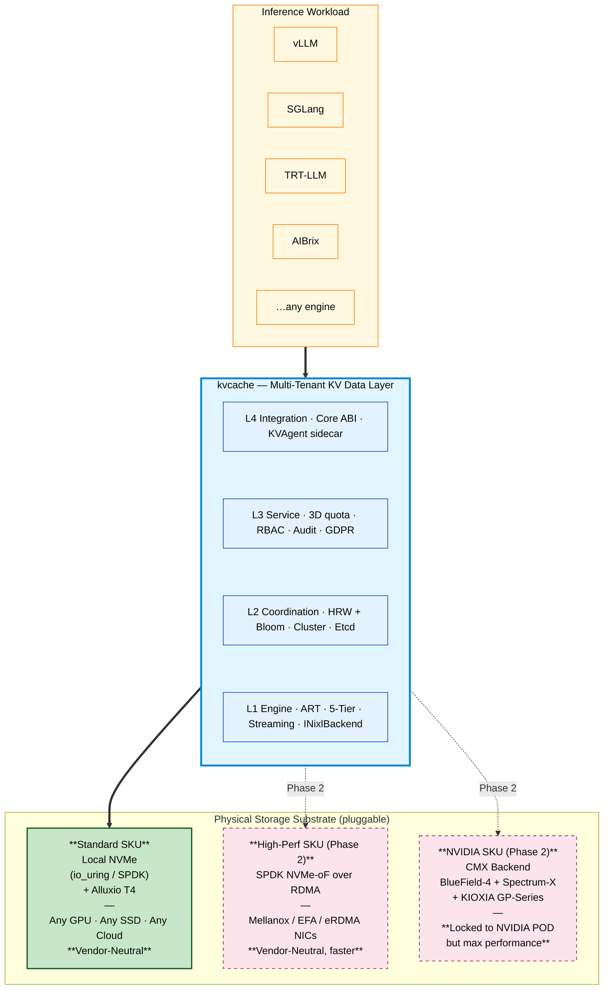
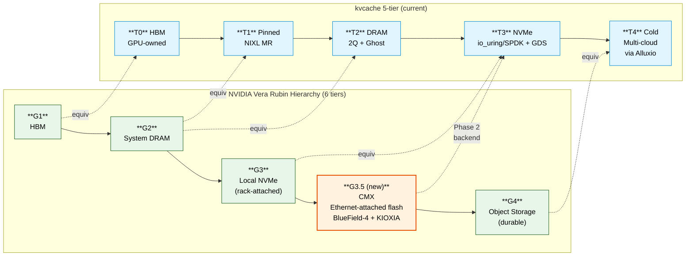

# NVIDIA Storage-Next / CMX — Position & Phase 2 Integration

> **Status**: Phase 2 planning. NVIDIA announced the CMX Context Memory Storage Platform at GTC 2026 (March). KIOXIA GP-Series SSD samples land end of 2026; production rollout estimated 2027 H1. This document records our positioning and integration plan.

---

## What CMX is

NVIDIA **CMX (Context Memory Storage)** — the platform behind the broader "Storage-Next" marketing umbrella — is a **vertically-integrated KV cache storage tier** for LLM inference. It bundles:

| Layer | NVIDIA component |
|:---|:---|
| Compute | Vera Rubin GPU pod (next gen after Blackwell) |
| DPU control | BlueField-4 |
| Fabric | Spectrum-X Ethernet (RDMA, 200–400 GbE) |
| SSD media | KIOXIA GP-Series (XL-FLASH SCM) — sub-millisecond |
| Software | DOCA Memos + Dynamo + NIXL |

NVIDIA positions CMX as **tier G3.5** in a newly-defined 6-tier hierarchy:

```
G1 HBM  →  G2 DRAM  →  G3 local NVMe  →  G3.5 CMX (Ethernet-attached flash, KV-purpose)  →  G4 Object Storage
```

**Performance claims** (NVIDIA): 5× higher tokens/s for long-context / agentic workloads, 5× greater power efficiency vs. general-purpose enterprise storage.

**Design philosophy** (NVIDIA developer blog, March 2026):
> "Inference context is derived and **recomputable**, demanding a storage architecture that prioritizes power and cost efficiency over traditional data durability."

This validates kvcache's [`L2-RD-1`](../../README.md#architecture) — KV is recomputable, no replication protocol needed.

---

## Where kvcache fits

**CMX is the physical storage layer for KV.** kvcache is the **logical service layer above it** — multi-tenancy, multi-cloud, compliance, vendor-neutral integration.

The two are **orthogonal, not competitive**:



---

## Tier hierarchy: kvcache 5-tier mapped to NVIDIA G1–G4



**Key observation:** NVIDIA's G3.5 is a **new tier** between G3 (local NVMe) and G4 (object storage). kvcache currently treats this gap implicitly via **cross-node NIXL Pull** to a peer KVStore Node's T3. Functionally equivalent (Ethernet-attached flash for KV); architecturally different (CMX = dedicated storage POD; kvcache = co-located on GPU nodes per [`D-DEPLOY-1`](../../README.md#architecture)).

**Phase 2 plan:** add an explicit **CMX backend** behind the `INixlBackend` abstraction. When the customer deploys on a Vera Rubin pod with CMX, kvcache's T3 (or a new T3.5) routes I/O through DOCA Memos to CMX. The L1–L4 logical layers above are unchanged.

---

## What kvcache adds on top of CMX

CMX provides hardware-accelerated KV storage. It does **not** provide:

| Capability | CMX alone | kvcache + CMX |
|:---|:---:|:---:|
| Hard multi-tenancy (3D quota · 3 priority classes) | ❌ | ✅ |
| RBAC + Audit + GDPR right-to-erase | ❌ | ✅ |
| Cross-cloud T4 cold tier (S3 / OSS / GCS / Blob) | ❌ | ✅ |
| Engine-neutral C ABI (vLLM / SGLang / TRT-LLM / AIBrix) | partial (via Dynamo) | ✅ |
| Runtime safety-net `fetch_estimate < recompute / 2` (`D-PERF-1`) | ❌ | ✅ |
| Vendor-neutral fallback (works without NVIDIA stack) | ❌ | ✅ |
| KV-aware routing across heterogeneous pools | ❌ | ✅ |

**Positioning sentence:** *kvcache is the multi-tenant, vendor-neutral service layer that sits above CMX (when present) or above commodity NVMe (when not). The customer chooses the storage substrate; the kvcache logical layer is invariant.*

---

## Why this validates kvcache's thesis, not threatens it

NVIDIA's investment in CMX is **positive market validation**:

1. **The KV-as-tier-of-its-own thesis is now NVIDIA's belief too** — they defined a whole new G3.5 tier for it. Three months ago this was a contested architectural claim.
2. **KV-is-recomputable is now an NVIDIA-public position** — exactly our [`L2-RD-1`](../../README.md#architecture). They publicly justify dropping durability for power/cost. We're aligned.
3. **The TAM is real** — NVIDIA does not build dedicated platforms for niche markets.

But CMX is **NVIDIA-locked top to bottom**:

- Vera Rubin GPU
- BlueField-4 DPU
- Spectrum-X fabric
- KIOXIA GP-Series SSD (initially exclusive)
- DOCA / Dynamo / NIXL software

Customers with **hybrid hardware fleets, multi-cloud presence, or vendor-neutrality policy** (precisely [the customer segments kvcache targets](../../README.md#the-thesis)) cannot buy in to CMX in full. The market split between *NVIDIA-pod customers* and *vendor-neutral customers* will widen, not narrow.

kvcache covers both: **Standard SKU for vendor-neutral, NVIDIA SKU (Phase 2) for those who do go all-in on CMX**.

---

## Permanent moat: multi-tenant QoS lives in kvcache, not CMX

The single most important architectural commitment:

> **No matter what physical substrate is below us — local NVMe, SPDK NVMe-oF, or CMX — multi-tenant QoS, RBAC, audit, and admission control always execute in the kvcache layer. CMX is not allowed to bypass this control point.**

This applies even when CMX's BlueField-4 DPU could theoretically take over the I/O path: kvcache holds the priority scheduler, the quota counter, and the audit log. CMX moves bytes; kvcache decides whose bytes and when.

This is a strengthening of [`D-PERF-2`](../../README.md#architecture) and the [Server-Pull-Only NIXL principle](../../README.md#2-server-pull-only-nixl--the-prerequisite-for-real-multi-tenancy). Server-pull-only is not just a performance choice — it is **the structural guarantee that the multi-tenant control plane is never circumvented**, even by hardware-accelerated alternatives.

---

## Timeline & monitoring

| Milestone | Target | Source |
|:---|:---|:---|
| NVIDIA CMX platform announced | 2026-03 (GTC) | [NVIDIA Developer Blog](https://developer.nvidia.com/blog/introducing-nvidia-bluefield-4-powered-inference-context-memory-storage-platform-for-the-next-frontier-of-ai/) |
| KIOXIA CM9 SSD samples | 2026 Q3 | [KIOXIA / ServeTheHome](https://www.servethehome.com/kioxia-gp-series-and-cm9-launched-for-the-era-of-agentic-ai-storage/) |
| KIOXIA GP-Series (XL-FLASH) samples | 2026 end of year | [KIOXIA / StorageReview](https://www.storagereview.com/news/kioxia-gp-series-ssd-extends-gpu-memory-with-xl-flash-for-nvidia-storage-next-ai-workloads) |
| First CMX production customers | est. 2027 H1 | est. |
| **kvcache CMX backend (Phase 2 trigger)** | When ≥ 1 customer commits to CMX | — |

We have a **~12-month window** before CMX hits real customer deployments — enough to harden the Standard SKU multi-tenant features (the moat) and to design the CMX backend integration carefully.

---

## Phase 2 engineering scope (when triggered)

| Work item | Estimate |
|:---|:---:|
| Add `CmxBackend` implementation of `INixlBackend` | 1.0 PM |
| Wire to DOCA Memos KV communication layer | 0.5 PM |
| Adapt tier promotion / demotion logic to G3.5 semantics | 0.5 PM |
| Test against Vera Rubin reference hardware | 1.0 PM |
| Documentation + customer integration guide | 0.5 PM |
| **Total** | **~3.5 PM** |

Triggered by: ≥ 1 customer commits to a Vera Rubin POD purchase and requests kvcache as the multi-tenant layer above CMX.

---

## Further reading (external)

- [NVIDIA Developer Blog — Introducing BlueField-4-Powered CMX](https://developer.nvidia.com/blog/introducing-nvidia-bluefield-4-powered-inference-context-memory-storage-platform-for-the-next-frontier-of-ai/) — official architecture overview
- [Blocks & Files — Nvidia and its partners' KV Cache extenders](https://www.blocksandfiles.com/ai-ml/2026/03/30/nvidia-and-its-partners-kv-cache-extenders/5209284) — industry analysis
- [StorageReview — KIOXIA GP Series SSD](https://www.storagereview.com/news/kioxia-gp-series-ssd-extends-gpu-memory-with-xl-flash-for-nvidia-storage-next-ai-workloads) — XL-FLASH SCM detail
- [ServeTheHome — KIOXIA GP and CM9](https://www.servethehome.com/kioxia-gp-series-and-cm9-launched-for-the-era-of-agentic-ai-storage/) — product datasheet roundup

> For NVIDIA's own architecture diagrams of CMX (CPU/GPU/HBM ↔ NVMe/PCIe ↔ SSD), see the [NVIDIA Developer Blog](https://developer.nvidia.com/blog/introducing-nvidia-bluefield-4-powered-inference-context-memory-storage-platform-for-the-next-frontier-of-ai/). We deliberately do not redistribute NVIDIA's marketing imagery; our own diagrams above show the kvcache positioning instead.
