```mermaid
flowchart TB
    %% =========================================================
    %% TOP: Workflow (engines)
    %% =========================================================
    subgraph WL["LLM Inference Workflow"]
        direction LR
        WL1["vLLM"]
        WL2["SGLang"]
        WL3["TRT-LLM"]
        WL4["AIBrix"]
        WL5["NVIDIA Dynamo<br/>(P1, 3–6 mo)"]
        WL6["LMDeploy · TGI<br/>DeepSpeed-MII<br/>(Phase 2)"]
    end

    %% =========================================================
    %% APIs (multi-language surface)
    %% =========================================================
    subgraph API["Multi-Language APIs"]
        direction LR
        A1["C ABI<br/>(authoritative)"]
        A2["Python<br/>(cffi)"]
        A3["Go<br/>(CP + Operator)"]
        A4["Rust<br/>(Phase 2)"]
    end

    %% =========================================================
    %% Core ABI
    %% =========================================================
    subgraph CORE["Core ABI — 6 verbs (L4 ⑪)"]
        direction LR
        V["kv_lookup · kv_reserve · kv_publish · kv_fetch · kv_seal · kv_release<br/>+ kv_subscribe_events"]
    end

    %% =========================================================
    %% kvcache Engine Layer (L1 ②③④)
    %% =========================================================
    subgraph ENGINE["kvcache Engine (L1 ②③④)"]
        direction LR
        EN1["② Prefix-reuse ART<br/>BLAKE3 + EBR<br/>lock-free reads"]
        EN2["③ 5-Tier Storage<br/>2Q + Ghost + ROI<br/>cross-tenant eviction"]
        EN3["④ Streaming Ingest<br/>watermark · seal<br/>NIXL Pull mode"]
    end

    %% =========================================================
    %% Transport Layer with future slot
    %% =========================================================
    subgraph TRANS["Transport Layer — INixlBackend abstraction"]
        direction LR
        T1["NIXL (current)<br/>NVIDIA-backed"]
        T2["Ascend HIXL<br/>(Phase 2 slot —<br/>non-NVIDIA hardware)"]
        T3["Custom backends<br/>(future expansion)"]
    end

    %% =========================================================
    %% NIXL Backends
    %% =========================================================
    subgraph NIXL["NIXL Backends (auto-selected per peer)"]
        direction LR
        B1["GDR<br/>(GPUDirect RDMA)<br/>~5 µs"]
        B2["UCX<br/>(IB / RoCE)<br/>~10 µs"]
        B3["GDS<br/>(NVMe → GPU direct)<br/>~30 µs"]
        B4["NVLink<br/>(intra-host)<br/>~2 µs"]
        B5["TCP<br/>(fallback)<br/>~100 µs"]
    end

    %% =========================================================
    %% Hardware
    %% =========================================================
    subgraph HW["Physical Hardware"]
        direction LR
        H1["GPU<br/>H100 / B100"]
        H2["NIC<br/>Mellanox CX-6/7"]
        H3["NVMe SSD<br/>(local)"]
        H4["Object Storage<br/>S3 · OSS · GCS · Blob"]
    end

    %% Flow
    WL ==> API
    API ==> CORE
    CORE ==> ENGINE
    ENGINE ==> TRANS
    T1 ==> NIXL
    NIXL ==> HW
    ENGINE -.->|"cold tier"| H4

    %% Styling
    classDef workload fill:#fff8e1,stroke:#f57c00,color:#000
    classDef apiStyle fill:#e3f2fd,stroke:#0d47a1,color:#000
    classDef coreStyle fill:#e1f5ff,stroke:#0288d1,stroke-width:3px,color:#000
    classDef engineStyle fill:#c8e6c9,stroke:#1b5e20,stroke-width:2px,color:#000
    classDef transStyle fill:#fff3e0,stroke:#e65100,color:#000
    classDef nixlStyle fill:#e8f5e9,stroke:#1b5e20,color:#000
    classDef hwStyle fill:#fafafa,stroke:#424242,color:#000
    classDef futureStyle fill:#fce4ec,stroke:#880e4f,stroke-dasharray: 5 5,color:#000

    class WL,WL1,WL2,WL3,WL4 workload
    class WL5,WL6 futureStyle
    class API,A1,A2,A3 apiStyle
    class A4 futureStyle
    class CORE,V coreStyle
    class ENGINE,EN1,EN2,EN3 engineStyle
    class TRANS,T1 transStyle
    class T2,T3 futureStyle
    class NIXL,B1,B2,B3,B4,B5 nixlStyle
    class HW,H1,H2,H3,H4 hwStyle
```

# Integration & Transport Stack

Layered view from inference engines down to physical hardware. Shows current MVP scope and where Phase 2 extension slots live.

---

---

## Layer-by-layer

### Workflow layer (top)
- **P0 engines (MVP)**: vLLM, SGLang, TRT-LLM, AIBrix — each ships an adapter that calls the Core ABI
- **P1 engines (3–6 mo)**: NVIDIA Dynamo — natural fit because Dynamo already uses NIXL
- **Phase 2**: LMDeploy, TGI, DeepSpeed-MII — based on customer demand

### API layer
- **C ABI** is the single source of truth; all other bindings are thin shells
- Python via `cffi` (~50 LOC adapter shells)
- Go is the language of the Control Plane and K8s Operator
- Rust is a Phase 2 nice-to-have (no concrete customer ask yet)

### Core ABI
Six verbs cover the entire data plane lifecycle. See [the main README API surface section](../../README.md#api-surface) for code examples and async semantics.

### kvcache Engine layer (L1)
The heart of the product. Three subsystems do the real work:
- **②** Adaptive Radix Tree for prefix matching (BLAKE3 chunk hashes, epoch-based lock-free reads, p99 < 10 µs)
- **③** Five-tier storage with cross-tenant LRU/2Q eviction and Ghost Cache
- **④** Streaming ingest with watermark-based partial visibility and atomic seal

### Transport layer
Currently **NIXL only**. The `INixlBackend` abstraction is in place so future backends (notably **Ascend HIXL** for Huawei hardware) can slot in alongside without touching call sites.

### NIXL Backends
NIXL auto-selects the optimal backend per peer connection. We do not implement backends; we just call NIXL.

### Hardware
What the system actually runs on. Cold-tier object storage is the only multi-cloud surface.

---

## Honest comparison vs Mooncake Transfer Engine

Mooncake builds their own transport stack with 5 categories of backends. We chose NIXL for focus on KV-cache logic. Today's gap:

| Backend / capability | Mooncake Transfer Engine | kvcache (current) | kvcache (planned) |
|:---|:---:|:---:|:---:|
| RDMA (RoCE / IB / eRDMA) | ✅ self-built | via NIXL UCX | via NIXL UCX |
| TCP | ✅ self-built | via NIXL | via NIXL |
| CXL / SHM / NVMe-oF | ✅ self-built | via NIXL NVMe-oF | via NIXL |
| Multi-node NVLink | ✅ self-built | via NIXL | via NIXL |
| **Ascend HIXL (Huawei)** | ✅ **self-built** | ❌ | **Phase 2 slot — if China customer demand confirms** |
| Multi-language APIs | C / C++ / Python / Go / **Rust** | C / Python / Go | + Rust (Phase 2) |
| Auto-discovery | ✅ | partial (via etcd) | full (Phase 2) |
| Fault tolerance | ✅ | per-node (no replica, KV recomputable) | unchanged (L2-RD-1) |

**Our position**: NIXL is a good current bet for NVIDIA-centric stacks; the `INixlBackend` abstraction is the insurance policy for non-NVIDIA hardware. **For Chinese customers running Ascend, we currently do not compete; this is the most important Phase 2 gap.**

---

## Related

- [System Overview](./system-overview.md) — deployment topology
- [Main README](../../README.md) — value proposition + quickstart
