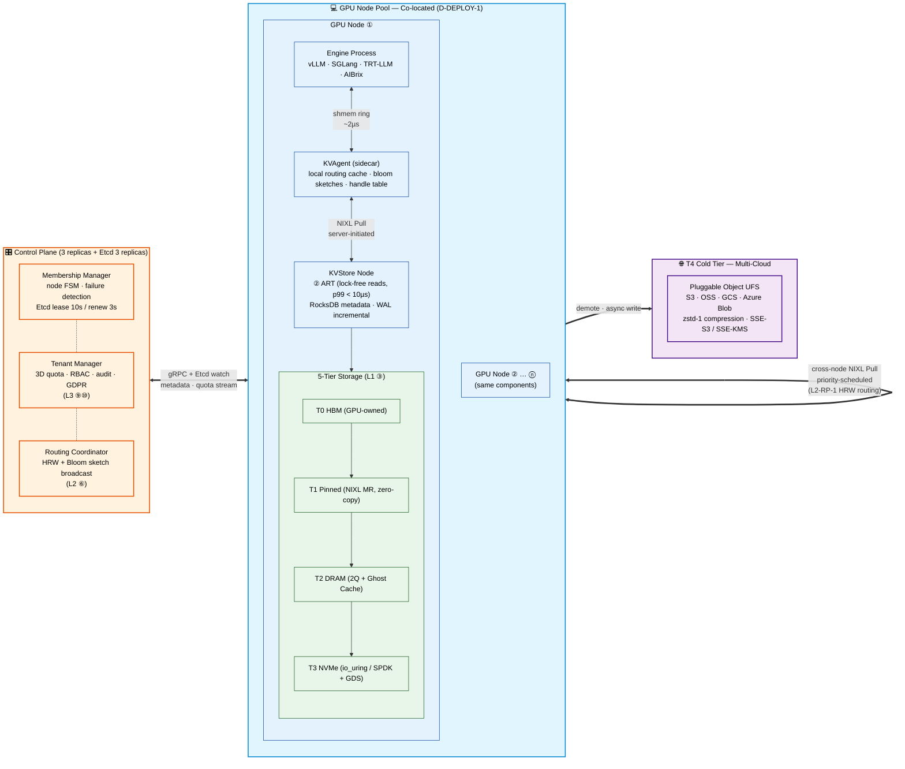

# System Overview

End-to-end deployment topology: Control Plane, GPU Node Pool (co-located), and the multi-cloud Cold Tier.

---

---

## Optimization goals

| Goal | Subject to |
|:---|:---|
| **Lookup p99 < 10 µs** | hot-path checks ≤ 1 µs (D-PERF-2) · lock-free ART reads (EBR) |
| **Tier latency << GPU recompute** | runtime safety-net (D-PERF-1) · GDS for tiles > 16 MB |
| **Hard multi-tenancy** | server-pull-only NIXL · 3D quota · 3 priority classes (P0/P1/P2) |
| **Data plane survives CP outage** | local routing cache · CP-independent (L2-CC-7) |
| **Zero-copy end-to-end** | Pinned slot ≡ NIXL MR · no bounce buffers |
| **No KV migration on rebalance** | KV is recomputable; ~1/N affected on join/leave (L2-RP-5) |

---

## Why **co-located** (and not Mooncake-style disaggregated pools)

| Aspect | Disaggregated pools (Mooncake) | Co-located (this design) |
|:---|:---|:---|
| **Scheduling complexity** | Central Conductor with 3 schedulers | Engine-local; CP only does metadata |
| **Disagg of prefill / decode** | First-class | Delegated to engine (vLLM v1 disagg, etc.) |
| **Cross-node KV motion** | Frequent (P-pool → D-pool) | Lazy (only on cache miss / membership change) |
| **Operational footprint** | 2 pod classes + Conductor + Store | 1 pod class (GPU node) + CP |
| **Idle CPU/DRAM utilization** | Wasted in storage-only nodes | Used (D-DEPLOY-1) |
| **Best fit for** | Single-tenant hyperscale | Multi-tenant enterprise |

The trade-off: we forgo central P/D coordination for **deployment simplicity and tenant isolation**.
For customers that need true disaggregation, the engine layer handles it (vLLM v1, SGLang, TRT-LLM all have disagg modes).

---

## Six core invariants

These hold across all scenarios (lookup / fetch / publish / eviction / membership change / network partition):

1. **Data plane never depends on Control Plane** — lookup/fetch/publish continue during CP outage
2. **Writes never block reads** — unsealed KV is not in ART; seal is atomic flip
3. **Zero-copy end to end** — engine writes into Pinned slot ≡ NIXL MR; server pulls same physical pages
4. **Server pulls, never client pushes** — NIXL Pull only; QoS lives server-side
5. **Per-node metadata strong-consistent; cross-node eventually consistent** — local RocksDB+ART atomic; cluster Bloom 30 s tick
6. **Cache always degrades to recompute** — D-PERF-1 safety-net; cache correctness never threatens system semantics

---

## Related

- [Integration & Transport Stack](./integration-stack.md) — engines down to hardware
- [Main README](../../README.md) — value proposition + quickstart
